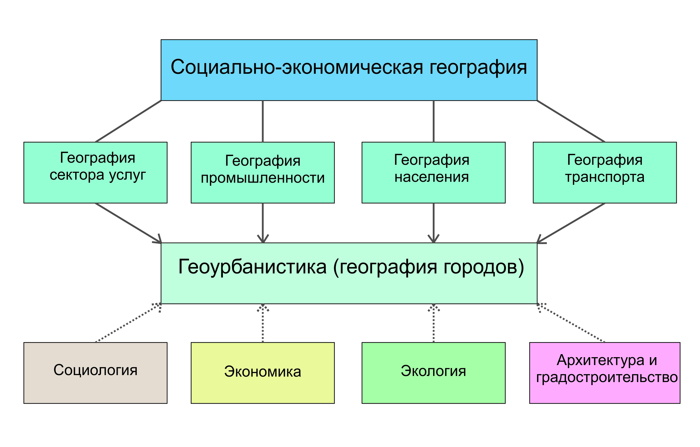
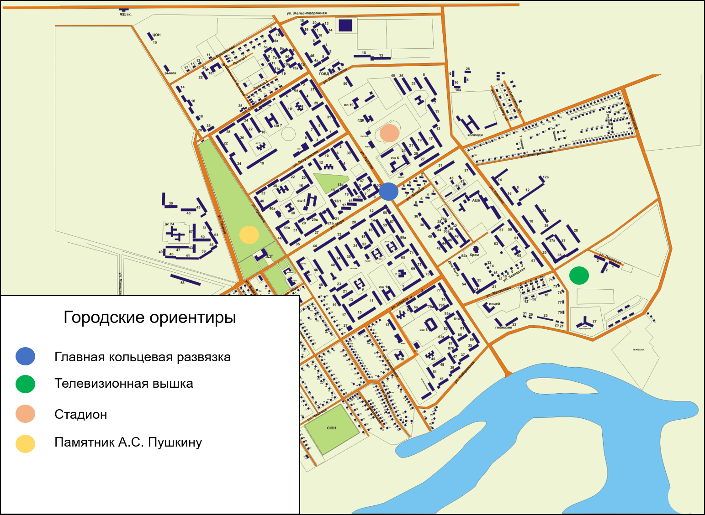

# Вводное занятие {#intro}

Знакомство с методами изучения городской территории и источниками информации

**Занятие №1а. Введение в геоурбанистику**

В современном мире науки часто имеют междисциплинарный характер, сочетая в себе концепции и методы сразу нескольких областей познания. Геоурбанистика или география городов представляет собой широкое направление в социально-экономической географии, изучающее организацию, развитие и функционирование городских систем разного уровня[^intro-1]. В последнее время часто объектом исследования геоурбанистики становятся не только города, но и населённые пункты вообще.

[^intro-1]: Махрова А. Г. География городов, геоурбанистика // Социально-экономическая география: понятия и термины. Словарь-справочник. Отв. ред. А.П. Горкин / Под ред. А. П. Горкин, Е.Е. Демидова (Чиркова). --- Ойкумена Смоленск, 2013. --- С. 53-54, 68-69.

Объектом исследования геоурбанистики могут быть системы разного пространственного уровня:

-   Микроуровень (отдельные городские или сельские территории: районы, кварталы, парки, площади)

-   Мезоуровень (отдельные города или сёла)

-   Макроуровень (системы населённых пунктов района, региона или страны)

Исследования городских и сельских населённых пунктов находят применение как при поиске теоретических закономерностей (создание моделей, типологий), так и в практических целях (городское планирование, маркетинг). В рамках геоурбанистики используется множество различных общенаучных и специфических для географических наук методов.

 Таблица 1.1. Основные методы исследований в геоурбанистике

+------------------------------+-----------------------------------------------------+
| Метод                        | Сущность метода                                     |
+==============================+=====================================================+
| Картографический             | Построение карт плотности, распределения явлений    |
+------------------------------+-----------------------------------------------------+
| Сравнительный исторический   | Анализ изменения ситуации во времени                |
+------------------------------+-----------------------------------------------------+
| Сравнительный географический | Анализ сходства с аналогами ситуации в другом месте |
+------------------------------+-----------------------------------------------------+
| Статистический               | Использование данных различных источников           |
+------------------------------+-----------------------------------------------------+
| Социологический              | Анализ мнения населения и экспертов                 |
+------------------------------+-----------------------------------------------------+
| Математический               | Моделирование и расчёт индикаторов ситуации         |
+------------------------------+-----------------------------------------------------+
| Наблюдение                   | Непосредственные подсчёты на местности              |
+------------------------------+-----------------------------------------------------+

 Все перечисленные методы могут комбинироваться в методики конкретных исследований. В географии методы исследований традиционно подразделяют также на полевые и камеральные. Первые относятся к непосредственным действиям на местности, работе с первичным источником информации. Примерами могут являться собственно полевые наблюдения, картирование местности, подсчёт транспортных потоков, социологические опросы. Вторые включают в себя все те операции, которые можно совершить, находясь в помещении -- поиск информации в интернете, расчёты, обработка полевых данных.

**Занятие 1б.**

Наиболее распространённым понятием в отечественных географических исследованиях является экономико-географическое положение (ЭГП). ЭГП представляет собой географическое положение объекта (части города, города в целом, региона или страны) по отношению к внешним объектам, играющим важную роль для его появления и развития. Концепция ЭГП выходит за рамки своего названия и включает в себя природные, экологические, социальные, информационные и культурные компоненты[^intro-2]. ЭГП не является статичным, оно развивается во времени и пространстве вместе с объектами, к которым относится.

[^intro-2]: Баранский Н. Н. Экономико-географическое положение //Становление советской экономической географии. М.: Мысль. -- 1980. -- С. 128-159.

На микроуровне ЭГП определяет функции места, которые часто выражены через городские ориентиры. Территории, которые имеют выгодное экономико-географическое положение становятся «центральными», концентрируя соответствующие объекты. Центр в данном случае понятие не только и не столько геометрическое, сколько функциональное.

Определённые характеристики среды значительно облегчают понимание микрогеографического положения и территориальных связей в городе. Среди подобных ориентиров, которые могут быть оценены визуально с помощью наблюдений на местности, можно перечислить следующие:

-   Планировочные (направленность улично-дорожной сети, топонимика, этажность и стиль застройки, расположение относительно водных объектов, зелёных зон, магистралей и предприятий);

-   Транспортные (интенсивность людских и транспортных потоков, расположение остановок общественного транспорта);

-   Функциональные (наличие «центральных» узловых функций -- здания администраций и других госучреждений, рынки, храмы, вокзалы, расположение определённых предприятий).

**Методические рекомендации для выполнения задания:**

Целью вводного занятия является знакомство школьников с городом как системой с внутренними и внешними связями. Полная оценка экономико-географического положения города или его отдельной части является сложной задачей, требующей значительного анализа.

По этой причине для ознакомительных целей используется приблизительная оценка ЭГП с точки зрения школьника как жителя этого населённого пункта

1\) Для крупных и средних городов учитель выбирает относительно однородный участок населённого пункта (желательно знакомый учащимся) размерами до 1000х1000 м.

Для малых городов и сёл объектом исследования становится весь населённый пункт.

2\) Если в занятии принимает участие более 6 человек, становится возможным разделение школьников на 2 и более групп. В малых городах в таком случае объектами исследования для других групп могут стать соседние населённые пункты.

Время, отведённое на выполнение задания, составляет 6 академических часов, из которых 2 отведены на полевые работы. Навыки, приобретённые в ходе вводного занятия, станут базой для выполнения последующих заданий в рамках практикума.

**Этапы выполнения задания:**

1.  Подготовка к полевому выходу

Перед началом полевого этапа учитель должен привести примеры локальных городских ориентиров, которые могут свидетельствовать о местоположении и функциях места. Например, «говорящая» о функциях места топонимика (ул. Кузнечная, ул. Дмитриевская Дамба, ул. Ставропольская) или детали, которые могут помочь в ориентировании по карте (вход в храм расположен с западной стороны, спутниковые тарелки обычно располагаются на южных фасадах зданий).

Таблица 1.2. Характеристики изучаемого участка

| №   | Группа характеристик | Пример |
|-----|----------------------|--------|
| 1   |                      |        |
| ... |                      |        |

Далее участникам занятия раздаются картосхемы участков на листах формата А4. Для экономии времени рекомендуется использование заранее распечатанных картографических шаблонов -- фрагментов карт из открытых Интернет-источников (Google Maps, OpenStreetMap, Яндекс).

На отдельном листе на каждую группу учащихся составляются таблицы, в которые будут вноситься данные о характеристиках городской среды (планировочных, транспортных, функциональных), позволяющих сделать выводы об ЭГП места, его функциях в системах более высокого уровня.

2.  Полевые работы

Школьники исследуют выбранный участок, фиксируя в таблицу XXX обнаруженные ими маркеры ЭГП. Также учащиеся должны нанести на выданную в качестве черновика картосхему участка основные городские ориентиры.

Маршрут участников занятия должен пролегать лишь вдоль основных элементов улично-дорожной сети участка, не затрагивая труднодоступные и недоступные территории, что дополнительно должно быть оговорено учителем.

3.  Камеральная обработка

Основными элементами отчётности по занятию являются карта-схема городских ориентиров исследованного участка, которая выполняется максимально упрощённо с использованием нумерации обнаруженных объектов.

При построении карты обязательно соблюдаются необходимые требования к оформлению картографических материалов (наличие чёткого названия, указания масштаба, наличия легенды, даты построения карты).

По итогам анализа характеристик среды школьники готовят доклад, характеризующий их роль в ЭГП участка.

**Необходимые материалы:** планшеты для всех участников с подготовленными картосхемами участков и листами для заполнения таблицы ХXX; простые карандаши

**Пример оформления итогового задания:**

Таблица 1.3. Характеристики изучаемого участка

+--------------+----------------------+--------------------------------------------------------------------------------------------+
| №            | Группа характеристик | Пример                                                                                     |
+==============+======================+============================================================================================+
| 1            | Планировочные        | Большинство кварталов участка расположены за железной дорогой по отношению к центру города |
+--------------+----------------------+--------------------------------------------------------------------------------------------+
| 2            | Функциональные       | На территории района находится железнодорожный вокзал и перехватывающая парковка           |
+--------------+----------------------+--------------------------------------------------------------------------------------------+

