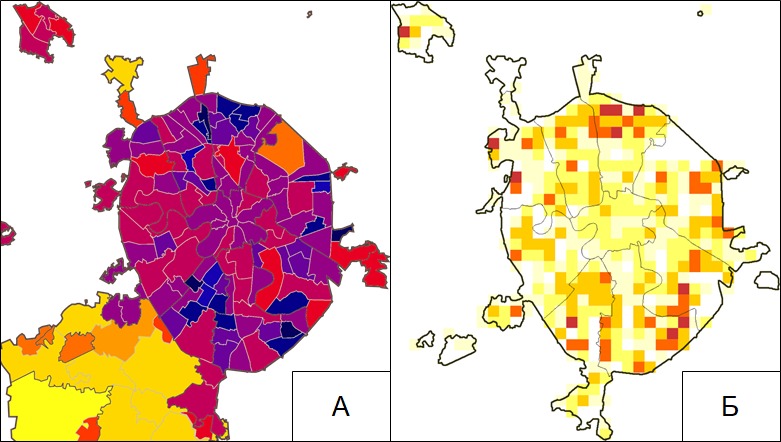
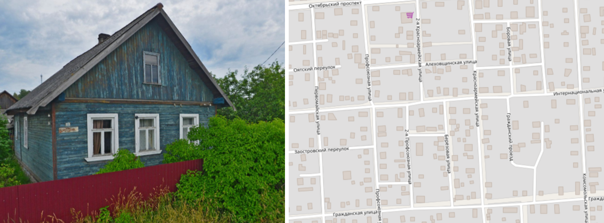
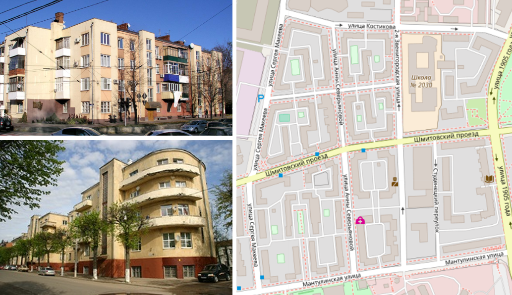
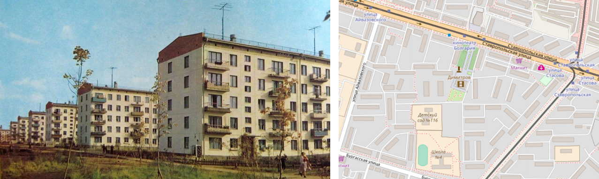
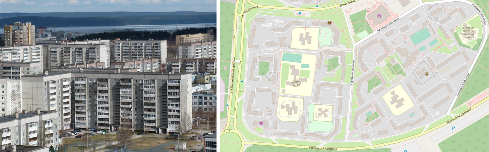
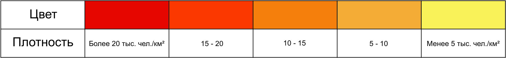
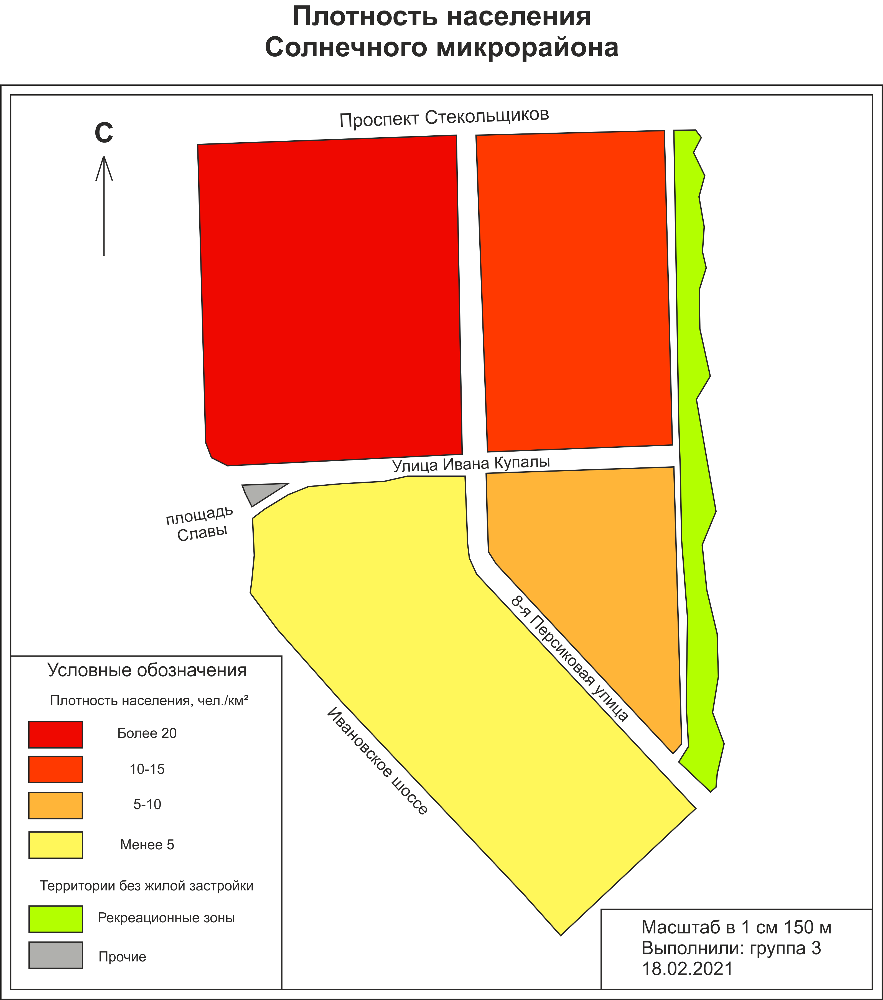
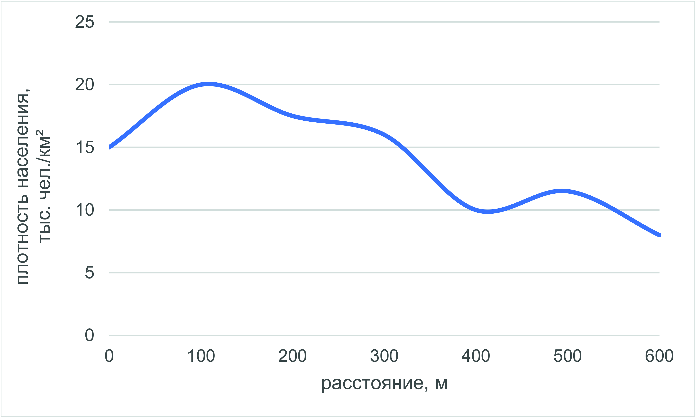

# Внутригородское расселение {#Settlement}

## Теоретическая часть {.unnumbered}

Одним из предметов изучения современной географии городов являются особенности городского расселения на разных уровнях, от глобального до локального. Численность населения городов и микрорайонов наиболее часто определяет набор их функций и их место на разных уровнях системы расселения. Тем не менее, география -- пространственная наука и характеристика территории абсолютными значениями численности населения была бы неполной. По этой причине географы используют в своём анализе относительный показатель -- плотность населения. *Перед началом непосредственной работы с показателем плотности населения ученикам напоминаются общие сведения о численности населения (страны, города, района, микрорайона), вместе рассчитывается средняя для города плотность населения, приводятся референсные значения плотности населения (таблица ХХХ). После этого обсуждается принципиальное отличие городской плотности населения от средней по территориям стран, регионов.*

Плотность населения[^settlement-1] есть отношение численности постоянного населения на единицу площади (чаще всего 1 км^2^). При определении плотности важно понимать, в каких границах она определяется, т.е. как говорят географы, определить масштаб операционной территориальной ячейки. Так, плотность населения города определяется для всей его площади, которая включает в себя и нежилую территорию. Таким образом, результатом расчетов фактически будет средняя плотность населения для рассматриваемой территории. Данный показатель рассчитывается по следующей формуле:

[^settlement-1]: Захарова О. Д. Плотность населения//Демографический понятийный словарь/Под ред. проф. Л. Л. Рыбаковского //М.: ЦСП. -- 2003.

```{=tex}
\begin{align*}
\rho_н = \frac{P}{S}
\end{align*}
```
где P -- численность населения территории чел.,

S -- площадь территории $км^{2}$

В городах различных размеров основным масштабом измерений могут стать кварталы, микрорайоны или административные районы. Однако наиболее распространённым способом является подсчёт плотности по территориальным ячейкам одинакового размера. 



Рисунок 3.1. Территориальные ячейки для расчёта плотности населения Москвы. А - административные районы, Б - ячейки 1,5\*1,5 км[^settlement-01]<sup>,</sup>[^settlement-02]

[^settlement-01]: Население Москвы // Википедия. [2018]. Дата обновления: 05.08.2018. URL: [https://commons.wikimedia.org/wiki/File:Картосхема_плотности_населения_Москвы.PNG](https://commons.wikimedia.org/wiki/File:Картосхема_плотности_населения_Москвы.PNG) (дата обращения: 05.08.2018).

[^settlement-02]: В. Баширов. Плотность населения Москвы // Живой Журнал. URL: <https://sevabashirov.livejournal.com/13211.html> (дата обращения: 05.08.2018).

Характеристика плотности населения обычно используется как показатель освоенности территории, которая в свою очередь определяется природно-географической средой и особенностями социально-экономического развития того или иного общества. Город выступает в качестве наиболее компактного элемента системы расселения. Различия в плотности населения внутри него в значительной мере определяют концентрацию спроса, что является основным фактором пространственной дифференциации социально-экономических процессов.

Плотность населения очень важна для определения обеспеченности районов города объектами социальных услуг [^settlement-2] и транспортной инфраструктуры. Учитывается она и при размещении торговых предприятий (в т.ч. сетевых магазинов). Изучение плотности населения в городе является базой для дальнейшего анализа функций города, его планировки, транспортной сети и сферы услуг.

[^settlement-2]: Поликлиники, больницы, детские сады, школы, спортивные объекты, дома культуры

Исследования показывают, что высокая плотность населения (около 10 тыс. чел./км^2^ позволяет сэкономить на коммунальных услугах, ремонте дорог и благоустройстве территорий, повышается полезность инвестиционных вложений. Однако при ещё более высокой плотности населения наступает обратный эффект: перенаселённые районы испытывают крайне высокую нагрузку и издержки обслуживания инфраструктуры снова начинают возрастать.


Плотность населения в городах напрямую зависит от характера жилой застройки (территории, занятой жилыми зданиями). В градостроительстве закреплены[^settlement-3] нормативные показатели плотности в зависимости от характера районной или микрорайонной застройки и размера города.

[^settlement-3]: Строительные нормы и правила СНиП 2.07.01-89 "Градостроительство. Планировка и застройка городских и сельских поселений" // Система Гарант. URL: <http://base.garant.ru/2305985/#ixzz5SPO3UTSp> (дата обращения: 05.08.2018).

Базовой пространственной ячейкой для подсчёта плотности населения является отдельно стоящее строение -- жилой дом. Основой классификации жилой застройки является её тип и этажность. Существует 2 основных типа застройки:

1. индивидуальная (участок вместе со зданием принадлежит одному домохозяйству[^settlement-4]

2. многоквартирная (жилое здание разделено на квартиры, где проживают несколько домохозяйств).

[^settlement-4]: Группа людей, ведущих общее хозяйство, проживающая совместно, чаще всего объединённая родственными или семейными связями

Общепринятая классификация жилых зданий по этажности отражает масштабность застройки районов города. Традиционно выделяются 3 класса застройки:

1. Малоэтажная (1-3 этажа)

2. Среднеэтажная (4-5 этажей)

3. Многоэтажная (6 и более этажей)

   a. Повышенной этажности (11-16 этажей)

   b. Высотная (17 и более этажей)

Подобная классификация связана с градостроительными нормативами. Так, 5 -- это максимальное число этажей, для которого в жилом здании необязательна установка лифта.

Жилая застройка городов не всегда была такой, какой мы знаем её сейчас. До начала активной стадии урбанизации в городах, как и в сельской местности преобладали индивидуальные жилые дома, которые почти всегда были окружены земельным участком. До сих пор в большинстве российских городов сохраняется подобный тип застройки, для малых и средних городов, а также населенных пунктах в степной и лесостепной зонах -- является преобладающим.


 
Рисунок 3.2. Индивидуальные жилая застройка малых городов[^settlement-5]<sup>,</sup>[^settlement-6]

[^settlement-5]: Снимки Google Street View

[^settlement-6]: Картографический материал OpenStreetMap -- г. Лодейное Поле

Вместе с увеличением численности городского населения в XVIII-XIX вв. в нашей стране появляется новая форма жилого помещения -- квартира. Тем не менее дома квартирного типа были распространены лишь в столицах, где представляли собой арендное жильё.

Революция в России и последовавшее за ней становление нового социального уклада потребовало новой формы быта. Активный приток населения в города (основная форма интенсивной урбанизации) стал причиной появления «коммуналок» (больших квартир, разделённых между несколькими семьями, с общими кухней и санузлом), а затем и волны нового жилищного строительства. Первым этапом стало создание комфортной среды для рабочих: в 1920-30-е гг. возводятся жилые районы и отдельные здания в стиле конструктивизм (простые геометрические формы, оптимизированная планировка квартир).

 
Рисунок 3.3. Жилые здания и кварталы 1920-30-х гг. в стиле конструктивизм[^settlement-7]<sup>,</sup>[^settlement-8]<sup>,</sup>[^settlement-9]

[^settlement-7]: Записки наблюдателя. Смоленск. Конструктивизм // Живой Журнал. URL: <https://babs71.livejournal.com/580227.html> (дата обращения: 05.08.2018).
[^settlement-8]: Культурное наследие. Краснодар. Дом «Стодворка» // Карта России. URL: <https://kartarf.ru/dostoprimechatelnosti/211308-dom-zhiloy-stodvorka> (дата обращения: 05.08.2018).
[^settlement-9]: Картографический материал OpenStreetMap -- Квартал Нижняя Пресня, Москва


К концу 1930-х гг. наиболее распространённым стало жилищное строительство в стиле «сталинский ампир» - квартиры в таких домах имели большую площадь, высокие потолки, а сами здания были украшены декоративными элементами. Тем не менее, подобные дома были широко распространены лишь в крупных городах, а квартиры в них предоставлялись лишь привилегированному населению. В то же время в условиях послевоенной нехватки жилья, основная часть городского населения ютилась в индивидуальных жилых домах или 2-этажных бараках квартирного типа, которые сохранились во многих российских городах до настоящего времени.

Наиболее важный этап массового жилищного строительства начался в конце 1950-х гг. Архитекторы и проектировщики начали поиск простых и недорогих решений по обеспечению каждой семьи отдельной квартирой. По всей стране началась застройка крупных жилых массивов типовыми, чаще всего 5-этажными зданиями, ставшими известными как «хрущёвки». В малых городах и сельской местности зачастую также встречаются 2-3-этажные модификации подобных типовых домов.


Рисунок 3.4. Жилые здания и кварталы конца 1950-х -- начала 1970-х гг. постройки, известные как «хрущёвки»[^settlement-10]

[^settlement-10]: Авиамастер. Хрущевки в ожидании войны // Живой Журнал. URL: [\<https://vikond65.livejournal.com/514931.html>](https://babs71.livejournal.com/580227.html) (дата обращения: 05.08.2018).

Следующим этапом домостроения стали жилые микрорайоны, строившиеся в 1970-х -- начале 1990-х гг. В отличие от «хрущёвок» подобные дома почти всегда относились к многоэтажным. По уже устоявшейся аналогии жилые здания, возведённые в этот период, получили названия «брежневки». Их отличительной чертой также являлось более высокое разнообразие типовых решений, а также значительно меньшая плотность застройки вследствие повышенной этажности (преимущественно 5-9 этажей в городах до 1 млн. человек, до 17 этажей в Москве и Санкт-Петербурге).


Рисунок 3.5. Жилые здания и кварталы конца 1970-х -- начала 1990-х гг. постройки, известные как «брежневки»[^settlement-11]

[^settlement-11]: Фотографии района Древлянка, Петрозаводск // Архитектурная фотобаза «Домофото» URL: <http://domofoto.ru/photo/114981/> (дата обращения: 05.08.2018).

Переход к рыночной экономике в постсоветский период ознаменовал новые изменения в жилищном строительстве. Увеличилось разнообразие застройки по этажности, появились таунхаусы.[^settlement-12] Получает распространение «точечная» застройка, её примером могут являться новые жилые комплексы в центрах городов на небольших освободившихся участках.

[^settlement-12]: Малоэтажные жилые дома с отдельным входом для каждой квартиры, часто таунхаус включает в себя гараж и небольшой земельный участок перед входом

Таким образом, в больших и крупных российских городах (более 100 тыс. чел.) прослеживается наиболее общая закономерность распределения плотности населения в зависимости от эпохи, в которую возник жилой массив. Чем новее район, тем чаще всего он более многоэтажный, а значит более плотно заселённый. Исключениями являются редкие примеры малоэтажной и среднеэтажной застройки премиум-класса, построенные в последние десятилетия.

В средних и малых городах (менее 100 тыс. чел.) не наблюдается чёткой закономерности в распределении плотности населения. из-за распространения индивидуального жилья и отсутствия районов масштабной жилой застройки. В таких городах встречаются лишь отдельные кварталы типовых жилых зданий.

Наиболее типичное распределение плотности населения в зависимости от расстояния от центра города (центрального делового района) для российских городов выглядит следующим образом: плотность минимальна в центре, скачкообразно возрастает на некотором расстоянии от него и максимальна на окраинах. Данный факт является прямым следствием массовой микрорайонной застройки спальными[^settlement-13] районами на окраинах большинства городов в советский период.

[^settlement-13]: Район с преобладанием жилых функций, где практически отсутствуют рабочие места, торговая и культурно-досуговая инфраструктура

Заметим, что для зарубежных городов распределение плотности населения почти обратное. В то же время есть и другие модели, достаточно хорошо описывающие распределение городской плотности. Английский экономист Колин Кларк в 1951 г. предложил использовать модель внутригородского расселения, согласно которой плотность населения максимальна в центре города, а по мере удалённости от него резко убывает. Данная зависимость также не универсальна и во многом отражает исторические факторы развития американских городов -- исключительно плотные центральные деловые районы, окружённые протяжёнными малоэтажными пригородами. Современные исследователи предлагают использовать более сложные функции с несколькими максимумами для описания различий плотности населения внутри городов.

## Практическая часть {.unnumbered}

**Методические рекомендации для формулировки и выполнения задания:**

Составление карты плотности населения для всего населенного пункта -- достаточно трудоёмкая задача, в особенности для крупных городов. При этом получить абсолютно точный результат измерений заведомо невозможно. Так, например, средний размер домохозяйств серьезно варьирует для разных городов и типов застройки.

Поэтому для учебных целей мы можем использовать приблизительную оценку плотности, определив среднее количество квартир для домов разного типа и экстраполировав результаты для всего города. Такой подход можно реализовать двумя способами:

1) Учитель выбирает некоторый модельный участок города, характеризующийся максимальным разнообразием типов жилой застройки. Данный вариант лучше всего подходит для работы в малых группах; размер участка в таком случае будет составлять в среднем 500\*500 м

2) Если в занятиях принимает участие более 6 человек, возможно разделение школьников на 2 и более групп. Тогда, для полевой работы предлагается выбор нескольких участков размером 300\*300 м, которые отличаются характерным типом жилой застройки

Время выполнения задания -- 6 академических часов, что включает в себя 2 академических часа полевых работ. Несмотря на большое количество работ в данном занятии, полученные по его итогам материалы (карта плотности населенного пункта) будут использованы в последующих занятиях (изучение системы городского транспорта, потребительских услуг, функциональных зон).

**Этапы выполнения задания**:

1. Подготовка к полевому выходу

Перед началом полевых работ требуется подготовка схемы участка в камеральных условиях. На листах размера А4 необходимо в масштабе нанести основные элементы планировочного каркаса -- улицы, границы функциональных зон (в первую очередь, отделить участки селитебной застройки). Для экономии времени рекомендуется использование заранее распечатанных картографических шаблонов -- фрагментов карт из открытых Интернет-источников (Google Maps, OpenStreetMap, Яндекс.Карты). Данные схемы будут использоваться для ориентирования, а также как черновики при построении карты плотности в камеральных условиях.

На отдельных листах на каждую группу школьников составляются таблицы, в которые будут вноситься данные о типах застройки и количестве квартир в домах на исследуемых участках. Столбец 1 может быть заполнен предварительно, столбцы 2-4 заполняются школьниками в поле.

Таблица 3.1. Характеристика домов на исследуемых участках

| № | Адрес дома | Тип застройки | Кол-во этажей | Кол-во квартир | Кол-во жителей |
|---|:----------:|:-------------:|:-------------:|:--------------:|:--------------:|
|   |      1     |       2       |       3       |        4       |        5       |
|   |     ...    |               |               |                |                |

2. Полевые работы

Работа выполняется школьниками в группах по 2-3 человека. Учитель заранее указывает границы каждого участка, закрепленного за группами. Школьники из каждой группы проводят измерения вместе, находясь в зоне видимости друг друга для обеспечения правил техники безопасности. Предполагается, что один из школьников ведет запись результатов наблюдений для каждого дома в таблицу XXХ, тогда как остальные непосредственно производят измерения. Возможна смена функций школьниками по ходу выполнения задания.

Для ускорения выполнения задания предлагается выбор маршрута прохождения таким образом, чтобы он не проходил через одно и то же место несколько раз (например, движение «змейкой» внутри квартала). Маршрут может проходить по улицам и дворовым территориям и не должен проходить через участки с ограниченным доступом (например, огороженные забором участки в зоне малоэтажной частной застройки). Требования техники безопасности должны быть отдельно оговорены руководителем практикума перед началом полевого выхода.

3. Камеральная обработка данных

А. Составление карты плотности населенного пункта

После выполнения задания в камеральных условиях производится обработка результатов полевых наблюдений с возможностью их экстраполяции на другие части населенного пункта. Предлагается следующий порядок действий:

- Определение средней плотности населения для разных типов застройки

В первую очередь, необходимо «разбить» исследуемую территорию по типам преобладающей застройки. В качестве территориальной ячейки (минимального масштаба определения плотности) стоит выбрать квартал или относительно однородный участок городской застройки. Его размер зависит от планировочной структуры и размеров населенного пункта, в котором проводится практикум, и определяется учителем. Рекомендуемые размеры участков представлены в таблице ХXX:

| Размер населенного пункта | Размер |
|---------------------------|:------:|
| Малые города (до 50 тыс. чел.) | 300\*300м| 
| Средние города (50-100 тыс. чел.)| 400\*400м|
| Большие и крупные города (100 тыс. -- 1 млн. чел.)| 500\*500м| 
| Крупнейшие города (более 1 млн. чел.) | 1000\*1000м|


Подобным кварталам присваивается один из следующих типов застройки:

- Индивидуальная

- Многоквартирная мало- и среднеэтажная (до 5 этажей)

- Многоэтажная (более 6 этажей)

- Многоэтажная повышенной высотности и высотная (более 10 этажей -- для Москвы и Санкт-Петербурга)


Для каждого подобного квартала рассчитывается численность населения, которая определяется по формуле:

$\begin{aligned}
Численность\ населения = \sum (Квартиры*Размер\ домохозяйства),
\end{aligned}$

Где население -- численность населения участка,

квартиры -- кол-во квартир в доме[^settlement-14],

размер домохозяйства -- средний размер домохозяйства

[^settlement-14]: Перед выполнением задания необходимо обратить внимание школьников на то, что в одном доме могут быть подъезды с разным количеством квартир. Предлагается в столбце 4 указывать число квартир в каждом подъезде, отделяя их между собой знаком суммирования, например: 20+15+15+20

Для работы выбираются значения среднего размера домохозяйств по последней переписи населения для конкретного муниципального образования из Базы данных показателей муниципальных образований Федеральной службы государственной статистики (показатель «Средний размер частного домохозяйства» в категории «Население»). При отсутствии значений в системе, предлагается использование данных в среднем для субъекта РФ и типа местности из Единой межведомственной информационно-статистической системы (ЕМИСС). При отсутствии возможности проверки значений следует использовать средний размер домохозяйства для России в целом (2,6 по Всероссийской переписи России 2010 г.). Предполагается, что значения должны быть выданы учащимся учителем, однако приветствуется самостоятельный поиск статистических данных школьниками.

Определение площади участков для расчета плотности может производиться с использованием топографических карт или специализированных Интернет-порталов (Яндекс.Карты, Google Earth, OpenStreetMap, т.д.). Для удобства последующих расчетов предлагается расчет плотности в чел./км^2^.

- Выделение типов селитебной застройки для населенного пункта

На основе карты, спутниковых снимков и, при наличии, панорам улиц в Google Maps или Яндекс.Карты, школьники определят типы застройки для других частей населенного пункта или района (округа) для Москвы, Санкт-Петербурга и городов-миллионников. В качестве минимального операционного масштаба необходимо взять кварталы аналогичной площади, как при выполнении предыдущего пункта задания. При этом необходимо придерживаться принципов географической генерализации -- в качестве типа застройки будет приниматься преобладающий (т.е. он приходится более чем на 50% домов квартала).

После этого, рассчитывается площадь отдельных кварталов каждого типа. Их плотность определяется путём умножения на среднюю плотность населения типов застройки, установленную в ходе полевых наблюдений.

Карта плотности населенного пункта составляется на листах формата А3, на который наносятся основные элементы планировочного каркаса города (главные транспортные магистрали, объекты гидрографической сети) и границы кварталов застройки. Им присваиваются цветовые значения в соответствии с расчетными значениями плотности и шкалой цветов. Последняя определяется для каждого населенного пункта на основе совокупности полученных значений плотности в кварталах.

Обычно в основе шкал лежит степень отклонения значений от среднего. Для наших целей подойдут простые трёх- или пятицветные шкалы, где градиент цвета показывает величину плотности: красным обозначают максимальную плотность, оранжевым -- среднюю, желтым -- минимальную.


Рисунок 3.5. Пример шкалы плотности населения для карты

Приветствуется использование геоинформационных программных продуктов (ArcGIS, QGIS) или усовершенствованных графических редакторов (CorelDraw).

Б. Определение пространственных особенностей дифференциации плотности в населенном пункте (по желанию участников практикума);

Полученная карта может быть использована для определения пространственных закономерностей распределения плотности населения. Наиболее репрезентативно продемонстрировать это в разрезе «центр-периферия» для нескольких основных планировочных направлений города или «север-юг»/«запад-восток». Последнее определяется преподавателем, в зависимости от особенностей планировочной структуры населенного пункта.

По оси абсцисс откладывается расстояние от центра города, по оси ординат -- значения плотности населения. Для удобства направления могут быть нанесены на составленную карту плотности населения и перенесены на график в соответствующем масштабе.

**Необходимые материалы:** планшеты для всех участников с предварительно составленной в камеральных условиях на черновике схемой участка и листами для заполнения таблицы XXХ; простые и цветные карандаши (для составления карт -- предпочтительно акварельные); калькулятор.

**Пример оформления задания:**

Характеристика домов на исследуемых участках

| № |    Адрес дома    |  Тип застройки | Кол-во этажей | Кол-во квартир | Кол-во жителей |
|---|:----------------:|:--------------:|:-------------:|:--------------:|:--------------:|
|   |         1        |        2       |       3       |        4       |        5       |
|   | ул.Волховская, 7 | Индивидуальная |       1       |        2       |  2 * 2,4 = 4,8 |
|   | ул.Варламова, 11 |  Среднеэтажная |       5       | 10+10+10+10+20 | 60 * 2,4 = 144 |
|   |   Пр.А.Невского  |  Многоэтажная  |       14      |       84       | 84 * 2,4 = 202 |
|   |        ...       |                |               |                |                |
|   |                  |                |               |      Сумма     |    2465 чел.   |



Рисунок 3.6. Пример карты плотности жилой застройки



Рисунок 3.7. Пример графика пространственной дифференциации плотности
