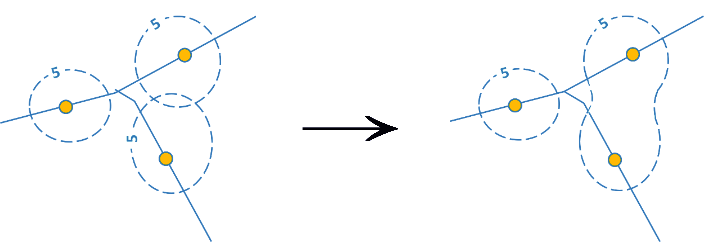
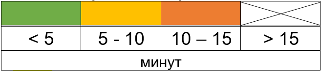
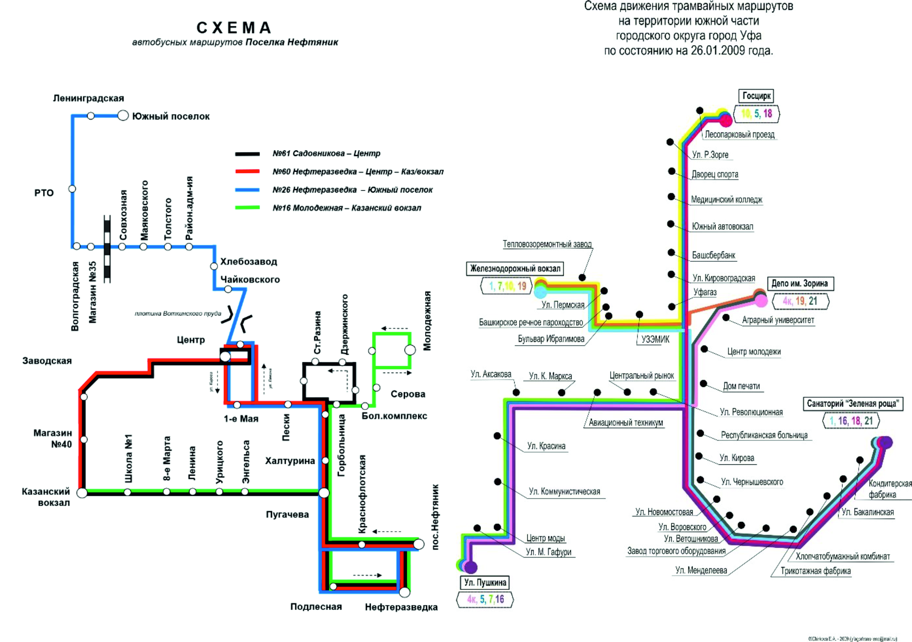
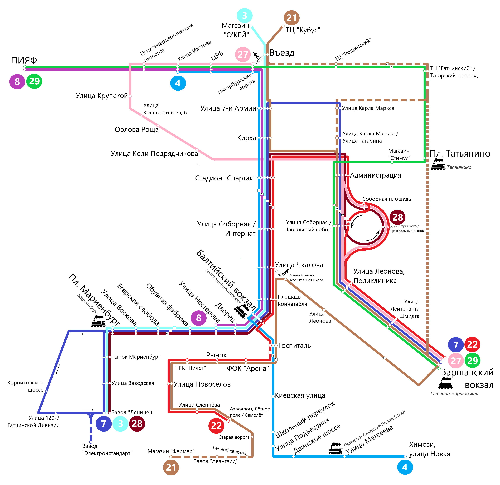

# Транспорт в городе {#transport}

## Теоретическая часть

Развитая транспортная инфраструктура является одним из ключевых условий жизнеобеспечения городов. В
условиях высокой плотности застройки и, как правило, низкой плотности дорожной сети (отношение протяжённости дорог к площади), обеспечение качественного общественного транспорта является важнейшей задачей городского транспортного комплекса.

Во многих российских городах общественный транспорт стремительно теряет свою популярность по ряду причин: износ автопарка, низкий уровень комфортности для пассажиров в транспорте и на остановках, неудобная организация маршрутной сети и расписания, наличие нелегальных перевозчиков, несоблюдение требований безопасности и комфорта пассажиров.

Эту тенденцию подтверждает официальная статистика: по мере роста автомобилизации население городов «пересаживалось» с общественного транспорта на личные автомобили. С 2008 по 2018 гг. доля автобусных перевозок сохранилась, однако произошло замещение электрического общественного транспорта (с 29,7% до
17,9%) личными автомобилями (с 30,1% до 41,9%). Наиболее сильно сократился пассажиропоток на трамваях и троллейбусах, которые в силу своей экологичности ближе всего стоят к целевой функции городского общественного транспорта - сокращению расходов ресурсов при перевозках. Однако уже сегодня в России есть проекты «экологизации» общественного транспорта, которые пока, правда, носят единичный характер -- с 2018 года в Москве запущено движение электробусов - автобусов, полностью работающих на электрической тяге.

В российских городах очень разный уровень автомобилизации.[^transport-1] Так, во Владивостоке этот показатель в 3 раза больше, чем в Махачкале. Средняя автомобилизация по стране составляет 297 автомобилей на 1000 человек. Уровень автомобилизации в Москве находится чуть выше среднероссийского и составляет 298 автомобилей. Московская область имеет более высокий показатель - 355 автомобилей. Уровень автомобилизации в столице сдерживается транспортными проблемами и транспортной политикой. Это связано с высокой плотностью населения, структурой улично-дорожной сети и большим количеством автомобилей, которые в течение будних дней въезжают в город из Московской области. Все это приводит к тому, что уровень автомобилизации непосредственно населения Москвы отстает от многих российских городов. Например, автомобилизация в Самаре составляет 334 автомобилей на 1000 жителей, а Санкт-Петербурге -- 321. 

[^transport-1]: Показатель количества автомобилей на 1000 жителей города рассчитан на
основе данных аналитического агентства «Автостат» по данным на 2018 год.

Крупнейшие города уступают более мелким по уровню автомобилизации не только в России. Город Нью-Йорк обладает одним из самых низких показателей количества автомобилей на 1000 жителей среди всех городов США (без учета метрополитенского ареала). 

Таблица 5.1. Автомобилизация городов мира, 2017 г.

|                    |     Автомобилизация (кол-во личных   автомобилей на 1000 жителей)    |
|--------------------|:--------------------------------------------------------------------:|
| Сиэтл              |                                  743                                 |
| Денвер             |                                  717                                 |
| Лос-Анжелес        |                                  595                                 |
| Нью-Йорк           |                                  305                                 |
| Лондон             |                                  302                                 |

Лондон имеет еще более низкий уровень автомобилизации - ниже среднего по Великобритании (469 автомобилей). Личный автомобиль становится наименее удобным видом транспорта в пространствах с высокой плотностью населения и проигрывает конкуренцию общественному транспорту.

Низкая транспортная связность удаленных городских районов, стремительно выросшая автомобилизация и
неподготовленность систем организации дорожного движения (режим работы светофоров, малое количество односторонних улиц, низкая эффективность управления парковочным пространством) -- все эти факторы создают предпосылки к возникновению транспортных заторов. Эффективно организованная работа системы общественного транспорта может в значительно мере решить транспортные проблемы крупных городов, однако для того, чтобы она полностью соответствовала их потребностям требуется детальная проработка всех ее элементов.

Согласно нормативным документам, регламентирующим деятельность транспорта в городе, из любой его
точки должна обеспечиваться 15-минутная доступность до остановок общественного транспорта. Однако этот норматив выполняется не везде -- где-то в силу быстрорастущего населения и активного жилищного строительства, не подкрепленного развитием городской инфраструктуры, где-то в результате реорганизации городской транспортной системы, отмены маршрутов, ликвидации отдельных видов транспорта.

## Практическая часть

**Методические рекомендации для формулировки и выполнения задания:**

Объектом исследования
может быть выбран один или несколько видов общественного транспорта. В качестве
территории для исследования может выступать:

- весь город (рекомендовано, если численность населения в вашем городе не превышает 100-150 тыс. чел.)

- отдельный микрорайон/район/часть города (рекомендовано, если численность населения в вашем городе превышает 100-150 тыс. чел.). В данном варианте предпочтение отдается удаленным от центра частям города, наиболее вероятно испытывающим проблемы с транспортным сообщением.

Задание может выполняться участниками индивидуально или в группах.

Учащимся предлагается построить карты внутригородской/внутрирайонной пешей доступности остановок общественного транспорта, выявить «лакуны» доступности общественного транспорта (территории, не имеющие транспортного сообщения с остальным городом/районом) путем построения изохрон пешей доступности от остановок
(линий равного временного расстояния), с учетом выявленных «лакун», по возможности, предложить оптимальную схему организации движения общественного транспорта в городе/районе.

**Оборудование и материалы:**

Бумага А4 или А3 (1 лист для карты, 1 лист для схемы), линейка, простой карандаш, цветные карандаши. 

**Этапы выполнения задания**

**1. Составление карты остановок общественного транспорта**

На листах размера А4 учащимся необходимо в масштабе нанести основные элементы планировочного каркаса
- все улицы, по которым осуществляется движение общественного транспорта. Остальные улицы могут быть отражены схематично, высокая детализация не требуется. В качестве источника информации рекомендуется использовать печатные карты города или картографические онлайн-сервисы (Google Maps, OpenStreetMap, Яндекс). Создание карты должно происходить с обязательным учетом правил оформления карт.

На полученной карте ученики отмечают остановки общественного транспорта. Рекомендации к выполнению:

- Если рассматривается несколько видов транспорта необходимо отразить их разными условными знаками в легенде.

- При мелком масштабе густое скопление остановок может быть картировано одним условным знаком.

- В случае, когда исследуется отдельный район города, необходимо учитывать доступность его периферийных территорий до остановок городского транспорта соседних районов (см. пример оформления готового задания:
северная часть Пашковского района тяготеет к системе городского транспорта соседних районов).

Источники информации о расположении остановок:

- Картографические онлайн-сервисы (Google Maps, OpenStreetMap, Яндекс, 2ГИС)

- Данные сайтов администраций муниципальных образований и городов, служб управления и обслуживания городского транспорта вашего города, данные компаний-перевозчиков (например, [www.m.gortransperm.ru](http://www.m.gortransperm.ru), [www.udmavtotrans.ru/raspisanie](http://www.udmavtotrans.ru/raspisanie))

- Данные сайтов-интеграторов информации об общественном транспорте ([www.marsruty.ru](http://www.marsruty.ru), [www.wikiroutes.info](http://www.wikiroutes.info) и др.)

- Полевые наблюдения учащихся (преимущественно для малых городов и сельских населенных пунктов).

**2. Зонирование территории по доступности общественного транспорта**

На полученных картах учащимся необходимо провести изохроны пешей доступности общественного
транспорта -- линии равного временного расстояния от каждой остановки, равной 5, 10, 15 минутам (сечение изохрон составляет 5 мин). Изолинии изображаются
пунктирной линией одним цветом, каждая изолиния подписывается.

В рамках выполнения задания принимается, что средняя скорость пешехода составляет 4,2 км/ч,
следовательно, за 5 минут он проходит 350 м, за 10 минут - 700 м, а за 15 минут - около 1 км. При расчетах расстояний в масштабе стоит учесть, что в условиях квартальной застройки оно преодолевается за большее время, чем по прямой улице. Поэтому, когда измерение расстояния проходит не вдоль транспортной магистрали, а через застроенные кварталы, необходимо применить понижающие коэффициенты, нивелирующие погрешности измерений.

Таблица 5.2. Понижающие коэффициенты для построения изохрон

| Тип населённого пункта         | Коэффициент |
|:-------------------------------|:-----------:|
| Городской населенный пункт     | 0,7         |
| Пгт, сельский населенный пункт | 0,8         |

Изохроны учащимся необходимо отразить от каждой остановки общественного транспорта в масштабе
карты. Перекрывающиеся изохроны одной величины объединяются в общий контур.

Рисунок 5.1. Принципы выделения изохрон

После нанесения на карту линий равного расстояния для большей наглядности учащиеся могут присвоить
цветовые значения каждой зоне удаленности, используя простую четырехцветную шкалу. Территории, удаленные от остановок более чем на 15 минут, не закрашиваются.

Рисунок 5.2. Пример шкалы пешей доступности

**3. Составление схем движения общественного транспорта**

На основании выявленных городских территорий, имеющих низкую доступность услуг общественного
транспорта, учащиеся предлагают варианты оптимизации сети маршрутов с учетом:

а) функционального использования этих территорий, прямо
влияющего на величину спроса на услуги общественного транспорта (селитебная с
выделением подтипов, промышленная, неиспользуемые территории и т.д.);

б) технических свойств общественного транспорта - пассажировместимости.

в) Приветствуется личный опыт участников, полученный в рамках добровольных полевых наблюдений на исследуемой территории.

Предлагаемые учащимися остановки должны быть расположены таким образом, чтобы полностью ликвидировать
участки с текущей доступностью более 15 минут. В случае, если по результатам выполнения предыдущих этапов они были выявлены не у всех участников практикума, они могут перегруппироваться для выполнения этого задания.

Составленная новая схема движения общественного транспорта должна быть максимально информативна и понятна, содержать элементы инфографики. К схемам не предъявляются жесткие требования по наличию обязательных элементов, как при составлении карт, однако такие элементы как название и легенда должны присутствовать во всех работах участников практикума.

**Пример оформления выполненного задания**

Карта города/района с обязательным соблюдением масштаба, на которой:

а) Присутствуют обязательные элементы оформления карты: рамка, название, год создания, масштаб, легенда, направление на север и пр.;

б) Приведено схематичное изображение основных улиц города, по которым осуществляется движение общественного транспорта;

в) Нанесены все остановки общественного транспорта;

г) Нанесены изохроны транспортной доступности от остановок общественного транспорта 5, 10 и 15-минутной доступности.

Схема маршрутов общественного транспорта города/района, составленная с учетом оптимизации маршрутной сети по результатам анализа транспортной доступности.

Рисунок 5.3 Пример оформления итогового задания по составлению карт доступности общественного транспорта

На основании проведенного зонирования учащиеся делают выводы:

- О плотности сети общественного транспорта в городе/районе.
- О доминировании одного или нескольких видов транспорта.
- О наличии или отсутствии территорий, имеющих плохую доступность общественного транспорта.
- О наличии транспортных осей в городе / районе, на которых наблюдаются дублирующиеся маршруты одного или нескольких видов
транспорта.

Выводы по проделанной работе могут быть представлены учащимися в разных форматах (на усмотрение учителя): защита проектов, устное или письменное сообщение, дискуссии с учителем и другими учениками.

Рисунок 5.4 Примеры оформления итогового задания по составлению схем
общественного транспорта
