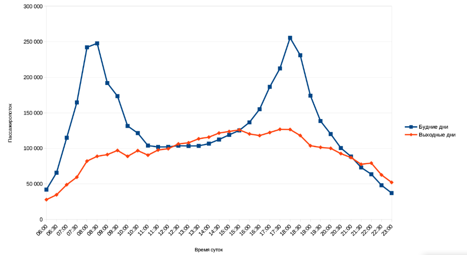
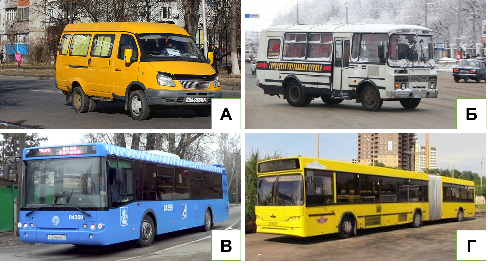
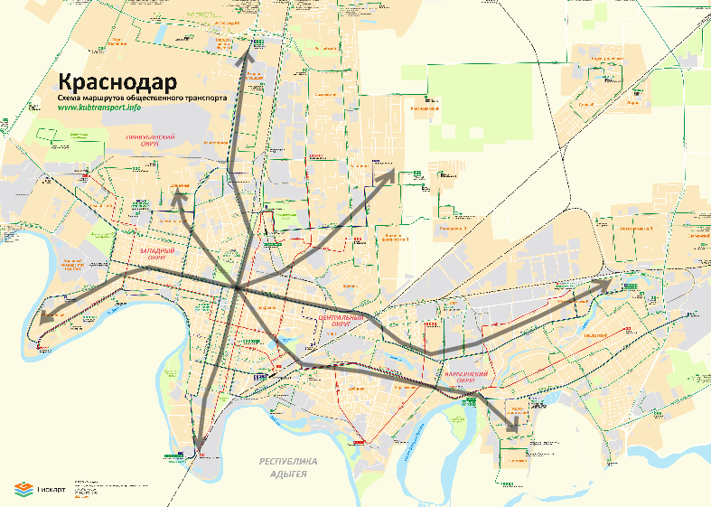
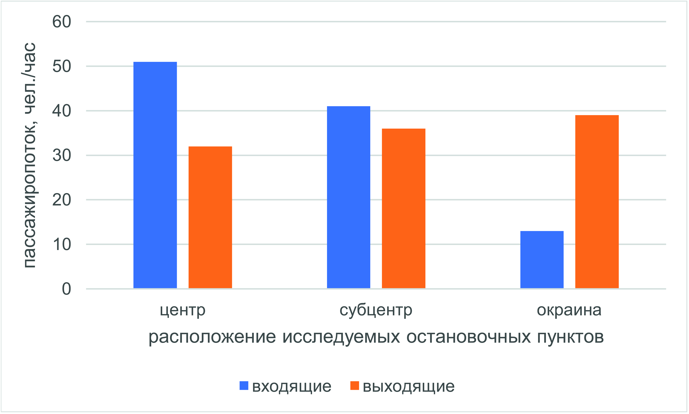

# Внутригородские миграции{#migration}

## Теоретическая часть

Современные города сложно представить без ежедневной необходимости совершать поездки из одних районов в другие. Увеличение скорости транспортных средств и сокращение удельных издержек перевозок стали основными факторами сдвига в территориальной мобильности. Изменился облик городов: компактные средневековые поселения с преобладанием пешеходных связей уступили место разросшимся вдоль транспортных путей урбанизированным ареалам.

Миграция при рассмотрении на уровне города подразумевается в широком смысле -- в качестве передвижения населения между территориями, которое характеризуется определённой интенсивностью и направленностью. По частотности подобные перемещения внутри города обычно подразделяются на 2 основных типа: *эпизодические* (не носят систематического характера, т.е. не исполняются периодически в строго определенное время; обычно к такому типу относятся поездки в магазины, больницы, к друзьям) и *маятниковые* (ежедневные регулярные маршруты, соединяющие место жительства с местом приложения труда).

Аналогичные типы миграций преобладают и в пределах городских агломераций. Их основными отличиями от внутригородских миграций являются более высокая длительность подобных перемещений (по времени и расстоянию), обусловленная отсутствием единой транспортной системы, и как следствие более высокая стоимость таких поездок. Высокая плотность населения на окраинах с одной стороны, и сверхконцентрация центральных функций в ядрах агломераций с другой становятся причинами высокой нагрузки на инфраструктуру таких городов (примерами могут служить пробки «из области в Москву» в утренние часы-пик и заполненный до предела пассажирами общественный транспорт).

Ежедневно городские жители совершают перемещения с различными целями, которые не всегда могут быть причислены к одному из типов. Подобные поездки могут совершаться как эпизодически, так и регулярно. Наиболее общепринятой является следующая классификация видов миграции:

*Трудовая* (экономическая, деловая) -- поездки на рабочее место и по рабочим делам в течение дня;

*Учебная* (образовательная) -- поездки на место учёбы (в школу, университет, к репетитору);

*Рекреационная* -- поездки с целью отдыха, развлечений или культурно-познавательные (походы в музеи, театры);

*Бытовая* -- посещение родственников и друзей, прочие личные дела;

*Потребительская* -- покупка товаров и услуг (в том числе в области здравоохранения, посещение государственных учреждений).

Среди вышеуказанных видов миграции преобладает трудовая. Несоответствие места жительства и приложения труда является основной причиной ежедневных маятниковых миграций внутри города.

Таким образом, структура внутригородских миграций с одной стороны определяет транспортный каркас, а с другой стороны, уже сложившаяся транспортная система влияет на структуру миграций внутри города. Другими факторами, определяющими характер и направленность миграций, могут являться, плотность населения, взаимное расположение основных функциональных зон и планировка города.

Выявление структуры внутригородских миграций требует анализа загруженности транспортной системы города в течение дня. Для этого необходим подсчёт пассажиропотока (количества пассажиров за определённый промежуток времени, обычно за час) для конкретного пункта или направления.

Рисунок 7.1 Суточная динамика пассажиропотока с выраженными часами-пик Источник: ЗАО «Коммет». Статистика Петербургского метрополитена[^migr-1]

[^migr-1]: URL: <http://kommet.ru/stats> (дата обращения 03.11.2018 г.)

Суточный ход пассажиропотока обычно характеризуется двумя выраженными максимумами в утреннее и вечернее время (*часы-пик*). Именно в эти промежутки времени горожане массово совершают трудовые и учебные миграции. Утром они направлены от жилых районов к основным местам концентрации рабочих мест, а вечером наоборот[^migr-2]. Кроме пассажиропотока общественного транспорта индикатором часов-пик является загруженность автомобильных дорог (например, оценка сервисов Яндекс.Пробки и Google Maps).

[^migr-2]: Важно отметить, что обычно вечерний час-пик в большинстве современных городов является более продолжительным, чем
утренний: время окончания рабочего дня заметно различается в зависимости от вида деятельности; кроме того, многие предпочитают заниматься личными делами после работы.

Отдельной динамикой пассажиропотока и загруженности городских магистралей обладают выходные дни. Часы-пик в таком случае обычно не выражены, максимальный объем миграций приходится на дневное и вечернее время (с 13 по 18 часов), когда горожане занимаются личными делами.
Тем не менее, в крупнейших агломерациях в последние годы заметна тенденция
роста утреннего пассажиропотока в условиях «плавающего» или ненормированного рабочего графика.

Помимо этого, существует и годовая динамика пассажиропотоков -- максимальная нагрузка на транспортную сеть приходится на зимнее время, когда интенсивность миграций осложняется неблагоприятными погодными условиями, в результате чего увеличивается аварийность на дорогах, снижается скорость перевозок, а многие пассажиры предпочитают в связи с этим пользоваться общественным транспортом[^migr-3]. В летнее время, напротив, интенсивность внутригородских перевозок обычно снижается -- в сезон отпусков численность постоянного населения городов сокращается. Однако объем пригородных перевозок увеличивается, в особенности в пятницу и выходные дни, за счет дачных миграций.

[^migr-3]: Абсолютный годовой максимум загруженности дорог в большинстве российских городов приходится на рабочие дни
последних недель перед Новым годом. Увеличение мобильности населения, стремящегося приобрести подарки родным и близким, зачастую сопровождается «коллапсом» на дорогах после сильных снегопадов и метелей.

Определение направленности внутригородских миграций происходит в зависимости от разницы пассажиропотока остановочного пункта «на вход» и «на выход». Если в утреннее время гораздо больше число тех пассажиров, которые приезжают на остановку или станцию (пассажиропоток «на выход»), то территория вокруг транспортного узла скорее всего носит административно-деловые функции. Для вечерних часов-пик в подобных зонах наблюдается обратная картина. В селитебных зонах аналогичным образом с утра основная часть потока приходится «на вход», а вечером -- «на выход».

Несмотря на значительный рост уровня автомобилизации населения в последние 20 лет, доля россиян, ежедневно использующих общественный транспорт для поездок по городу, остаётся высокой (около 50-60%)[^migr-4].
Примерно 30% населения использует личный автотранспорт, ещё около 10% передвигается пешком.

[^migr-4]: По данным Левада-Центра. URL: <https://www.levada.ru/2017/09/27/transport-i-transportnye-problemy/> (дата обращения 03.11.2018 г.)

Подсчёты пассажиропотока общественного транспорта ведутся исходя из его примерной загруженности (% от максимальной вместимости; см. таблицу 7.1).

Таблица 7.1. Классификация общественного транспорта по пассажировместимости

| Класс по пассажиро-вместимости | Виды общественного транспорта               | Примерная пассажиро-вместимость 1 ед., чел. | Внешний вид (рисунок 7.2) |
|--------------------------------|---------------------------------------------|---------------------------------------------|---------------------------|
| Малый                          | Микроавтобусы («маршрутки»)                 | 20-30                                       | А                         |
| Средний                        | Небольшие автобусы                          | 30-60                                       | Б                         |
| Большой                        | Автобусы, троллейбусы, одиночные трамваи    | 60-90                                       | В                         |
| Особо большой                  | Сочленённые автобусы, троллейбусы, трамваи,  вагон метрополитена | 90-180                 | Г                         |

Рисунок 7.2. Классы вместимости автобусного транспорта

Другой важной характеристикой внутригородских миграций является количество транспортных средств на маршруте (величина, обратная показателю интервала движения -- времени между отправлением рейсов одного маршрута). В сочетании с вместимостью транспортных средств, эти две характеристики демонстрируют интенсивность миграции по выбранному направлению: чем выше произведение двух показателей, тем больше величина миграций из одного района в другой.

## Практическая часть

**Методические
рекомендации для формулировки выполнения задания:**

Анализ внутригородских миграций требует работы с большими объёмами данных, включающих сведения сервисов
геопозиционирования о движении личного и общественного транспорта. Для отслеживания ежедневных миграций в пределах города и агломерации также могут использоваться данные сотовых операторов.

Целью занятия является знакомство в первую очередь с полевыми методами оценки интенсивности и направленности
внутригородских миграций. Это позволит сформировать целостную картину о мобильности населения внутри города, основываясь на непосредственных наблюдениях школьников.

Объектом изучения каждой группы школьников станет одно из направлений внутригородских миграций в поселении. С
учётом различного масштаба городов учителю предлагаются на выбор следующие категории населения, как объекты исследования:

1. пешеходы (для сельских поселений и малых городов)

2. пользователи общественного транспорта (для средних и крупных городов)

При условии участия в занятии более 10 человек исследование может проводиться в малых группах (5-6 человек). Каждая
группа выбирает одно из основных направлений внутригородской миграции для последующего анализа. Затем полученные данные могут быть сопоставлены для получения комплексной картины внутригородской мобильности горожан.

Время, отведённое на данное занятие, составляет 6 академических часов, включая 2 часа на выступления школьников и 2 часа на проведение замеров в полевых условиях. При работе над заданиями школьники могут использовать материалы предыдущих занятий
(плотность населения, изучения городского транспорта, функциональное зонирование).

**Этапы выполнения задания:**

1. Подготовительный

*А) Выбор направления*

Для корректного выбора направления миграций учитель подготавливает для школьников схему общественного транспорта
поселения. В случае малых городов и сельских поселений используются планировочные схемы населённых пунктов.

Далее учащиеся выбирают одно из направлений типа «центр города -- отдалённый микрорайон». Оно определяется по
конечным остановкам магистральных маршрутов, отражённых на схемах и числу маршрутов в каждом направлении. Стоит отметить, что подобные схемы не всегда включают все маршруты общественного транспорта (могут отсутствовать данные по коммерческим перевозчикам). В этом случае рекомендуется использовать данные картографических сервисов (Яндекс.Карты, 2ГИС и другие).

Задача учащихся каждой группы на данном этапе состоит в выделении направления для последующего анализа (прохождение
всех маршрутов, соединяющих конечные пункты по одной траектории необязательно (см. рисунок 7.3).

Рисунок 7.3. Пример схемы общественного
транспорта города с выделенными направлениями. Источник: Общественный транспорт
Адыгеи и Кубани[^migr-5]

[^migr-5]: <http://www.kubtransport.info/schemes/krasnodar2014_center.gif> (дата обращения 03.11.2018 г.)

*Б) Определение объема потенциального пассажиропотока выбранного направления*

Для дальнейшего анализа необходимо собрать данные о потенциальном пассажиропотоке общественного транспорта с
помощью анализа существующих маршрутов, связывающих выбранные конечные пункты. В таком случае мы предполагаем, что в соответствии с правилами формирования рыночного спроса, величина потенциального пассажиропотока будет максимально приближена к реальной величине миграций между районами (т. е. даже субсидируемые из бюджета муниципальные маршруты так же отражают реальные
пассажиропотоки между районами города).

В целях экономии времени для расчёта потенциального пассажиропотока направления предлагается заполнение таблицы XXX,
в которой для каждого маршрута по направлению указывается класс
пассажировместимости (используется среднее значение вместимости для класса) и
количество рейсов в час в течение утреннего (с 7 до 10 часов) или вечернего (с
17 до 20 часов) часов-пик. Итоговая ёмкость направления представляет сумму
значений, указанных в столбце «пассажиропоток, чел./час».

Источником данных является информация о маршрутах общественного транспорта, которая обычно находится на сайтах
администраций муниципальных образований. В случае ее отсутствия таблица 7.2 заполняется «экспертным путём» на основе знаний школьников и учителей о транспорте в их
городе.

Таблица 7.2

| № маршрута | Класс пассажиро-вместимости (таблица XXX) | Интервал, мин | Количество рейсов в час (60/интервал), шт. |  Пассажиропоток, чел./час (класс пассажиро-вместимости\*количество рейсов)  |
|------------|-------------------------------------------|---------------|--------------------------------------------|-------------------------------------------------------|
| ...        | ...                                       | ...           | ...                                        | ...                                                   |

Для оптимизации расчетов предлагается ограничить число выделенных направлений тремя на группу. В таком случае, если
занятие проходит с небольшим число участников, учитель помогает школьникам определить основные направления внутригородских миграций (обычно, крупнейшие микрорайоны).

Для занятий в сельской местности и малых городах данный пункт практикума не выполняется. Определение потенциала
направления производится на основе замеров потока пешеходов при полевых наблюдениях.

2. Полевые измерения

Следующим этапом является проведение измерений на местности для подтверждения гипотез о характере и направленности
выбранного направления внутригородских миграций.

Участникам предлагается при помощи учителя выбрать до 3 остановочных пунктов на одном из выделенных направлений миграций. Условием отбора является их взаимное расположение -- одна их точек должна располагаться в «центральной зоне», где выражены деловые функции, вторая в нейтральной зоне «расширенного центра», третья в районе с выраженными селитебными функциями.

Для каждого из остановочных пунктов в течение 20 минут предлагается вести замеры пассажиропотока общественного
транспорта. Измерения должны быть синхронизированы и проводиться в вечерние часы-пик (наиболее удобное с учётом расписания учебных занятий время между 17 и 19 ч). Учитывая время суток, необходимо вести измерения на остановочных пунктах в направлении «из центра на окраину».

Таблица 7.3

| № Маршрута | Число вошедших | Число выходящих | Общий пассажиропоток | Разница |
|------------|----------------|-----------------|----------------------|---------|
| ...        | ...            | ...             | ...                  | ...     |

Учащимся предлагается заполнить таблицу Y, куда вносится число вошедших и
вышедших пассажиров из каждого транспортного средства в течение периода
измерений. По итогам измерений вычисляются суммы по каждому столбцу, которые
затем приводятся к значению пассажиропотока в час (умножаются на 3). Далее
полученные показатели сопоставляются для 3 остановочных пунктов изучаемого
направления. Особое внимание школьников должно быть обращено на разницу
входящих и выходящих пассажиров на остановочном пункте.

В случае малых городов и сельских
поселений в ходе полевых наблюдений производятся замеры числа пешеходов,
двигающихся по направлениям «центр-окраина» и «окраина-центр». Для этого, с
помощью учителя выбираются три аналогичные точки на одном из направлений,
определенных в п.1.

Таблица 7.4

| Число пешеходов в направлении центр-окраина | Число пешеходов в направлении окраина-центр | Общий пассажиропоток | Разница |
|---------------------------------------------|---------------------------------------------|----------------------|---------|
| ...                                         | ...                                         | ...                  | ...     |

3. Камеральная обработка

Итогом работы всех участников должна стать общая карта ёмкости основных направлений внутригородской миграции. Каждая
группа должна подготовить выступление, в котором будет отражено место конкретного направления во внутригородских миграциях, охарактеризованы основные источники пассажиропотока на исследованных остановочных пунктах. Школьники описывают различия входящего и выходящего потока на каждой остановке в виде диаграмм, а также делают выводы о функциональном назначении территорий вокруг
исследуемых пунктов.

По желанию, участники практикума могут также выполнить творческое аналитическое задание. На основе данных наблюдений,
умений и навыков, полученных в ходе практикума, а также знаний о родном городе школьникам предлагается составить диаграмму, отражающую суточный ход пассажиропотока для одного (по выбору) остановочного пункта в рамках исследуемого
направления. По оси абсцисс откладывается время с шагом в 1 ч, а по оси ординат пассажиропоток, чел./час. Предполагается, что в ходе подведения результатов практикума, школьники могут выступить перед группой с диаграммой, пояснив причины подобного
хода пассажиропотока в течение дня.

**Необходимые материалы:** простой карандаш, цветные карандаши, бумага, планшеты, часы (таймер для проведения замеров)

**Пример оформления выполненного задания**:

Пример заполненной таблицы 7.2

| № маршрута | Класс пассажировместимости (таблица XXX) | Интервал, мин | Количество рейсов в час (60/интервал), шт. | Пассажиропоток, чел./час (класс пассажировместимости \* количество рейсов)  |
|:----------:|:----------------------------------------:|:-------------:|:------------------------------------------:|:------------------------------------------:|
| 30         | Особо большая (135)                      | 5             | 12                                         | 1620                                       |
| 47         | Малая (25)                               | 20            | 3                                          | 75                                         |

Сумма = 1695 чел./час

Пример заполненной таблицы 7.3

| № Маршрута | Число вошедших | Число выходящих | Общий пассажиропоток | Разница |
|:----------:|:--------------:|:---------------:|:--------------------:|:-------:|
| 30         | 14             | 4               | 18                   | 10      |
| 47         | 5              | 1               | 6                    | 4       |

Сумма пассажиропотока = 72 чел./час

Пример заполненной таблицы 7.4

| Число пешеходов в направлении центр-окраина | Число пешеходов в направлении окраина-центр | Общий пассажиропоток | Разница |
|:-------------------------------------------:|:-------------------------------------------:|:--------------------:|:-------:|
| 54                                          | 14                                          | 68                   | 40      |

Сумма пассажиропотока = 204 чел./час

Пример диаграммы пассажиропотоков в вечерний час-пик

