# О пособии {.unnumbered}

Руководство по проведению практикума по геоурбанистике для учителей географии, педагогов дополнительного образования.

[*НАДО дать регалии авторов (степени, знания, должности и места работы)*]{.ul}

[*В апробации пособия принимали участие: 1. Тищенко Надежда Ивановна, учитель географии ГБОУ «Школа №.....», 2. Григорьева Анастасия Владимировна, учитель географии ГБОУ «Школа №.....», 3. Шуванова Ольга Владимировна, учитель географии ГБОУ «Школа №.....», 4. Тимошенко Ирина Васильевна, учитель географии ГБОУ «Школа №.....»*]{.ul}

**Ссылка на грант**

**МОЖНО ПОМЕНЯТЬ НАЗВАНИЕ ПРАКТИКУМА**

```{r include=FALSE}
# automatically create a bib database for R packages
knitr::write_bib(c(
  .packages(), 'bookdown', 'knitr', 'rmarkdown'
), 'packages.bib')
```

# Введение {.unnumbered}

География городов (геоурбанистика) является комплексным научным направлением, объединяющим исследовательский аппарат географии, истории, экономики, обществознания. В России, где ¾ населения -- горожане, проблемы городов особенно актуальны, неслучайно они всё чаще привлекают внимание молодого поколения. С многими насущными проблемами городов школьники сталкиваются почти ежедневно, поэтому реализация содержания практикума позволит, под руководством учителя, проводить обучающимся учебные исследования на регулярной основе.

Настоящее учебное пособие разработано для учителей географии образовательных организаций, расположенных в городской местности, для проведения факультативных занятий по географии городов (геоурбанистике) с группами школьников, проявляющих повышенный интерес к изучению географии, выбравших географию как элемент будущей профессиональной подготовки.

Особое внимание при реализации программы практикума следует уделять организации учебных экскурсий и практических исследований, особенно полевых наблюдений, в рамках которых требуется не только продуманная организация работ, но и соблюдение требований техники безопасности. Специальные инструкции по выполнению полевых работ приведены в соответствующих тематических разделах пособия.

Практикум адаптирован для школьников и с учётом междисциплинарных связей географии с другими учебными предметами. Для учителей и учеников обеспечивается вариативность содержания индивидуальных задач и чёткое распределение ролей исполнителей в коллективных исследованиях.

Пособие построено по принципу «конструктора»: учитель может изменять содержание занятий в зависимости от возрастного состава и уровня теоретической подготовки групп школьников, доступного графика проведения занятий, внешних условий для полевых исследований, особенностей исследуемой местности, специфики проблем территории дислокации школы, материально-технической обеспеченности исследований и т.д. В зависимости от размера и состава групп также можно существенно варьировать объёмы и виды детальности исследований, комбинировать индивидуальную и коллективную работу, организовывать разделение видов деятельности, совместную работу школьников разного возраста.

## Методические рекомендации {.unnumbered}

Появление в школьной практике элементов проектного обучения, специальных профильных образовательных программ, введение в программы курсов таких понятий как устойчивое развитие, цели и вызовы мирового устойчивого развития, актуализируют необходимость практической ориентированности учебного процесса. Однако, в настоящий момент нет чёткого понимания специфики организации профильного географического образования в основной и средней школе, а также в системе повышения квалификации и переподготовки педагогических кадров.

Определённо, профильное географическое образование носит междисциплинарный характер и находит отражение в содержании многих школьных предметов: истории, обществознании, экологии, биологии, химии, физики, экономики, информатики. География как школьный предмет имеет серьёзные возможности стать системообразующего в формировании верного и истинного представления о современном мире, а также комплексного и системного понимания всех природных и социально-экономических процессов, что формирует правильную картину мира.

В виду значимости и актуальности проблем урбанизации географическое образование должно строиться на принципах системности, непрерывности и целенаправленности процесса, цель которого -- сформировать у обучающихся географическую и экологическую грамотность, развить социальные компетенции через ответственное отношение к окружающей среде.

Основными направлениями реализации занятий практикума «МОЙ ГОРОД -- ГЕОГРАФИЧЕСКАЯ ЛАБОРАТОРИЯ» являются:

-   развитие познавательного интереса к обучению в целом, формирование функциональной грамотности;

-   подготовка к решению разного уровня контрольно-измерительных материалов, олимпиадных заданий по географии;

-   приобретение знаний и навыков, освоение способов деятельности для решения практических, жизненных задач, уход от традиционного школьного «академизма»;

-   возможности успешной карьеры выпускника и учителя, продвижения на рынке труда;

-   интеграция основного и дополнительного географического образования;

-   профессиональная ориентация обучающихся;

-   формирование целостной научной картины мира.

## Цели и задачи {.unnumbered}

Цель практикума «МОЙ ГОРОД -- ГЕОГРАФИЧЕСКАЯ ЛАБОРАТОРИЯ» --- сформировать комплексное мышление, географическую культуру личности обучающегося на материалах о городской среде и ее трансформации. Выполнение заданий практикума позволяет решить задачи профильной и профессиональной ориентации, стимулирует приобретение навыков будущей профессиональной и научно-исследовательской деятельности, даёт возможность понять механизмы процессов, происходящих в городской среде.

Содержание практикума можно рассматривать как элемент непрерывного географического образования в условиях интеграции основного и дополнительного образования. Выполнение заданий практикума стимулируют учебно-исследовательскую деятельность обучающихся, позволяет достичь качественных образовательных результатов по географии, истории, экологии, обществознанию, краеведению, а также формирует опыт социального взаимодействия у старшеклассников.

Задачи практикума:

-   создать условия для повышения качества географического образования через развитие географической культуры личности школьника, удовлетворения его образовательных потребностей и формирование индивидуальной образовательной траектории развития;

-   сформировать мотивацию учащегося на непрерывность образования и развитие профессиональных компетенций для выполнения будущей профессиональной научно-исследовательской и научно-практической деятельности через раскрытие важности овладения географическими знаниями и методами географического анализа для принятия решений в междисциплинарном проблемном поле и в повседневной жизни;

-   дополнить знания обучающихся о природных, социальных и экономических факторах, влияющих на пространственную организацию хозяйства современного города;

-   показать современные тенденции процесса мировой урбанизации и место Российской Федерации в этом процессе;

-   увеличить количество обучающихся, вовлеченных в предпрофильную, профильную и профориентационную работу по приоритетным научным направлениям через практическую деятельность.

В ходе освоения содержания и выполнения заданий практикума «МОЙ ГОРОД -- ГЕОГРАФИЧЕСКАЯ ЛАБОРАТОРИЯ» согласно требованиям Федерального государственного образовательного стандарта основного общего образования (ФГОС ООО) обучающиеся должны достичь личностных, метапредметных и предметных результатов.

1.  Личностные результаты освоения содержания практикума отражают осознание российской гражданской идентичности; готовность обучающихся к саморазвитию, самостоятельности и личностному самоопределению; ценность самостоятельности и инициативы; наличие мотивации к целенаправленной социально-значимой деятельности; сформированность внутренней позиции личности как особого ценностного отношения к себе, к окружающим людям и к жизни в целом, и формируются по нескольким направлениям:

-   патриотическое воспитание: осознание российской гражданской идентичности в поликультурном и многоконфессиональном обществе, проявление интереса к познанию родного языка, истории, культуры Российской Федерации, своего края, народов России; ценностное отношение к достижениям своей Родины -- России, к науке, искусству, боевым подвигам и трудовым достижениям народа; уважение к символам России, государственным праздникам, историческому и природному наследию и памятникам, традициям разных народов, проживающих в родной стране;

-   гражданское воспитание: готовность к выполнению обязанностей гражданина и реализации его прав, уважение прав, свобод и законных интересов других людей; активное участие в жизни семьи, образовательной организации, местного сообщества, родного края, страны; неприятие любых форм экстремизма, дискриминации; понимание роли различных социальных институтов в жизни человека; представление об основных правах, свободах и обязанностях гражданина, социальных нормах и правилах межличностных отношений в поликультурном и многоконфессиональном обществе; готовность к разнообразной совместной деятельности, стремление к взаимопониманию и взаимопомощи, активное участие в школьном самоуправлении; готовность к участию в гуманитарной деятельности (волонтерство; помощь людям, нуждающимся в ней);

-   духовно-нравственное воспитание: ориентация на моральные ценности и нормы в ситуациях нравственного выбора; готовность оценивать свое поведение и поступки, а также поведение и поступки других людей с позиции нравственных и правовых норм, с учетом осознания последствий поступков; активное неприятие асоциальных поступков, свобода и ответственность личности в условиях индивидуального и общественного пространства;

-   эстетическое воспитание: восприимчивость к разным видам искусства, традициям и творчеству своего и других народов, понимание эмоционального воздействия искусства; осознание важности художественной культуры как средства коммуникации и самовыражения; понимание ценности отечественного и мирового искусства, роли этнических культурных традиций и народного творчества; стремление к самовыражению в разных видах искусства;

-   ценности научного познания: ориентация в деятельности на современную систему научных представлений об основных закономерностях развития человека, природы и общества, взаимосвязях человека с природной и социальной средой; овладение языковой и читательской культурой как средством познания мира; овладение основными навыками исследовательской деятельности, установка на осмысление опыта, наблюдений, поступков и стремление совершенствовать пути достижения индивидуального и коллективного благополучия;

-   физическое воспитание, формирование культуры здоровья и эмоционального благополучия: осознание ценности жизни; ответственное отношение к своему здоровью и установка на здоровый образ жизни (здоровое питание, соблюдение гигиенических правил, сбалансированный режим занятий и отдыха, регулярная физическая активность); осознание последствий и неприятие вредных привычек (употребление алкоголя, наркотиков, курение) и иных форм вреда для физического и психического здоровья; соблюдение правил безопасности, в том числе навыки безопасного поведения в интернет-среде; способность адаптироваться к стрессовым ситуациям и к меняющимся социальным, информационным и природным условиям, в том числе осмысляя собственный опыт и выстраивая дальнейшие цели;

-   трудовое воспитание: установка на активное участие в решении практических задач (в рамках семьи, школы, города, края) технологической и социальной направленности, способность инициировать, планировать и самостоятельно выполнять такого рода деятельность; интерес к практическому изучению профессий и труда различного рода, в том числе на основе применения изучаемого предметного знания; осознание важности обучения на протяжении всей жизни для успешной профессиональной деятельности и развитие необходимых умений для этого; готовность адаптироваться в профессиональной среде; уважение к труду и результатам трудовой деятельности; осознанный выбор и построение индивидуальной траектории образования и жизненных планов с учетом личных и общественных интересов и потребностей;

-   экологическое воспитание: ориентация на применение знаний из социальных и естественных наук для решения задач в области окружающей среды, планирования поступков и оценки их возможных последствий для окружающей среды; повышение уровня экологической культуры, осознание глобального характера экологических проблем и путей их решения; активное неприятие действий, приносящих вред окружающей среде; осознание своей роли как гражданина и потребителя в условиях взаимосвязи природной, технологической и  социальной сред; готовность к участию в практической деятельности экологической направленности.

2.  Метапредметные результаты освоения содержания практикума отражают освоенные обучающимися межпредметные понятия (используются в нескольких предметных областях и позволяют связывать знания из различных дисциплин в целостную научную картину мира) и универсальные учебные действия (познавательные, коммуникативные, регулятивные); способность их использовать в учебной, познавательной и социальной̆ практике; готовность к самостоятельному планированию и осуществлению учебной деятельности и организации учебного сотрудничества с педагогами и сверстниками, к участию в построении индивидуальной образовательной траектории; овладение навыками работы с информацией: восприятие и создание информационных текстов в различных форматах, в том числе в цифровой среде, с учетом назначения информации и ее целевой аудитории, и формируются по нескольким направлениям:

-   овладение познавательными универсальными учебными действиями: переводить практическую ситуацию в учебную задачу; формулировать вопросы, фиксирующие разрыв между имеющимися необходимыми условиями решения учебной задачи, выявлять дефициты информации; соотносить учебную задачу с мотивами, выдвинутыми проблемами и предположениями, выдвигать предположения о причинах несоответствия желаемым и текущим состоянием объекта, процесса; выявлять элементы / переменные для решения учебной задачи и формулировать вопросы об их значимых признаках; устанавливать связи между элементами, выявлять закономерности и противоречия в наборе фактов, данных, наблюдениях, аргументации; переносить усвоенные алгоритмы, способы действий, формы контроля в новые контексты; самостоятельно конструировать способ решения учебной задачи, (сравнивать несколько вариантов решения, выбирать наиболее целесообразный и эффективный); планировать и учитывать время, последовательность действий необходимых для решения учебной задачи; узнавать учебные задачи, имеющие более одного способа решения, и обосновывать допустимость нескольких вариантов решений; рассматривать несколько вариантов решения учебной задачи; определять их сильные и слабые стороны с целью выбора оптимального решения; находить сходные аргументы, проверять наличие альтернативных аргументов в разных источниках и их обосновывать; проводить по самостоятельно составленному плану опыт, эксперимент, небольшое исследование по установлению особенностей̆ объекта изучения, причинно-следственных связей и зависимостей объектов между собой; формулировать обобщения и выводы по результатам проведенного наблюдения, опыта, исследования; осуществлять логические операции по установлению родовидовых отношений, обобщению и ограничению понятия, группировке понятий по объему и содержанию; выделять признаки предметов (явлений) по заданным существенным основаниям; устанавливать существенный признак классификации, основания для сравнения, критерии проводимого анализа; осуществлять дедуктивные и индуктивные умозаключения в том числе умозаключения по аналогии, приводить аргументы, подтверждающие собственную позицию с учетом существующих точек зрения;

-   овладение регулятивными универсальными учебными действиями: самостоятельно планировать деятельность (намечать цель, создавать алгоритм, отбирая целесообразные способы решения учебной̆ задачи); оценивать средства (ресурсы), необходимые для решения учебной задачи; осуществлять контроль результата (продукта) и процесса деятельности (степень освоения способа действия) по заданным и (или) самостоятельно определенным критериям; устанавливать приоритеты в деятельности, вносить коррективы в деятельность на основе новых обстоятельств, измененных ситуаций, установленных ошибок, возникших трудностей; прогнозировать последствия своих решений и действий; прогнозировать трудности, которые могут возникнуть при решении учебной задачи; объяснять причины успеха (неудач) в деятельности; сравнивать полученные результаты с исходной учебной задачей (достигнуто ли решение, каковы его сильные и слабые стороны);

-   овладение коммуникативными универсальными учебными действиями: владеть смысловым чтением текстов разного вида, жанра, стиля с целью решения различных учебных задач, для удовлетворения познавательных запросов и интересов -- определять тему, главную идею текста, цель его создания; устранять в рамках общения разрывы в коммуникации, обусловленные непониманием / неприятием со стороны собеседника учебной задачи, формы или содержания диалога; выявлять детали, важные для раскрытия основной темы, содержания текста, выступления, диалога; определять жанр выступления и в соответствии с ним отбирать содержание коммуникации, учитывать особенности аудитории; определять содержание выступления в соответствии с его жанром и особенностями аудитории; соблюдать нормы публичной речи и регламент; адекватно теме и ситуации общения использовать средства речевой выразительности для выделения смысловых и эмоциональных характеристик своего выступления; публично представлять полученные результаты практической экспериментальной или теоретической исследовательской деятельности;

-   овладение навыками участия в совместной деятельности: принимать цель совместной деятельности; участвовать в учебном диалоге -- следить за соблюдением процедуры обсуждения, задавать вопросы на уточнение и понимание идей друг друга; сопоставлять свои суждения с суждениями других участников диалога; оценивать полученный совместный результат, свой вклад в общее дело, проявлять уважение к партнерам по совместной̆ работе, самостоятельно разрешать конфликты; владеть умениями осуществлять совместную деятельность (договариваться, распределять обязанности, подчиняться, лидировать, контролировать свою работу); проявлять готовность конструктивно разрешать конфликты;

-   овладение навыками работы с информацией: самостоятельно формулировать основания для извлечения информации из источников, учитывая характер учебной задачи; различать основную и дополнительную информацию, устанавливать логические связи и отношения, представленные в тексте; распознавать истинные и ложные суждения по заданным критериям; использовать знаково-символические средства для представления информации и создания моделей изучаемых объектов, с выделением значимых компонентов и связей между ними; преобразовывать предложенные схематичные модели в текстовый вариант представления информации, а также предложенную текстовую информацию в схематичные модели (таблица, диаграмма, схема); соблюдать правила информационной безопасности.

3.  Предметные результаты освоения содержания практикума отражают освоенные обучающимися в ходе изучения учебного предмета научные знания, умения и способы действий, специфические для данной предметной области; предпосылки научного типа мышления; виды деятельности по получению нового знания, его интерпретации, преобразованию и применению в различных учебных ситуациях, а также при создании учебных и социальных проектов, и формируются по нескольким направлениям:

-   приводить примеры географических объектов, процессов и явлений, изучаемых различными ветвями географической науки;

-   приводить элементарные примеры использования геоинформационных систем (ГИС) в повседневной жизни;

-   использовать планы, топографические и географические карты для получения информации, необходимой для решения учебных и (или) практико-ориентированных задач;

-   находить, извлекать и использовать информацию из различных источников (картографические, текстовые, видео- и фотоизображения, Интернет-ресурсы) необходимую для решения учебных и (или) практико-ориентированных задач;

-   различать изученные географические объекты, процессы и явления;

-   распознавать проявления глобальных проблем человечества на локальном и региональном уровнях и приводить примеры международного сотрудничества по их преодолению;

-   приводить примеры взаимодействия природы и общества в пределах отдельных территорий и давать им объективную оценку в т. ч. влияния природных условий на хозяйственную деятельность населения и экономику семьи;

-   формулировать оценочные суждения о воздействии человеческой деятельности на окружающую среду;

-   выбирать источники географической информации (картографические, статистические, текстовые, видео- и фотоизображения, компьютерные базы данных), необходимые для изучения особенностей природы и (или) населения России;

-   представлять в различных формах (таблицы, графики, географическое описание) географическую информацию, необходимую для решения учебных и (или) практико-ориентированных задач;

-   использовать знания о естественном и механическом движении населения, половозрастной структуре и размещении населения, городском и сельском населении, этническом и религиозном составе населения для решения практико-ориентированных задач в контексте реальной жизни;

-   сравнивать города России по численности населения, отдельные территории страны по плотности населения;

-   использовать знания об особенностях компонентов природы России и ее отдельных территорий, об особенностях взаимодействия природы и общества в пределах отдельных территорий для решения практико-ориентированных задач в контексте реальной жизни;

-   проводить классификацию населенных пунктов и регионов России по заданным основаниям;

-   распознавать показатели, характеризующие состояние окружающей среды, демографические процессы и явления, характеризующие динамику численности населения России и отдельных регионов страны (естественное движение населения, рождаемость, смертность, внутренние и внешние миграции, миграционный прирост);

-   находить, извлекать и использовать информацию, характеризующую отраслевую, функциональную и территориальную структуру хозяйства России для решения практико-ориентированных задач;

-   использовать знания о факторах и условиях размещения хозяйства для решения различных учебных и практико-ориентированных задач;

-   критически оценивать финансовые условия жизнедеятельности человека и их природные, социальные, политические, технологические, экологические аспекты, необходимые для принятия собственных решений, с точки зрения домохозяйства, предприятия и национальной экономики;

-   оценивать влияние географического положения отдельных регионов России на особенности природы, жизнь и хозяйственную деятельность населения;

-   объяснять географические различия населения и хозяйства территорий крупных регионов страны.

## Содержательно-теоретическое ядро {.unnumbered}

***Содержательно-теоретическое ядро*** практикума «МОЙ ГОРОД -- ГЕОГРАФИЧЕСКАЯ ЛАБОРАТОРИЯ» как модели интеграции основного и дополнительного географического образования --- это организующая роль практических полевых занятий и учебных экскурсий.  Фундаментальность и интегративность содержания задают направление отбора учебного материала, проектирования учебных ситуаций и конструирования учебного содержания, ориентированного на формирование предметных компетенций и способностей по географии. Далее потенциальные способности обучающегося ориентируются относительно ступеней географического образования. Такова логика реализации образовательных программ по географии в условиях профильного обучения.

Методы и формы обучения определяются требованиями профилизации обучения, учетом индивидуальных способностей, развитием и саморазвитием личности школьника. В связи с этим можно выделить основные приоритеты методики преподавания в условиях внедрения развивающих образовательных программ, интеграции основного и дополнительного образования:

-   междисциплинарная интеграция, ориентированная на формирование целостной научной картины мира;

-   обучение через опыт и сотрудничество;

-   интерактивность (работа в малых группах, метод проектов, имитационное моделирование);

-   личностно-деятельностный подход в обучении;

-   краеведческий подход при отборе материала;

-   лидерство, основанное на совместной деятельности, направленное на достижение общей образовательной цели.

## Методические рекомендации по проведению лекционных занятий {.unnumbered}

*Лекции* по актуальным темам географической науки требуют от учителя дополнительной подготовки, связанной с поиском, обобщением и систематизацией материала, продумыванием логики изложения, выбором наиболее актуальных и существенных вопросов изучаемой темы, формулированием основных выводов в заключении. В лекцию следует включить более широкий обзорный материал, для чего необходимо привлечь информацию, опубликованную в научных и справочных изданиях, учебниках, специализированных журналах.

Время лекции не более 35 минут, после чего следует спланировать время (до 10 минут) для ответов на вопросы обучающихся, возникшие в ходе лекции. Затем можно провести беседу по обсуждаемой теме занятия с использованием материалов пособия и дополнительной литературы

Представленные в программе практикума «проблемные и актуальные» темы, позволяют развить познавательный интерес обучающихся к процессу развития урбанизации, особенностям взаимодействия общества и природы, созданию городского ландшафта как специфической системы. Организация дискуссий и диалога позволяет участникам проекта высказывать своё мнение и обосновать свою точку зрения по неоднозначным вопросам, существующим в рамках устойчивого развития общества, например «Урбанизация и устойчивые поселения», «Перспективы человечества, оптимистический и пессимистический прогноз» и так далее.

Целесообразно в процессе обучения по программе практикума, обращать внимание обучающихся на изучении особенностей устойчивого развития человечества, демонстрировать современные материалы о глобальных геоэкологических проблемах, проектах социально-экономического развития общества, истории развития человеческой циви­лизации и перспективах её развития.

**Методические рекомендации по проведению практических занятий и учебных экскурсий**

*Практические занятия и учебные экскурсии* активизируют географическое мышление обучающихся, позволяют организовать обучение на основе системно-деятельностного подхода. Использование методов и приемов частично-поискового и творческого характера побуждают обучающихся к познавательной деятельности (организация практик, маршрутных съемок, наблюдений, работа в учебном проекте).

Решение сложной методической задачи --- реализовать на практике компетентностный подход (т.е. сформировать у обучающихся готовность использовать усвоенные знания, умения и способы деятельности в жизни для решения практических задач и жизненно значимых ситуаций) - возможно при использовании следующих видов работ:

-   работа с источниками геоэкологической информации и научно-популярной литературой;

-   работа с картами и картосхемами;

-   работа со статистическим материалом;

-   работа на местности, на географической площадке;

-   маршрутные съемки;

-   наблюдения за окружающей средой;

-   практикумы;

-   работа с ресурсами ГИС и Интернета;

-   учебные (практико-ориентированные) проекты.

Данные виды работ направлены на усиление практической составляющей программ дополнительного образования по географии как дидактического принципа подготовки обучающихся к успешному выбору будущей профессии.

В основе отбора содержания экскурсионного материала и практических занятий лежат основные дидактические и методические принципы: научность, системность, индивидуализация и социализация.

## Типология уроков/учебных занятий {.unnumbered}

Современный урок/учебное занятие (далее урок) должен строиться на основе требований ФГОС, но при этом опираться на традиции российской педагогической школы. Исходя из данных постулатов, можно выделить следующие типы уроков:

-   урок освоения новых знаний и видов учебной деятельности;

-   урок применения знаний и умений учебной деятельностиурок обобщения и систематизации знаний и умений учебной деятельности;

-   урок развивающего контроля;

-   комбинированный урок.

-   Необходимость изменения структуры уроков объясняется следующими причинами:

-   изменением целеполагания деятельности учителя и обучающегося в процессе урочной и внеурочной деятельности на основе результатов освоения основной образовательной программы;

-   изменением структуры учебника и УМК;

-   необходимостью формирования устойчивой мотивации к обучению у школьников;

-   изменением роли и функции учителя на уроке: переход от транслятора знаний и способов учебной деятельности к организатору и координатору деятельности, направленной на освоение новых знаний и учебных действий;

-   изменением логики построения процесса обучения: переход от усвоения набора знаний к способности добывать их самостоятельно и применять в учебных и жизненных ситуациях.

Система разных типов уроков, используемых учителем в повседневной практике, должна обеспечивать восприятие, осмысление, закрепление, применение знаний и учебных действий на практике.

К современному уроку предъявляются группы требований:

1)  общепедагогические: учёт возрастных и личностных особенностей обучающегося, приоритет развития личности школьника, ориентация на педагогическое взаимодействие, доминирование деятельностного подхода в организации обучения, становление и поддержание устойчивой мотивации к учению, ориентация процесса обучения на достижение результатов освоения основной образовательной программы и результатов изучения курса, чередование видов и форм работы при их соответствии поставленным целям деятельности;

2)  дидактические: рациональное использование времени, интегрированное применение вариативных методов обучения, ориентация на активные методы освоения новых знаний и учебных действий, опора на субъектный опыт обучающегося, дифференцированный и личностно ориентированный подход к обучению, стимулирование учебной деятельности школьников;

3)  психологические: учёт психологических особенностей обучающихся и их состояния в данный момент обучения, создание благоприятной психологической среды общения на уроке за счёт сочетания доброжелательности и требовательности в отношениях с обучающимися.

Развёрнутая структура типовых уроков

1\. Урок освоения новых знаний и видов учебной деятельности

Данный тип урока используется:

-   при освоении новых знаний на основе применения сформированных видов учебной деятельности;

-   при формировании новых видов учебной деятельности на основе освоенных знаний;

-   при освоении новых знаний на основе формирования новых видов учебной деятельности.

Целью использования данного типа урока является формирование у обучающихся новых научных знаний и (или) учебных действий в рамках учебной ситуации выбора. В каждой из трёх ситуаций структура урока имеет вид:

1¬й этап --- мотивация учебной деятельности, то есть создание внутреннего позыва у обучающихся к освоению новых знаний и (или) учебных действий;

2¬й этап --- актуализация знаний и (или) учебных действий;

3¬й этап --- формирование индивидуального алгоритма освоения новых знаний и (или) учебных действий;

4¬й этап --- освоение новых знаний и (или) учебных действий;

5¬й этап --- самопроверка уровня усвоения новых знаний и (или) сформированности умений проведения учебных действий на основе сопоставления их с эталоном;

6¬й этап --- рефлексия учебной деятельности по освоению новых знаний и (или) формированию учебных действий.

Деятельность:

-   учителя: создание педагогических условий для деятельностного и предметного освоения новых знаний и (или) учебных действий обучающимися;

-   обучающегося: восприятие, осмысление, запоминание новых знаний и (или) учебных действий.

2.  Урок применения знаний и умений учебной деятельности

Целью использования данного типа урока является формирование у обучающихся способностей использования новых научных знаний и (или) учебных действий в рамках учебной и жизненной ситуации выбора, то есть соответствие новых знаний и (или) учебных действий учебным и жизненным задачам. Структура урока имеет вид:

1¬й этап --- мотивация учебной деятельности, то есть создание внутреннего позыва у обучающихся к применению новых знаний и (или) учебных действий;

2¬й этап --- актуализация освоенных знаний и (или) учебных действий;

3¬й этап --- формирование индивидуального алгоритма применения новых знаний и (или) учебных действий в рамках стандартной учебной ситуации;

4¬й этап --- сопоставление результата деятельности с эталоном;

5¬й этап --- применение новых знаний и (или) учебных действий в рамках нестандартной учебной и (или) жизненной ситуации;

6¬й этап --- самопроверка и взаимопроверка способности применения новых знаний и (или) умений использования учебных действий в рамках нестандартной ситуации выбора;

7¬й этап --- рефлексия учебной деятельности по использованию новых знаний и (или) учебных действий в рамках нестандартной ситуации выбора.

Деятельность:

-   учителя: создание педагогических ситуаций, направленных на практическое применение новых знаний и (или) учебных действий обучающимися;

-   обучающегося: практическое применение новых знаний и (или) учебных действий обучающимися.

3.  Урок обобщения и систематизации знаний и умений учебной деятельности

Целью использования данного типа урока является обобщение и систематизация у обучающихся способностей использования новых научных знаний и (или) учебных действий в рамках учебной и жизненной ситуации выбора. Структура урока имеет вид:

1¬й этап --- мотивация учебной деятельности, то есть создание внутреннего позыва у обучающихся к демонстрации новых знаний и (или) учебных действий;

2¬й этап --- актуализация освоенных знаний и (или) учебных действий;

3¬й этап --- формирование индивидуального алгоритма обобщения новых знаний и (или) учебных действий в рамках стандартной учебной ситуации;

4¬й этап --- сопоставление результата деятельности с эталоном;

5¬й этап --- коррекция знаний и (или) учебных действий в рамках нестандартной учебной и (или) жизненной ситуации;

6¬й этап --- самопроверка и взаимопроверка способности применения новых знаний и (или) умений использования учебных действий в рамках нестандартной ситуации выбора;

7¬й этап --- рефлексия учебной деятельности по использованию новых знаний и (или) учебных действий в рамках нестандартной ситуации выбора.

Деятельность:

-   учителя: организация обобщения и систематизации знаний и (или) умений учебной деятельности обучающихся;

-   обучающегося: обобщение и систематизация знаний и (или) умений учебной деятельности обучающимися на основе выявления затруднений.

4\. Урок развивающего контроля

Целью использования данного типа урока является контроль у обучающихся способностей использования новых научных знаний и (или) учебных действий в рамках учебной и жизненной ситуации выбора в рамках использования диагностического материала разного вида. Структура урока имеет вид:

1¬й этап --- мотивация учебной деятельности, то есть создание внутреннего позыва у обучающихся к применению новых знаний и (или) учебных действий при использовании диагностического материала;

2¬й этап --- использование освоенных знаний и (или) учебных действий при выполнении диагностических заданий;

3¬й этап --- самоконтроль и самоанализ деятельности по результатам выполнения диагностических заданий;

4¬й этап --- взаимоконтроль и взаимоанализ деятельности по результатам выполнения диагностических заданий;

5¬й этап --- коррекция результатов деятельности по итогам выполнения диагностических заданий;

6¬й этап --- контроль учителем итогов выполнения диагностических заданий;

Деятельность:

-   учителя: организация контроля уровня усвоения знаний и (или) сформированности умений учебной деятельности обучающихся;

-   обучающегося: выполнение дидактических заданий, само¬ и взаимоконтроль, само¬ и взаимопроверка результатов выполнения диагностических заданий контроля уровня усвоения знаний и (или) сформированности умений учебной деятельности обучающихся.

5\. Комбинированный урок

Целью использования данного типа урока является создание ситуации, при которой учитель имеет возможность наряду с освоением новых знаний и (или) учебных действий обучающимися провести закрепление уровня их усвоения и сформированности. Структура урока формируется на основе целеполагания деятельности учителя из разных иных типов уроков.

Деятельность:

-   учителя: организация освоения знаний и (или) умений учебной деятельности, их практическое применение обучающимися;

-   обучающегося: освоение знаний и (или) умений учебной деятельности, их практическое применение.

ффективность использования типа урока зависит от способности учителя:

-   организовать интенсивное мышление и деятельность обучающихся, основанные на планировании учебной деятельности, определении содержания, методов и средств достижения цели;

-   проанализировать учебные ситуации;

-   определить цель обучения и сделать её личностно значимой для каждого обучающегося;

-   предъявить учебный материал обучающимся с учётом особенностей их личностей, уровня предметной и деятельностной подготовки;

-   организовать освоение обучающимися знаний, предметных и метапредметных учебных действий;

-   организовать обобщение, систематизацию, контроль, корректировку знаний и деятельности обучающихся на основе анализа результатов обучения.

## Контроль знаний и сформированности универсальных учебных действий (УУД) {.unnumbered}

-   Правильно организованная *работа на этапе отработки и закрепления знаний* формирует глубину, осознанность и прочность знаний.

-   Контрольные мероприятия могут иметь различную форму:

-   опрос обучающихся по пройденному материалу на занятиях;

-   проверка выполненных заданий;

-   тестирование/ письменная контрольная работа/ выполнение заданий в КИМах и заданий интеллектуальных соревнований разного уровня;

-   подготовка эссе и устных сообщений.

Одной из форм проверки усвоения обучающимися знаний и УУД является подготовка и написание эссе по теме «Проблемы пространственного развития города (городского района/округа/поселения/муниципального образования). Сравнение с территориями-аналогами». Эта творческая работа позволяет выявить способности обучающегося самостоятельно собирать и анализировать географическую информацию, работать с литературными первоисточниками и статистической информацией, делать обобщающие выводы.

Системное использование представленных заданий практикума «МОЙ ГОРОД -- ГЕОГРАФИЧЕСКАЯ ЛАБОРАТОРИЯ» позволит достичь высоких образовательных результатов. Разработанные материалы ориентированы на выделение значимого в представленной информации, а также на самостоятельность в нахождении способов и средств выполнения.

Овладение общими учебными умениями, навыками и способами деятельности как существенными элементами культуры являются условиями, необходимыми для развития и социализации школьников. Целостность информационно-образовательной среды, интеграция основного и дополнительного образования по географии позволяют обучающемся активно и сознательно организовывать свою учебную деятельность.

Курс практических занятий рассчитан на 72 часа, в т.ч. 24 камеральных (аудиторных), 48 полевых (в т.ч. самостоятельных) работ.

## Примерное почасовое планирование {.unnumbered}

Примерное почасовое планирование приведено в ниже.

+-------+----------------------------------------------------------------------------------------------------------------------------------------------------------------------------------------------------------------------------+----------------------+
|       | **Тематика**                                                                                                                                                                                                               | **Объём занятий, ч** |
+=======+============================================================================================================================================================================================================================+======================+
| 1     | **Вводное занятие*.***                                                                                                                                                                                                     | 4                    |
|       |                                                                                                                                                                                                                            |                      |
|       | Знакомство с методами и источниками информации                                                                                                                                                                             |                      |
+-------+----------------------------------------------------------------------------------------------------------------------------------------------------------------------------------------------------------------------------+----------------------+
| 2     | **Историческая и природная среда**.                                                                                                                                                                                        | 8                    |
|       |                                                                                                                                                                                                                            |                      |
|       | Составление карты «Географическая летопись» поселения (городского района)                                                                                                                                                  |                      |
+-------+----------------------------------------------------------------------------------------------------------------------------------------------------------------------------------------------------------------------------+----------------------+
| 3     | **Внутригородское расселение.**                                                                                                                                                                                            | 8                    |
|       |                                                                                                                                                                                                                            |                      |
|       | Составление карты плотности населения поселения (городского района)                                                                                                                                                        |                      |
+-------+----------------------------------------------------------------------------------------------------------------------------------------------------------------------------------------------------------------------------+----------------------+
| 4     | **«Геометрия города».**                                                                                                                                                                                                    | 10                   |
|       |                                                                                                                                                                                                                            |                      |
|       | Схема планировочной структуры города/городского района/ населённого пункта                                                                                                                                                 |                      |
+-------+----------------------------------------------------------------------------------------------------------------------------------------------------------------------------------------------------------------------------+----------------------+
| 5     | **Функции городских территорий.** Составление карт землепользования и анализ материалов функционального зонирования города/городского района/                                                                              | 14                   |
|       |                                                                                                                                                                                                                            |                      |
|       | населённого пункта                                                                                                                                                                                                         |                      |
+-------+----------------------------------------------------------------------------------------------------------------------------------------------------------------------------------------------------------------------------+----------------------+
| 6     | **Транспорт в городе.**                                                                                                                                                                                                    | 8                    |
|       |                                                                                                                                                                                                                            |                      |
|       | Составление схем общественного транспорта (городские и сельские условия), картографический анализ проблем транспортной доступности (городские и сельские условия), концентрации личного автотранспорта (городские условия) |                      |
+-------+----------------------------------------------------------------------------------------------------------------------------------------------------------------------------------------------------------------------------+----------------------+
| 7     | **Внутригородские миграции.**                                                                                                                                                                                              | 8                    |
|       |                                                                                                                                                                                                                            |                      |
|       | Составление схем движения (миграций) населения и сопоставление их со схемами общественного транспорта                                                                                                                      |                      |
+-------+----------------------------------------------------------------------------------------------------------------------------------------------------------------------------------------------------------------------------+----------------------+
| 8     | **Сфера обслуживания.**                                                                                                                                                                                                    | 6                    |
|       |                                                                                                                                                                                                                            |                      |
|       | Картирование предприятий сферы обслуживания и анализ принципов их размещения.                                                                                                                                              |                      |
+-------+----------------------------------------------------------------------------------------------------------------------------------------------------------------------------------------------------------------------------+----------------------+
| 9     | **Итоговый проект.**                                                                                                                                                                                                       | 6                    |
|       |                                                                                                                                                                                                                            |                      |
|       | *Эссе на темы «Проблемы пространственного развития города (городского района/ поселения». Сравнение с территориями-аналогами*                                                                                              |                      |
+-------+----------------------------------------------------------------------------------------------------------------------------------------------------------------------------------------------------------------------------+----------------------+

**Учебно-тематический план**


<!--chapter:end:index.Rmd-->

# Вводное занятие {#intro} 

Знакомство с методами изучения городской территории и источниками информации

## Занятие 1а {.unnumbered}

**Введение в геоурбанистику**
В современном мире науки часто имеют междисциплинарный характер, сочетая в себе концепции и методы сразу нескольких областей познания. Геоурбанистика или география городов представляет собой широкое направление в социально-экономической географии, изучающее организацию, развитие и функционирование городских систем разного уровня[^intro-1]. В последнее время часто объектом исследования геоурбанистики становятся не только города, но и населённые пункты вообще.

[^intro-1]: Махрова А. Г. География городов, геоурбанистика // Социально-экономическая география: понятия и термины. Словарь-справочник. Отв. ред. А.П. Горкин / Под ред. А. П. Горкин, Е.Е. Демидова (Чиркова). --- Ойкумена Смоленск, 2013. --- С. 53-54, 68-69.


Объектом исследования геоурбанистики могут быть системы разного пространственного уровня:

-   Микроуровень (отдельные городские или сельские территории: районы, кварталы, парки, площади)

-   Мезоуровень (отдельные города или сёла)

-   Макроуровень (системы населённых пунктов района, региона или страны)

Исследования городских и сельских населённых пунктов находят применение как при поиске теоретических закономерностей (создание моделей, типологий), так и в практических целях (городское планирование, маркетинг). В рамках геоурбанистики используется множество различных общенаучных и специфических для географических наук методов.

 Таблица 1.1. Основные методы исследований в геоурбанистике

+------------------------------+-----------------------------------------------------+
| Метод                        | Сущность метода                                     |
+==============================+=====================================================+
| Картографический             | Построение карт плотности, распределения явлений    |
+------------------------------+-----------------------------------------------------+
| Сравнительный исторический   | Анализ изменения ситуации во времени                |
+------------------------------+-----------------------------------------------------+
| Сравнительный географический | Анализ сходства с аналогами ситуации в другом месте |
+------------------------------+-----------------------------------------------------+
| Статистический               | Использование данных различных источников           |
+------------------------------+-----------------------------------------------------+
| Социологический              | Анализ мнения населения и экспертов                 |
+------------------------------+-----------------------------------------------------+
| Математический               | Моделирование и расчёт индикаторов ситуации         |
+------------------------------+-----------------------------------------------------+
| Наблюдение                   | Непосредственные подсчёты на местности              |
+------------------------------+-----------------------------------------------------+

 Все перечисленные методы могут комбинироваться в методики конкретных исследований. В географии методы исследований традиционно подразделяют также на полевые и камеральные. Первые относятся к непосредственным действиям на местности, работе с первичным источником информации. Примерами могут являться собственно полевые наблюдения, картирование местности, подсчёт транспортных потоков, социологические опросы. Вторые включают в себя все те операции, которые можно совершить, находясь в помещении -- поиск информации в интернете, расчёты, обработка полевых данных.

## Занятие 1б {.unnumbered}

Наиболее распространённым понятием в отечественных географических исследованиях является экономико-географическое положение (ЭГП). ЭГП представляет собой географическое положение объекта (части города, города в целом, региона или страны) по отношению к внешним объектам, играющим важную роль для его появления и развития. Концепция ЭГП выходит за рамки своего названия и включает в себя природные, экологические, социальные, информационные и культурные компоненты[^intro-2]. ЭГП не является статичным, оно развивается во времени и пространстве вместе с объектами, к которым относится.

[^intro-2]: Баранский Н. Н. Экономико-географическое положение //Становление советской экономической географии. М.: Мысль. -- 1980. -- С. 128-159.

На микроуровне ЭГП определяет функции места, которые часто выражены через городские ориентиры. Территории, которые имеют выгодное экономико-географическое положение становятся «центральными», концентрируя соответствующие объекты. Центр в данном случае понятие не только и не столько геометрическое, сколько функциональное.

Определённые характеристики среды значительно облегчают понимание микрогеографического положения и территориальных связей в городе. Среди подобных ориентиров, которые могут быть оценены визуально с помощью наблюдений на местности, можно перечислить следующие:

-   Планировочные (направленность улично-дорожной сети, топонимика, этажность и стиль застройки, расположение относительно водных объектов, зелёных зон, магистралей и предприятий);

-   Транспортные (интенсивность людских и транспортных потоков, расположение остановок общественного транспорта);

-   Функциональные (наличие «центральных» узловых функций -- здания администраций и других госучреждений, рынки, храмы, вокзалы, расположение определённых предприятий).

**Методические рекомендации для выполнения задания:**

Целью вводного занятия является знакомство школьников с городом как системой с внутренними и внешними связями. Полная оценка экономико-географического положения города или его отдельной части является сложной задачей, требующей значительного анализа.

По этой причине для ознакомительных целей используется приблизительная оценка ЭГП с точки зрения школьника как жителя этого населённого пункта

1\) Для крупных и средних городов учитель выбирает относительно однородный участок населённого пункта (желательно знакомый учащимся) размерами до 1000х1000 м.

Для малых городов и сёл объектом исследования становится весь населённый пункт.

2\) Если в занятии принимает участие более 6 человек, становится возможным разделение школьников на 2 и более групп. В малых городах в таком случае объектами исследования для других групп могут стать соседние населённые пункты.

Время, отведённое на выполнение задания, составляет 6 академических часов, из которых 2 отведены на полевые работы. Навыки, приобретённые в ходе вводного занятия, станут базой для выполнения последующих заданий в рамках практикума.

**Этапы выполнения задания:**

1.  Подготовка к полевому выходу

Перед началом полевого этапа учитель должен привести примеры локальных городских ориентиров, которые могут свидетельствовать о местоположении и функциях места. Например, «говорящая» о функциях места топонимика (ул. Кузнечная, ул. Дмитриевская Дамба, ул. Ставропольская) или детали, которые могут помочь в ориентировании по карте (вход в храм расположен с западной стороны, спутниковые тарелки обычно располагаются на южных фасадах зданий).

Таблица 1.2. Характеристики изучаемого участка

| №   | Группа характеристик | Пример |
|-----|----------------------|--------|
| 1   |                      |        |
| ... |                      |        |

Далее участникам занятия раздаются картосхемы участков на листах формата А4. Для экономии времени рекомендуется использование заранее распечатанных картографических шаблонов -- фрагментов карт из открытых Интернет-источников (Google Maps, OpenStreetMap, Яндекс).

На отдельном листе на каждую группу учащихся составляются таблицы, в которые будут вноситься данные о характеристиках городской среды (планировочных, транспортных, функциональных), позволяющих сделать выводы об ЭГП места, его функциях в системах более высокого уровня.

2.  Полевые работы

Школьники исследуют выбранный участок, фиксируя в таблицу XXX обнаруженные ими маркеры ЭГП. Также учащиеся должны нанести на выданную в качестве черновика картосхему участка основные городские ориентиры.

Маршрут участников занятия должен пролегать лишь вдоль основных элементов улично-дорожной сети участка, не затрагивая труднодоступные и недоступные территории, что дополнительно должно быть оговорено учителем.

3.  Камеральная обработка

Основными элементами отчётности по занятию являются карта-схема городских ориентиров исследованного участка, которая выполняется максимально упрощённо с использованием нумерации обнаруженных объектов.

При построении карты обязательно соблюдаются необходимые требования к оформлению картографических материалов (наличие чёткого названия, указания масштаба, наличия легенды, даты построения карты).

По итогам анализа характеристик среды школьники готовят доклад, характеризующий их роль в ЭГП участка.

**Необходимые материалы:** планшеты для всех участников с подготовленными картосхемами участков и листами для заполнения таблицы ХXX; простые карандаши

**Пример оформления итогового задания:**

Таблица 1.3. Характеристики изучаемого участка

+--------------+----------------------+--------------------------------------------------------------------------------------------+
| №            | Группа характеристик | Пример                                                                                     |
+==============+======================+============================================================================================+
| 1            | Планировочные        | Большинство кварталов участка расположены за железной дорогой по отношению к центру города |
+--------------+----------------------+--------------------------------------------------------------------------------------------+
| 2            | Функциональные       | На территории района находится железнодорожный вокзал и перехватывающая парковка           |
+--------------+----------------------+--------------------------------------------------------------------------------------------+


<!--chapter:end:01-intro.Rmd-->

# Историческая и природная среда {#history}

## Теоретическая часть {.unnumbered}

Современный облик населённых пунктов является результатом их продолжительной эволюции под воздействием природных и социально-экономических факторов. В рамках геоурбанистики эти группы могут называться физико- или экономико-географическими соответственно. Вместе данные факторы формируют историческую и природную среду, которые неразрывно взаимодействуют.

На мезо- и макроуровне историко-природная среда формировала экономико-географическое положение городов в системе расселения масштаба региона и страны. Так как ЭГП является достаточно сложной категорией для формализации, в геоурбанистике обычно рассматривают динамику преобладающих функций поселения.

Среди основных функций или специализаций поселений можно перечислить следующие:

- Оборонительная (военная)
- Административная (управленческая)
- Промышленная (индустриальная)
- Сельскохозяйственная (аграрная)
- Транспортная
- Торгово-транзитная
- Торгово-ремесленная
- Культурно-рекреационная (туристская)

Все эти функции находятся в постоянном взаимодействии, образуя локальные особенности специализации того или иного города, некоторые из них доминировали на различных исторических этапах. Так, многие древнерусские города были основаны как военные укрепления, а затем как центры торговли. В XIX в. вместе с развитием сети железных дорог, вдоль них появлялись поселения с выраженными транспортными функциями, а в cоветские годы было создано множество городов-спутников крупных промышленных предприятий.

В XXI в. вместе с повышением мобильности населения, информации, товаров и услуг преобладание конкретных функций уходит на второй план, трансформируясь в историческую категорию. Несмотря на это, история функций города во многом определяет его нынешние возможности для социально-экономического роста.

На микроуровне историческая и природная среда также определяют различия между разными частями поселений. Среди природных (физико-географических) факторов можно выделить следующие:

- Рельеф (амплитуда высот, расчленённость, крутизна склонов);
- Грунты (характеристика почв, подземных вод, сейсмичность);
- Водные объекты (их расположение, размеры, роль в жизни города);
- Растительность (состав и расположение);
- Климат (температура воздуха, роза ветров, количество и годовое распределение осадков).

Исторические факторы крайне многообразны, но сводятся к трём основным наследованным характеристикам местности:

- Функции (специализация населённого пункта);
- Связи (направленность и интенсивность обмена товарами, услугами, информацией);
- Границы (старые рубежи города, различные собственники на землю).

Все эти факторы могут быть как барьерами, так и драйверами для развития города. Именно они одновременно определяют и составляют экономико-географическое положение населённого пункта или его части на разных территориальных уровнях.

Влияние природной и исторической среды выражено практически во всех элементах городского ландшафта. Характеристики природных факторов обычно учитываются в градостроительстве -- от характера грунтов и рельефа зависят инженерные параметры строительства зданий.

Среди элементов городской среды, где может проявляться влияние природных и исторических факторов можно выделить следующие:

- Планировка (улично-дорожная сеть, характер застройки кварталов и микрорайонов)
- Городская семантика (топонимика, памятники, стиль застройки и малых архитектурных форм)
- Функциональные зоны (взаимное расположение и специализация внутригородских территорий)

Примерами подобной обусловленности могут быть промышленные предприятия и полигоны захоронения отходов, как правило, расположенные к востоку от основных жилых районов с учётом преимущественно западного направления ветров. Планировка городских кварталов и топонимика часто могут иметь физико-географическую привязку и отражать историческое состояние среды.

На рисунке 2.1[^history-1] изображены характерные для природной среды изменения, отражённые в локальной топонимике. За 130 лет река изменила своё русло, однако старая набережная сохранила своё название, а улицы, проложенные на территории пойменной зоны старого русла, напрямую отражают геоморфологию местности (ул. 1-я линия поймы реки Кубань и т. д.)

[^history-1]: По данным картографических сервисов Яндекс.Карты (<https://yandex.ru/maps/)> и Retromap (<http://www.retromap.ru)>

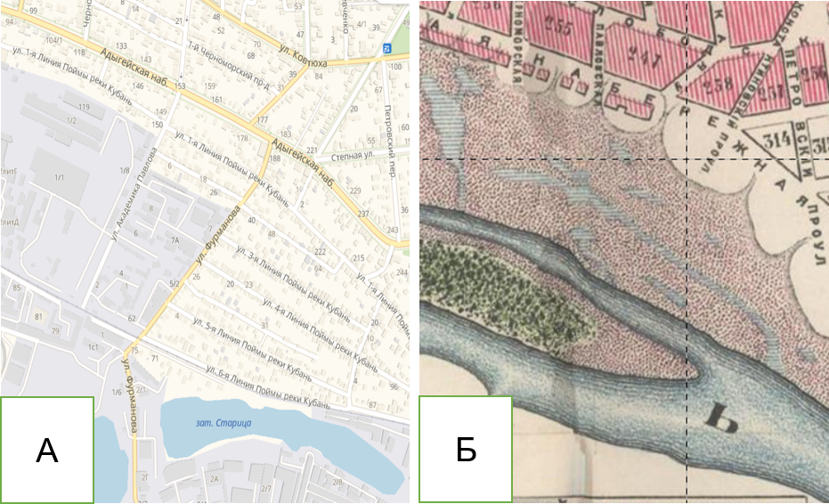

## Практическая часть {.unnumbered}

**Методические рекомендации для формулировки и выполнения задания:**

Целью данного занятия является знакомство школьников с историческими и природными факторами городской среды, формировавшими на протяжении времени функции и ЭГП поселения на различных территориальных уровнях.

Данное занятие включает в себя 2 элемента: оценку динамики функций поселения или части крупного города и характеристику исторических и природных факторов городской среды. В зависимости от наличия времени для выполнения заданий учитель может выбрать одно из них, либо выполнить оба.

1\) Объектом для оценки динамики функций поселения становится в первую очередь родной для школьников город (для крупных городов, объектом может стать его крупная часть, имевшая собственную историю развития). При небольшом количестве участников каждый школьник может выбрать одну или несколько функций, которые будет исследовать. В случае если в занятии принимает участие более 6 человек, для учащихся из других групп в качестве объекта может быть выбран соседний город или сельский населённый пункт.

2\) Характеристика исторических и природных факторов проводится в случае крупных городов для полигона размерами примерно 500\*500 м. Для малых городов и сёл участком для исследования может стать вся территория поселения. Учителю рекомендуется выбрать интересный с точки зрения разнообразия условий полигон (с застройкой разного времени, природными объектами на его территории). При участии в занятии более 6 человек возможно разделение школьников на 2 и более групп. В малых городах и сёлах в таком случае объектами исследования для других групп могут стать соседние населённые пункты.

Время, отведённое на выполнение задания, составляет 6 академических часов, из которых 2 отведены на полевые работы. Умения, приобретённые в ходе занятия, станут основой для формирования у школьников целостной картины историко-географической среды своего города и пригодятся им для выполнения последующих заданий.

**Этапы выполнения задания:**

1. Подготовка к полевому выходу

Перед началом полевого этапа учитель может привести локальные примеры воздействия исторических и природных факторов на городскую среду. Далее участникам занятия раздаются картосхемы участков на листах формата А4. Для экономии времени рекомендуется использование заранее распечатанных картографических шаблонов -- фрагментов карт из открытых Интернет-источников (Google Maps, OpenStreetMap, Яндекс). По возможности учащимся также предоставляются старые карты участка, выполненные в аналогичном масштабе (например, с сервиса Retromap).

Таблица 2.1. Историко-природные факторы и примеры их воздействия

| №   | Фактор | Пример |
|-----|--------|--------|
| 1   |        |        |
| ... |        |        |

На отдельном листе на каждую группу учащихся составляются таблицы, в которые школьники будут вносить возможные примеры исторических и природных факторов на исследуемом участке.


2.  Полевые работы

Учащиеся исследуют указанный участок, отмечая в таблице XXX возможные примеры влияния историко-природных факторов. Опорой может стать сравнение картосхемы, отражающей нынешнее состояние местности с картой ретроспективной ситуации.

Маршрут участников занятия должен пролегать лишь вдоль основных элементов улично-дорожной сети участка, не затрагивая труднодоступные и недоступные территории, что дополнительно должно быть оговорено учителем.

3.  Камеральная обработка

Основными элементами отчётности школьников по итогам занятия становятся графическое отображение динамики функций поселения (может выполняться только в камеральных условиях), а также заполненная в полевых условиях таблица XXХ по второй части задания. В результате работы с источниками и консультаций с учителем каждая группа также может представить доклад о роли тех или иных факторов на формирование городской среды полигона.

Необходимые материалы: планшеты для всех участников с подготовленными картосхемами участков и листами для заполнения таблицы XXX; простые карандаши

**Пример оформления выполненного задания:**

Пример графического отображения динамики (эволюции) функций поселения на макроуровне:

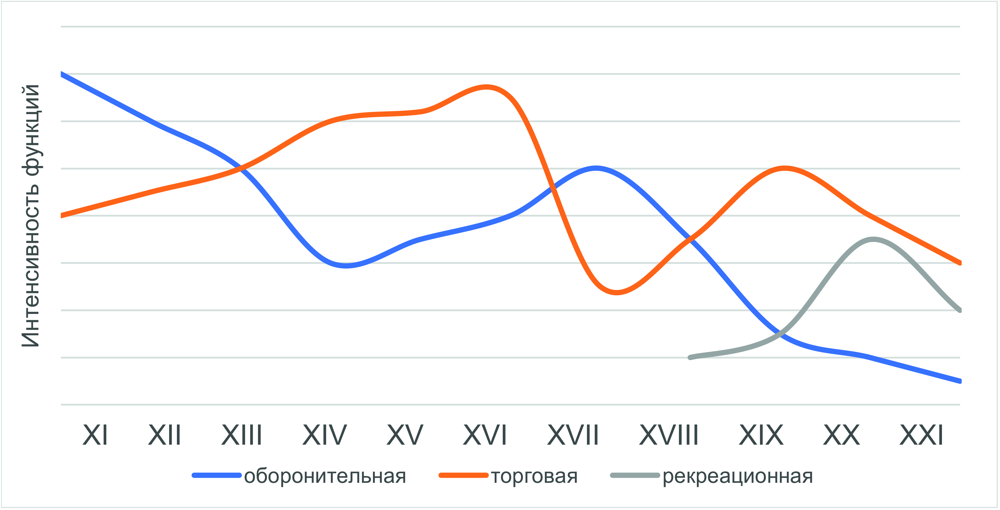

Данный график является лишь примером возможной визуализации, любые идеи участников занятия лишь приветствуются. Также возможно отразить на графике основные вехи, приводившие к изменению динамики.

Пример заполненной таблицы 2.1:

Таблица 2.2. Историко-природные факторы и примеры их воздействия

+--------+---------+--------------------------------------------------------------------------------------------+
| №      | Фактор  | Пример воздействия                                                                         |
+========+=========+============================================================================================+
| 1      | Границы | незастроенные кварталы в начале ул. Красной -- наследие войскового плаца на окраине города |
+--------+---------+--------------------------------------------------------------------------------------------+
| 2      | Рельеф | излом Змиевского проезда связан с пересечением крутого склона долины р. Темерник           |
+--------+---------+--------------------------------------------------------------------------------------------+
| 3      | ...     | ...                                                                                        |
+--------+---------+--------------------------------------------------------------------------------------------+

<!--chapter:end:02-history.Rmd-->

# Внутригородское расселение {#Settlement}

## Теоретическая часть {.unnumbered}

Одним из предметов изучения современной географии городов являются особенности городского расселения на разных уровнях, от глобального до локального. Численность населения городов и микрорайонов наиболее часто определяет набор их функций и их место на разных уровнях системы расселения. Тем не менее, география -- пространственная наука и характеристика территории абсолютными значениями численности населения была бы неполной. По этой причине географы используют в своём анализе относительный показатель -- плотность населения. *Перед началом непосредственной работы с показателем плотности населения ученикам напоминаются общие сведения о численности населения (страны, города, района, микрорайона), вместе рассчитывается средняя для города плотность населения, приводятся референсные значения плотности населения (таблица ХХХ). После этого обсуждается принципиальное отличие городской плотности населения от средней по территориям стран, регионов.*

Плотность населения[^settlement-1] есть отношение численности постоянного населения на единицу площади (чаще всего 1 км^2^). При определении плотности важно понимать, в каких границах она определяется, т.е. как говорят географы, определить масштаб операционной территориальной ячейки. Так, плотность населения города определяется для всей его площади, которая включает в себя и нежилую территорию. Таким образом, результатом расчетов фактически будет средняя плотность населения для рассматриваемой территории. Данный показатель рассчитывается по следующей формуле:

[^settlement-1]: Захарова О. Д. Плотность населения//Демографический понятийный словарь/Под ред. проф. Л. Л. Рыбаковского //М.: ЦСП. -- 2003.

```{=tex}
\begin{align*}
\rho_н = \frac{P}{S}
\end{align*}
```
где P -- численность населения территории чел.,

S -- площадь территории $км^{2}$

В городах различных размеров основным масштабом измерений могут стать кварталы, микрорайоны или административные районы. Однако наиболее распространённым способом является подсчёт плотности по территориальным ячейкам одинакового размера. 


Рисунок 3.1. Территориальные ячейки для расчёта плотности населения Москвы. А - административные районы, Б - ячейки 1,5\*1,5 км[^settlement-2]<sup>,</sup>[^settlement-3]

[^settlement-2]: Население Москвы // Википедия. [2018]. Дата обновления: 05.08.2018. URL: [https://commons.wikimedia.org/wiki/File:Картосхема_плотности_населения_Москвы.PNG](https://commons.wikimedia.org/wiki/File:Картосхема_плотности_населения_Москвы.PNG) (дата обращения: 05.08.2018).

[^settlement-3]: В. Баширов. Плотность населения Москвы // Живой Журнал. URL: <https://sevabashirov.livejournal.com/13211.html> (дата обращения: 05.08.2018).

Характеристика плотности населения обычно используется как показатель освоенности территории, которая в свою очередь определяется природно-географической средой и особенностями социально-экономического развития того или иного общества. Город выступает в качестве наиболее компактного элемента системы расселения. Различия в плотности населения внутри него в значительной мере определяют концентрацию спроса, что является основным фактором пространственной дифференциации социально-экономических процессов.

Плотность населения очень важна для определения обеспеченности районов города объектами социальных услуг [^settlement-4] и транспортной инфраструктуры. Учитывается она и при размещении торговых предприятий (в т.ч. сетевых магазинов). Изучение плотности населения в городе является базой для дальнейшего анализа функций города, его планировки, транспортной сети и сферы услуг.

[^settlement-4]: Поликлиники, больницы, детские сады, школы, спортивные объекты, дома культуры

Исследования показывают, что высокая плотность населения (около 10 тыс. чел./км^2^ позволяет сэкономить на коммунальных услугах, ремонте дорог и благоустройстве территорий, повышается полезность инвестиционных вложений. Однако при ещё более высокой плотности населения наступает обратный эффект: перенаселённые районы испытывают крайне высокую нагрузку и издержки обслуживания инфраструктуры снова начинают возрастать.


Плотность населения в городах напрямую зависит от характера жилой застройки (территории, занятой жилыми зданиями). В градостроительстве закреплены[^settlement-5] нормативные показатели плотности в зависимости от характера районной или микрорайонной застройки и размера города.

[^settlement-5]: Строительные нормы и правила СНиП 2.07.01-89 "Градостроительство. Планировка и застройка городских и сельских поселений" // Система Гарант. URL: <http://base.garant.ru/2305985/#ixzz5SPO3UTSp> (дата обращения: 05.08.2018).

Базовой пространственной ячейкой для подсчёта плотности населения является отдельно стоящее строение -- жилой дом. Основой классификации жилой застройки является её тип и этажность. Существует 2 основных типа застройки:

1. индивидуальная (участок вместе со зданием принадлежит одному домохозяйству[^settlement-6]

2. многоквартирная (жилое здание разделено на квартиры, где проживают несколько домохозяйств).

[^settlement-6]: Группа людей, ведущих общее хозяйство, проживающая совместно, чаще всего объединённая родственными или семейными связями

Общепринятая классификация жилых зданий по этажности отражает масштабность застройки районов города. Традиционно выделяются 3 класса застройки:

1. Малоэтажная (1-3 этажа)

2. Среднеэтажная (4-5 этажей)

3. Многоэтажная (6 и более этажей)

   a. Повышенной этажности (11-16 этажей)

   b. Высотная (17 и более этажей)

Подобная классификация связана с градостроительными нормативами. Так, 5 -- это максимальное число этажей, для которого в жилом здании необязательна установка лифта.

Жилая застройка городов не всегда была такой, какой мы знаем её сейчас. До начала активной стадии урбанизации в городах, как и в сельской местности преобладали индивидуальные жилые дома, которые почти всегда были окружены земельным участком. До сих пор в большинстве российских городов сохраняется подобный тип застройки, для малых и средних городов, а также населенных пунктах в степной и лесостепной зонах -- является преобладающим.


 
Рисунок 3.2. Индивидуальные жилая застройка малых городов[^settlement-7]<sup>,</sup>[^settlement-8]

[^settlement-7]: Снимки Google Street View

[^settlement-8]: Картографический материал OpenStreetMap -- г. Лодейное Поле

Вместе с увеличением численности городского населения в XVIII-XIX вв. в нашей стране появляется новая форма жилого помещения -- квартира. Тем не менее дома квартирного типа были распространены лишь в столицах, где представляли собой арендное жильё.

Революция в России и последовавшее за ней становление нового социального уклада потребовало новой формы быта. Активный приток населения в города (основная форма интенсивной урбанизации) стал причиной появления «коммуналок» (больших квартир, разделённых между несколькими семьями, с общими кухней и санузлом), а затем и волны нового жилищного строительства. Первым этапом стало создание комфортной среды для рабочих: в 1920-30-е гг. возводятся жилые районы и отдельные здания в стиле конструктивизм (простые геометрические формы, оптимизированная планировка квартир).

 
Рисунок 3.3. Жилые здания и кварталы 1920-30-х гг. в стиле конструктивизм[^settlement-9]<sup>,</sup>[^settlement-10]<sup>,</sup>[^settlement-11]

[^settlement-9]: Записки наблюдателя. Смоленск. Конструктивизм // Живой Журнал. URL: <https://babs71.livejournal.com/580227.html> (дата обращения: 05.08.2018).
[^settlement-10]: Культурное наследие. Краснодар. Дом «Стодворка» // Карта России. URL: <https://kartarf.ru/dostoprimechatelnosti/211308-dom-zhiloy-stodvorka> (дата обращения: 05.08.2018).
[^settlement-11]: Картографический материал OpenStreetMap -- Квартал Нижняя Пресня, Москва


К концу 1930-х гг. наиболее распространённым стало жилищное строительство в стиле «сталинский ампир» - квартиры в таких домах имели большую площадь, высокие потолки, а сами здания были украшены декоративными элементами. Тем не менее, подобные дома были широко распространены лишь в крупных городах, а квартиры в них предоставлялись лишь привилегированному населению. В то же время в условиях послевоенной нехватки жилья, основная часть городского населения ютилась в индивидуальных жилых домах или 2-этажных бараках квартирного типа, которые сохранились во многих российских городах до настоящего времени.

Наиболее важный этап массового жилищного строительства начался в конце 1950-х гг. Архитекторы и проектировщики начали поиск простых и недорогих решений по обеспечению каждой семьи отдельной квартирой. По всей стране началась застройка крупных жилых массивов типовыми, чаще всего 5-этажными зданиями, ставшими известными как «хрущёвки». В малых городах и сельской местности зачастую также встречаются 2-3-этажные модификации подобных типовых домов.


Рисунок 3.4. Жилые здания и кварталы конца 1950-х -- начала 1970-х гг. постройки, известные как «хрущёвки»[^settlement-12]

[^settlement-12]: Авиамастер. Хрущевки в ожидании войны // Живой Журнал. URL: [\<https://vikond65.livejournal.com/514931.html>](https://babs71.livejournal.com/580227.html) (дата обращения: 05.08.2018).

Следующим этапом домостроения стали жилые микрорайоны, строившиеся в 1970-х -- начале 1990-х гг. В отличие от «хрущёвок» подобные дома почти всегда относились к многоэтажным. По уже устоявшейся аналогии жилые здания, возведённые в этот период, получили названия «брежневки». Их отличительной чертой также являлось более высокое разнообразие типовых решений, а также значительно меньшая плотность застройки вследствие повышенной этажности (преимущественно 5-9 этажей в городах до 1 млн. человек, до 17 этажей в Москве и Санкт-Петербурге).


Рисунок 3.5. Жилые здания и кварталы конца 1970-х -- начала 1990-х гг. постройки, известные как «брежневки»[^settlement-13]

[^settlement-13]: Фотографии района Древлянка, Петрозаводск // Архитектурная фотобаза «Домофото» URL: <http://domofoto.ru/photo/114981/> (дата обращения: 05.08.2018).

Переход к рыночной экономике в постсоветский период ознаменовал новые изменения в жилищном строительстве. Увеличилось разнообразие застройки по этажности, появились таунхаусы.[^settlement-14] Получает распространение «точечная» застройка, её примером могут являться новые жилые комплексы в центрах городов на небольших освободившихся участках.

[^settlement-14]: Малоэтажные жилые дома с отдельным входом для каждой квартиры, часто таунхаус включает в себя гараж и небольшой земельный участок перед входом

Таким образом, в больших и крупных российских городах (более 100 тыс. чел.) прослеживается наиболее общая закономерность распределения плотности населения в зависимости от эпохи, в которую возник жилой массив. Чем новее район, тем чаще всего он более многоэтажный, а значит более плотно заселённый. Исключениями являются редкие примеры малоэтажной и среднеэтажной застройки премиум-класса, построенные в последние десятилетия.

В средних и малых городах (менее 100 тыс. чел.) не наблюдается чёткой закономерности в распределении плотности населения. из-за распространения индивидуального жилья и отсутствия районов масштабной жилой застройки. В таких городах встречаются лишь отдельные кварталы типовых жилых зданий.

Наиболее типичное распределение плотности населения в зависимости от расстояния от центра города (центрального делового района) для российских городов выглядит следующим образом: плотность минимальна в центре, скачкообразно возрастает на некотором расстоянии от него и максимальна на окраинах. Данный факт является прямым следствием массовой микрорайонной застройки спальными[^settlement-15] районами на окраинах большинства городов в советский период.

[^settlement-15]: Район с преобладанием жилых функций, где практически отсутствуют рабочие места, торговая и культурно-досуговая инфраструктура

Заметим, что для зарубежных городов распределение плотности населения почти обратное. В то же время есть и другие модели, достаточно хорошо описывающие распределение городской плотности. Английский экономист Колин Кларк в 1951 г. предложил использовать модель внутригородского расселения, согласно которой плотность населения максимальна в центре города, а по мере удалённости от него резко убывает. Данная зависимость также не универсальна и во многом отражает исторические факторы развития американских городов -- исключительно плотные центральные деловые районы, окружённые протяжёнными малоэтажными пригородами. Современные исследователи предлагают использовать более сложные функции с несколькими максимумами для описания различий плотности населения внутри городов.

## Практическая часть {.unnumbered}

**Методические рекомендации для формулировки и выполнения задания:**

Составление карты плотности населения для всего населенного пункта -- достаточно трудоёмкая задача, в особенности для крупных городов. При этом получить абсолютно точный результат измерений заведомо невозможно. Так, например, средний размер домохозяйств серьезно варьирует для разных городов и типов застройки.

Поэтому для учебных целей мы можем использовать приблизительную оценку плотности, определив среднее количество квартир для домов разного типа и экстраполировав результаты для всего города. Такой подход можно реализовать двумя способами:

1) Учитель выбирает некоторый модельный участок города, характеризующийся максимальным разнообразием типов жилой застройки. Данный вариант лучше всего подходит для работы в малых группах; размер участка в таком случае будет составлять в среднем 500\*500 м

2) Если в занятиях принимает участие более 6 человек, возможно разделение школьников на 2 и более групп. Тогда, для полевой работы предлагается выбор нескольких участков размером 300\*300 м, которые отличаются характерным типом жилой застройки

Время выполнения задания -- 6 академических часов, что включает в себя 2 академических часа полевых работ. Несмотря на большое количество работ в данном занятии, полученные по его итогам материалы (карта плотности населенного пункта) будут использованы в последующих занятиях (изучение системы городского транспорта, потребительских услуг, функциональных зон).

**Этапы выполнения задания**:

1. Подготовка к полевому выходу

Перед началом полевых работ требуется подготовка схемы участка в камеральных условиях. На листах размера А4 необходимо в масштабе нанести основные элементы планировочного каркаса -- улицы, границы функциональных зон (в первую очередь, отделить участки селитебной застройки). Для экономии времени рекомендуется использование заранее распечатанных картографических шаблонов -- фрагментов карт из открытых Интернет-источников (Google Maps, OpenStreetMap, Яндекс.Карты). Данные схемы будут использоваться для ориентирования, а также как черновики при построении карты плотности в камеральных условиях.

На отдельных листах на каждую группу школьников составляются таблицы, в которые будут вноситься данные о типах застройки и количестве квартир в домах на исследуемых участках. Столбец 1 может быть заполнен предварительно, столбцы 2-4 заполняются школьниками в поле.

Таблица 3.1. Характеристика домов на исследуемых участках

| № | Адрес дома | Тип застройки | Кол-во этажей | Кол-во квартир | Кол-во жителей |
|---|:----------:|:-------------:|:-------------:|:--------------:|:--------------:|
|   |      1     |       2       |       3       |        4       |        5       |
|   |     ...    |               |               |                |                |

2. Полевые работы

Работа выполняется школьниками в группах по 2-3 человека. Учитель заранее указывает границы каждого участка, закрепленного за группами. Школьники из каждой группы проводят измерения вместе, находясь в зоне видимости друг друга для обеспечения правил техники безопасности. Предполагается, что один из школьников ведет запись результатов наблюдений для каждого дома в таблицу XXХ, тогда как остальные непосредственно производят измерения. Возможна смена функций школьниками по ходу выполнения задания.

Для ускорения выполнения задания предлагается выбор маршрута прохождения таким образом, чтобы он не проходил через одно и то же место несколько раз (например, движение «змейкой» внутри квартала). Маршрут может проходить по улицам и дворовым территориям и не должен проходить через участки с ограниченным доступом (например, огороженные забором участки в зоне малоэтажной частной застройки). Требования техники безопасности должны быть отдельно оговорены руководителем практикума перед началом полевого выхода.

3. Камеральная обработка данных

А. Составление карты плотности населенного пункта

После выполнения задания в камеральных условиях производится обработка результатов полевых наблюдений с возможностью их экстраполяции на другие части населенного пункта. Предлагается следующий порядок действий:

- Определение средней плотности населения для разных типов застройки

В первую очередь, необходимо «разбить» исследуемую территорию по типам преобладающей застройки. В качестве территориальной ячейки (минимального масштаба определения плотности) стоит выбрать квартал или относительно однородный участок городской застройки. Его размер зависит от планировочной структуры и размеров населенного пункта, в котором проводится практикум, и определяется учителем. Рекомендуемые размеры участков представлены в таблице ХXX:

| Размер населенного пункта | Размер |
|---------------------------|:------:|
| Малые города (до 50 тыс. чел.) | 300\*300м| 
| Средние города (50-100 тыс. чел.)| 400\*400м|
| Большие и крупные города (100 тыс. -- 1 млн. чел.)| 500\*500м| 
| Крупнейшие города (более 1 млн. чел.) | 1000\*1000м|


Подобным кварталам присваивается один из следующих типов застройки:

- Индивидуальная

- Многоквартирная мало- и среднеэтажная (до 5 этажей)

- Многоэтажная (более 6 этажей)

- Многоэтажная повышенной высотности и высотная (более 10 этажей -- для Москвы и Санкт-Петербурга)


Для каждого подобного квартала рассчитывается численность населения, которая определяется по формуле: 

$\begin{aligned}
Численность\ населения = \sum (Квартиры*Размер\ домохозяйства),
\end{aligned}$

Где население -- численность населения участка,

квартиры -- кол-во квартир в доме[^settlement-16],

размер домохозяйства -- средний размер домохозяйства

[^settlement-16]: Перед выполнением задания необходимо обратить внимание школьников на то, что в одном доме могут быть подъезды с разным количеством квартир. Предлагается в столбце 4 указывать число квартир в каждом подъезде, отделяя их между собой знаком суммирования, например: 20+15+15+20

Для работы выбираются значения среднего размера домохозяйств по последней переписи населения для конкретного муниципального образования из Базы данных показателей муниципальных образований Федеральной службы государственной статистики (показатель «Средний размер частного домохозяйства» в категории «Население»). При отсутствии значений в системе, предлагается использование данных в среднем для субъекта РФ и типа местности из Единой межведомственной информационно-статистической системы (ЕМИСС). При отсутствии возможности проверки значений следует использовать средний размер домохозяйства для России в целом (2,6 по Всероссийской переписи России 2010 г.). Предполагается, что значения должны быть выданы учащимся учителем, однако приветствуется самостоятельный поиск статистических данных школьниками.

Определение площади участков для расчета плотности может производиться с использованием топографических карт или специализированных Интернет-порталов (Яндекс.Карты, Google Earth, OpenStreetMap, т.д.). Для удобства последующих расчетов предлагается расчет плотности в чел./км^2^.

- Выделение типов селитебной застройки для населенного пункта

На основе карты, спутниковых снимков и, при наличии, панорам улиц в Google Maps или Яндекс.Карты, школьники определят типы застройки для других частей населенного пункта или района (округа) для Москвы, Санкт-Петербурга и городов-миллионников. В качестве минимального операционного масштаба необходимо взять кварталы аналогичной площади, как при выполнении предыдущего пункта задания. При этом необходимо придерживаться принципов географической генерализации -- в качестве типа застройки будет приниматься преобладающий (т.е. он приходится более чем на 50% домов квартала).

После этого, рассчитывается площадь отдельных кварталов каждого типа. Их плотность определяется путём умножения на среднюю плотность населения типов застройки, установленную в ходе полевых наблюдений.

Карта плотности населенного пункта составляется на листах формата А3, на который наносятся основные элементы планировочного каркаса города (главные транспортные магистрали, объекты гидрографической сети) и границы кварталов застройки. Им присваиваются цветовые значения в соответствии с расчетными значениями плотности и шкалой цветов. Последняя определяется для каждого населенного пункта на основе совокупности полученных значений плотности в кварталах.

Обычно в основе шкал лежит степень отклонения значений от среднего. Для наших целей подойдут простые трёх- или пятицветные шкалы, где градиент цвета показывает величину плотности: красным обозначают максимальную плотность, оранжевым -- среднюю, желтым -- минимальную.


Рисунок 3.5. Пример шкалы плотности населения для карты

Приветствуется использование геоинформационных программных продуктов (ArcGIS, QGIS) или усовершенствованных графических редакторов (CorelDraw).

Б. Определение пространственных особенностей дифференциации плотности в населенном пункте (по желанию участников практикума);

Полученная карта может быть использована для определения пространственных закономерностей распределения плотности населения. Наиболее репрезентативно продемонстрировать это в разрезе «центр-периферия» для нескольких основных планировочных направлений города или «север-юг»/«запад-восток». Последнее определяется преподавателем, в зависимости от особенностей планировочной структуры населенного пункта.

По оси абсцисс откладывается расстояние от центра города, по оси ординат -- значения плотности населения. Для удобства направления могут быть нанесены на составленную карту плотности населения и перенесены на график в соответствующем масштабе.

**Необходимые материалы:** планшеты для всех участников с предварительно составленной в камеральных условиях на черновике схемой участка и листами для заполнения таблицы XXХ; простые и цветные карандаши (для составления карт -- предпочтительно акварельные); калькулятор.

**Пример оформления задания:**

Характеристика домов на исследуемых участках

| № |    Адрес дома    |  Тип застройки | Кол-во этажей | Кол-во квартир | Кол-во жителей |
|---|:----------------:|:--------------:|:-------------:|:--------------:|:--------------:|
|   |         1        |        2       |       3       |        4       |        5       |
|   | ул.Волховская, 7 | Индивидуальная |       1       |        2       |  2 * 2,4 = 4,8 |
|   | ул.Варламова, 11 |  Среднеэтажная |       5       | 10+10+10+10+20 | 60 * 2,4 = 144 |
|   |   Пр.А.Невского  |  Многоэтажная  |       14      |       84       | 84 * 2,4 = 202 |
|   |        ...       |                |               |                |                |
|   |                  |                |               |      Сумма     |    2465 чел.   |


Рисунок 3.6. Пример карты плотности жилой застройки


Рисунок 3.7. Пример графика пространственной дифференциации плотности

<!--chapter:end:03-settlement.Rmd-->

# «Геометрия» города {#geometry}

## Теоретическая часть

Планировочная структура любого населённого пункта (в особенности гóрода) является ключевым фактором территориальных различий социально-кономических явлений. Если функциональные зоны отражают локализацию основных видов деятельности в городе, то его «геометрия», или планировочная структура, тановится каркасом, определяющим их взаимное расположение, характер и интенсивность связей.

Обозначим основные термины, которые используются исследователями для характеристики основных элементов городской планировки:[^geometry-1]

[^geometry-1]: СНиП 2.07. 01-89. Градостроительство. Планировка и застройка городских и сельских поселений.
Утв. постановлением Госстроя России от 25 августа 1993 г.

*Квартал* -- первичная планировочная единица застройки в границах красных линий, ограниченная улично-дорожной сетью;

*Микрорайон* -- планировочная единица застройки более крупного масштаба, где городские функции не обязательно концентрируются вдоль улиц, а размещены в пределах кварталов застройки;

*Красная линия* -- граница, которая отделяет квартал, микрорайон или другую единицу планировочной структуры от улично-дорожной сети и других территорий общего пользования (например, зелёных зон);

*Планировочный каркас* -- ведущие элементы застройки поселения, включает в себя элементы как природного, так и антропогенного характера, его элементами являются улично-дорожная сеть, железные дороги (планировочные оси), озеленённые территории, водотоки и водоёмы (экологический каркас);

*Улично-дорожная сеть* -- сеть дорог общего пользования, предназначенных для передвижения людей и транспорта (улицы, проезды, площади, набережные, а также стоянки).
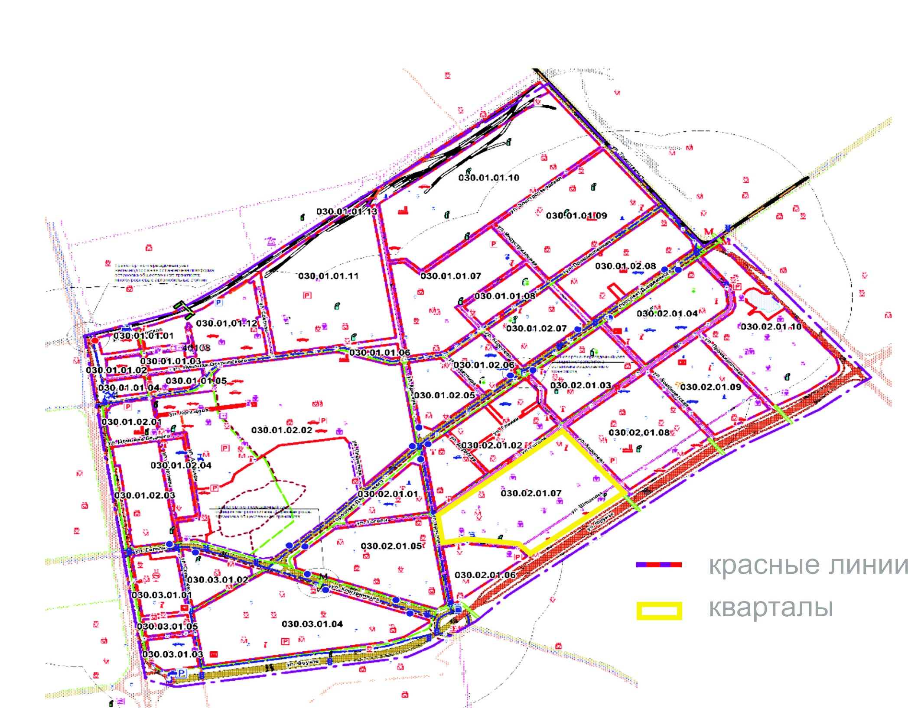
Рисунок 4.1. Схема планировки микрорайона г. Новосибирска[^geometry-2]

[^geometry-2]: URL:<http://dsa.novo-sibirsk.ru/ru/site/1963.html> (дата обращения 24.10.2018 г.)


Улицы в городе можно условно разделить в зависимости от роли в планировочной структуре на 3 типа:

-   Магистральные (соединяют основные планировочные районы, обычно имеют более 2-3 полос движения в каждую сторону);

-   Основные (большинство городских улиц, связывающих магистрали с кварталами и микрорайонами, 1-2 полосы движения в каждую сторону);

-   Внутриквартальные и дворовые (проезды внутри застройки, полосы движения обычно не выделяются);

*Городской узел* -- общественное пространство (зона), формирующаяся вблизи пересечений магистральных улиц общегородского значения и характеризующаяся высокой концентрацией экономической и социальной активности.

Существует множество факторов, которые определяют конфигурацию городских территорий и проявляются на разных масштабах (городская агломерация,
населённый пункт, район, микрорайон, квартал). Выделяют природно-географические и социально-экономические факторы формирования планировочной структуры городов.


**Факторы формирования планировочной структуры города**

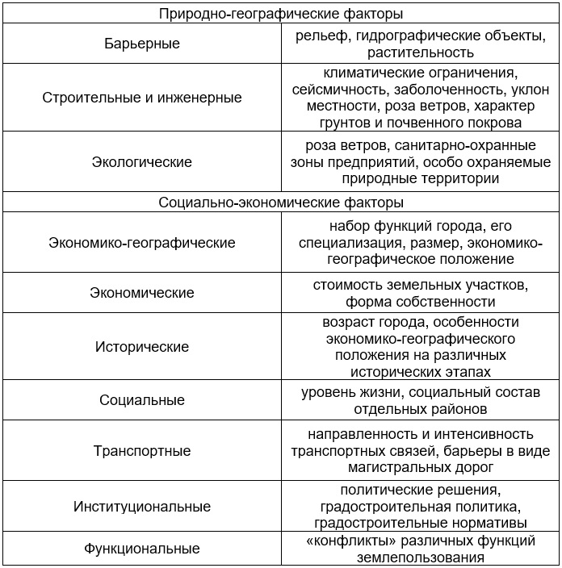

Сочетание данных факторов, как правило, определяет общий тип планировочной структуры города. В *компактных* городах вся застройка расположена в едином периметре. *Рассредоточенный* тип планировки присущ городам, где из-за рельефа местности или расположения градообразующих предприятий сформировались изолированные очаги застройки. Также выделяются *линейные* города, которые обязаны своей формой физико-географическим объектам (морские побережья, долины рек).

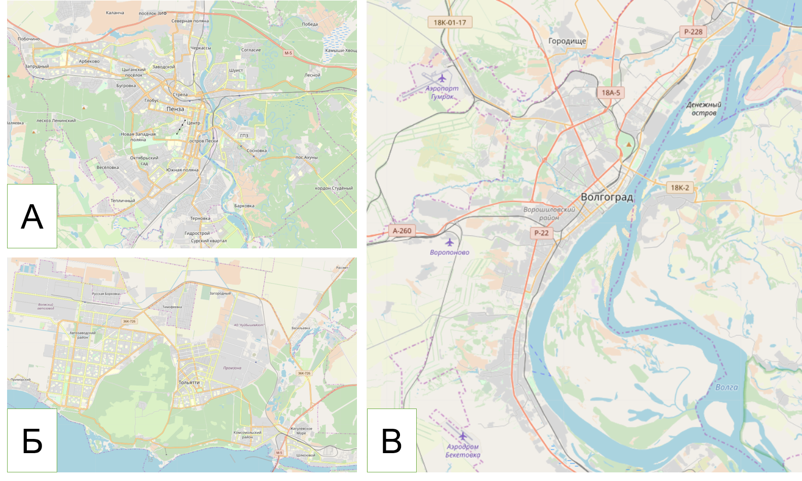

Рисунок 4.2. Типы планировочной структуры городов. А -- Компактный, Б -- Рассредоточенный, В -- Линейный


Внутренняя планировочная структура большинства городов может быть отнесена к одному из нескольких типов. В то же время ни один город не может быть идеальным примером какого-либо типа планировочной структуры. Как правило, наблюдаются комбинации нескольких основных типов планировки:

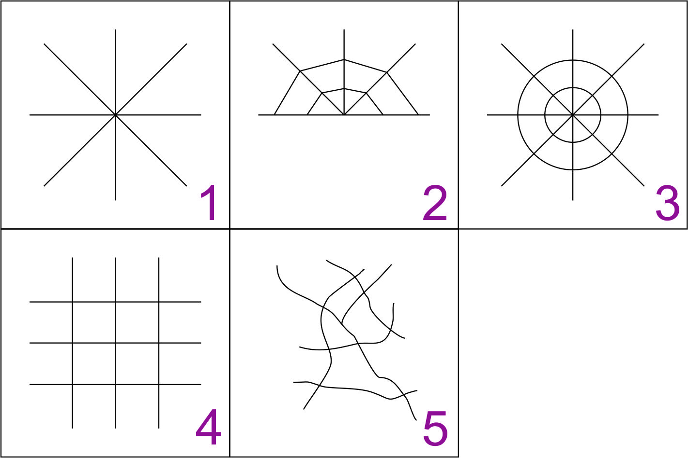
Рисунок 4.3. Типы планировки городов. А - радиальная, Б -- радиально-кольцевая,
В -- лучевая (веерная), Г -- регулярная («шахматная»), Д -- свободная
(произвольная, иррегулярная)

-   *Радиальная и радиально-кольцевая (А и Б)* планировка характерна для крупных городов, транспортных узлов, где застройка велась преимущественно вдоль основных путей, связывающих центр поселения с соседними городами. К такому типу относятся многие столичные города (Москва, Париж, Лондон, Мадрид), которые исторически были связаны с другими крупнейшими центрами страны. Зачастую она складывалась в городах, окружённых крепостными стенами, валами, которые по мере роста поселений и утраты оборонительных функций были срыты и использованы в качестве коридоров для строительства кольцевых улиц (например, Бульварного и Садового колец в Москве).

-   *Веерный* (В) тип наблюдается в городах, расположенных у водоёмов или крутых уступов рельефа, выступавших в роли барьера для развития города с одной из сторон света (например, Волга в Костроме или Ока в Калуге). Зачастую лучи, расходящиеся из центра, также имели функцию направлений в окружающие города: так, «лучи» Твери до сих пор носят названия в честь тех городов, куда вели эти дороги (Новоторжская улица в сторону Торжка, улица Вольного Новгорода к речному пути по Волге).

-   Прямоугольная *регулярная (Г)* планировка является наиболее распространённым типом рисунка улично-дорожной сети городов. Подобная
    сетка формировалась при проектировании городов, что позволяет обеспечить
    простоту ориентирования и достаточную степень связности территории. В России
    первым городом с регулярной планировкой был Санкт-Петербург, которому
    изначально придавался столичный облик с широкими магистралями и набережными. В период правления Екатерины II многие губернские
    города также были перестроены или создавались с учетом регулярной прямоугольной планировки (например, Петрозаводск, Краснодар). Такой тип планировки характерен для городов пионерного освоения XIX-XX в., когда в условиях отсутствия ограничений для размещения городов, им задавался самый простой геометрический каркас. Именно прямоугольная планировка свойственна большинству городов Северной Америки и Австралии.

-   *Свободная (Д)* планировка характерна для старых районов городов (например, средневековых кварталов европейских городов), застраивавшихся без чёткого плана. В современных городах она встречается в основном в развивающихся странах в районах нелегальной застройки (трущобы, фавелы). Подобные кварталы являются признаком процесса «ложной урбанизации», когда переселение людей в города не сопровождается изменением их образа жизни и вида деятельности. Кроме того, условно «свободной» может быть названа планировка городов, имеющих серьезные физико-географические ограничения развития уличной сети (например, рельеф местности во Владивостоке).


За тысячелетнюю историю существования городов происходили значительные изменения в экономическом и социальном укладе их жителей по всему миру, что не могло не отразиться на развитии градостроительных идей. Города Древнего мира представляли собой стихийно сложившиеся поселения со
свободной планировкой, где границы участков определялись каждым землевладельцем самостоятельно. Наиболее влиятельные представители знати и духовенства впервые применили регулярную планировку для дворцовых и храмовых ансамблей. В эпоху Римской империи рост численности населения городов стал фактором, определившим необходимость законодательного регулирования планировки городов. Планирование было распространено на гражданскую практику -- в городах появляются форумы[^geometry-03], прокладываются магистральные улицы, строятся мосты и акведуки, закладываются основы регулярной планировки.

[^geometry-03]: Центральная городская площадь, сформированная несколькими общественными зданиями, где часто проходили обсуждения важных для граждан вопросов, а также велась торговля.


В Средние века города часто представляли собой укреплённые поселения, окружённые стенами. Радиально-кольцевой тип планировки в некоторых городах был целесообразен для обороны поселения и экономии при строительстве. Именно в этот период сложилась планировка исторических центров большинства европейских городов, происходил возврат к преобладанию свободной планировки.

Общий культурный подъем эпохи Возрождения и переход от натурального хозяйства к производственному обратил внимание на проблемы градостроительства. Возникли первые проекты «идеальных городов» (Сфорцинда, Пальманова), снова наблюдается преобладание регулярной планировки. Активно строятся общественные здания, площади, возникают градостроительные ансамбли (цельно спланированные очаги застройки).

Скачкообразная урбанизация XIX-XX вв. вместе с технологическим развитием
промышленности и транспорта привела к коренной трансформации градостроительных идей. Активное расширение городов, как за счет селитебной застройки, так и промышленных зон привело к распространению централизованного проектирования. Резкое увеличение уровня автомобилизации и социальные эксперименты в XX в. привели к укрупнению планировочной
структуры городов: микрорайоны, окружённые скоростными шоссе, пришли на смену классической квартальной застройке.

Тем не менее, во многих городах до сих пор можно встретить следы застройки малых населенных пунктов, которые были поглощены при росте городов. Такими являются, например, города Тушино, Кунцево, Люблино и Перово, которые став крупными жилыми районами современной Москвы, сохраняют элементы старой улично-квартальной сети и застройку.

Для определения типа планировочной сети можно использовать карты города или его отдельных районов. Представленные «гистограммы-компасы» для улиц некоторых крупных российских городов могут эффектно визуализировать пространственную ориентацию, а также преобладающий тип их планировки.

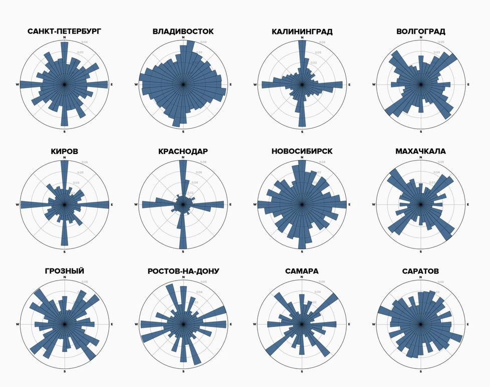
Рисунок 4.4. Как ориентированы улицы в российских городах? Источник: С. Сулейманов, А. Григорьева, J. Boeing, составлено[^geometry-4] на основе картографических данных OpenStreetMap.

[^geometry-4]: URL: <https://meduza.io/shapito/2018/07/14/issledovatel-iz-ssha-pridumal-udivitelnuyu-vizualizatsiyu-ob-yasnyayuschuyu-ustroystvo-gorodov-a-my-s-ee-pomoschyu-posmotreli-na-rossiyskie> (дата обращения 24.10.2018 г.)

Города с преимущественно прямоугольной сеткой застройки имеют на диаграмме вид «креста» (большая часть улиц ориентирована по основным сторонам света -- в направлении север-юг и перпендикулярном к нему запад-восток: Краснодар, Киров, Калининград). Те поселения, которые расположены вдоль побережья морей и крупных рек, характеризуются гистограммами с максимумами, совпадающими с простиранием упомянутых физико-географических объектов (Махачкала, Волгоград). Крупные транспортные узлы, города рассредоточенного типа или поселения, включающие в себя значительные ареалы свободной застройки, имеют равномерное распределение улиц по их ориентированности (Санкт-Петербург, Владивосток).

## Практическая часть

**Методические рекомендации для формулировки и выполнения задания:**

Анализ планировочной структуры городской территории не требует выполнения полевого этапа работ. Занятие является камеральным по причине того, что наиболее показательно рассмотрение города в комплексе, а с учётом временны́х рамок практикума, выполнение школьниками подобного объёма работ не представляется возможным. Тем не менее, на наш взгляд подобный вариант является удобным, т.к. позволяет иметь постоянную загрузку школьников без перерывов на случай непредвиденных обстоятельств, например, неблагоприятных погодных условий. Картографические материалы из различных источников в то же время призваны значительно облегчить выполнение занятия.

С учётом различного масштаба городов учителю предлагается на выбор один из следующих полигонов для изучения:

1\) вся территория в пределах городской черты для малых и средних городов (до 100 тыс. чел.)

2\) отдельные районы крупных и крупнейших городов

При условии участия в занятии более 5 человек работа может проводиться в рамках
небольших групп (2-3 человека). При выборе малого или среднего города для
анализа его планировочной структуры, другим группам должны быть предложены
аналоги (малые и средние города, расположенные в том же регионе). В случае
выбора в качестве полигона отдельных районов крупных городов, учитель отбирает
разные в планировочном отношении части городской застройки (например, старый
центр, спальные районы) и распределяет их между группами. Затем полученные
разными группами школьников данные могут быть сопоставлены (сравнение малых
городов либо районов крупного города).

Время выполнения задания -- 4 академических часа, включая 1 час на выступления
школьников с результатами творческих проектов. При работе над заданием учащиеся могут использовать данные, полученные в ходе прошлых занятий (карты плотности населения, «географическая летопись» поселения).


**Этапы выполнения задания:**

1. Подготовительный

Перед непосредственным анализом планировочной структуры необходимо подготовить картографический материал, где будет отражена вся планировочная сеть (улично-дорожная сеть и застройка) исследуемого участка.

В качестве источников рекомендуется использовать регулярно обновляемые
электронные карты (OpenStreetMap, Яндекс.Карты, 2ГИС и Google Maps). Необходимо ознакомить школьников с существующими разработками, посвященными анализу пространственной структуры населенных пунктов, заложенные в генеральные планы населенных пунктов и муниципальных
районов. Подобные материалы имеются в настоящее время у подавляющего
большинства муниципальных образований России и обычно могут быть найдены в
свободном доступе на их официальных сайтах[^geometry-5]. Распечатка карт предполагает использование формата A4, однако в случае крайне густой планировочной сети возможно использование более крупномасштабных карт на листах A3.

[^geometry-5]: В качестве примера: Генеральный план г. Канска (Красноярский край) на официальном сайте муниципального образования:
<http://www.kansk-adm.ru/index.php/gradostroitelnaya-deyatelnost/dokumenty-territorialnogo-planirovaniya/generalnyj-plan-goroda>

2. Работа с картой

Для каждой группы школьников преподаватель выбирает полигон для исследования планировочной структуры. Учащиеся должны маркировать на черновой карте основные планировочные оси (магистральные улицы) и городские узлы (места пересечения магистралей с высокой концентрацией общественных функций). Затем школьники выделяют районы (для крупных городов), отличающиеся особенностями планировки.

Далее учащиеся дают общую характеристику застройки исследуемого города или района, выбирая один из следующих типов:

-   Компактный

-   Рассредоточенный

-   Линейный

В рамках каждого планировочного района даётся характеристика рисунка
улично-дорожной сети (типа планировки) в соответствии со следующими обобщёнными типами:

-   Радиальный (радиально-кольцевой)

-   Веерный

-   Регулярный

-   Свободный

На следующем этапе учащиеся выявляют влияние факторов на планировку полигона. Для удобства примеры особенностей планировочной структуры могут быть занесены в таблицу:

Таблица 4.2. Факторы планировочной структуры города

|  №  | Особенность планировки  | Фактор |
|:---:|:-----------------------:|:------:|
|  1  |     ...                 |  ...   |
|  2  |     ...                 |  ...   |


Более детальный анализ планировочной структуры, её ориентации в пространстве
предполагает построение «звёздчатых» гистограмм, (рис.XXX). Для удобства
выполнения задания школьникам предлагается заполнить таблицу для каждой из
основных улиц, представленных на полигоне. Предполагается, что общее количество главных улиц не будет превышать 30-40 для полигона. Распределение труда внутри групп школьников и совпадение направления большинства улиц облегчит работу над заданием.

Учащиеся отбирают для каждой улицы условно центральный участок (некоторые улицы могут искривляться), для которого определяется азимут по направлению в обе стороны. Результаты измерений заносятся в таблицу. Для целей исследования достаточно точности измерений до 30°. Для построения гистограммы предполагаются 12 интервалов, где угол отсчитывается по часовой стрелке от направления на север (345 - 15°, 15 - 45° и т. д.)

Таблица 4.3. Анализ планировочной структуры

|  №  | Название улицы   | Азимут 1 | Азимут 2 |
|:---:|:----------------:|:--------:|:--------:|
|  1  |   ...            |   ...    |   ...    |


3. Выступление

Результатом работы каждой группы школьников должна стать карта, где отражены основные планировочные оси и городские узлы. Учащиеся выступают с докладом, где охарактеризованы типы пространственной организации и рисунка городской
планировки, отражены основные факторы, оказавшие влияние на современную
«геометрию» города.

В качестве творческого задания школьникам предлагается аналитическим путем
выявить недостатки существующей улично-дорожной сети города и предложить
основные механизмы решения подобных проблем[^geometry-6]. В их качестве могут быть
варианты строительства новых транспортных коридоров, развязок, формирования
экологического каркаса, новых жилых и промышленных кварталов.

[^geometry-6]: В профессиональной геоурбанистике и
географии транспорта для решения таких зада используется целый ряд
математических методов, в первую очередь -- анализ графов транспортной сети. Тем
не менее, на наш взгляд, принципиально важно, чтобы школьники были способны
идентифицировать городские проблемы без дополнительных методов исследований. В
этом и заключается основная характерная черта географического кругозора, формирование
которого -- основная задача практикума.


При проявлении заинтересованности в данной теме занятия школьники могут построить создают гистограмму пространственной ориентации улиц исследуемого полигона, которую можно использовать для подкрепления гипотез о планировочной структуре, сделанных во время первичного анализа картографических материалов.

**Необходимые материалы:** простой карандаш, цветные карандаши, линейка, транспортир.

**Пример оформления задания**:

Пример карты планировочной структуры города (масштаб приведён в качестве примера оформления легенды)

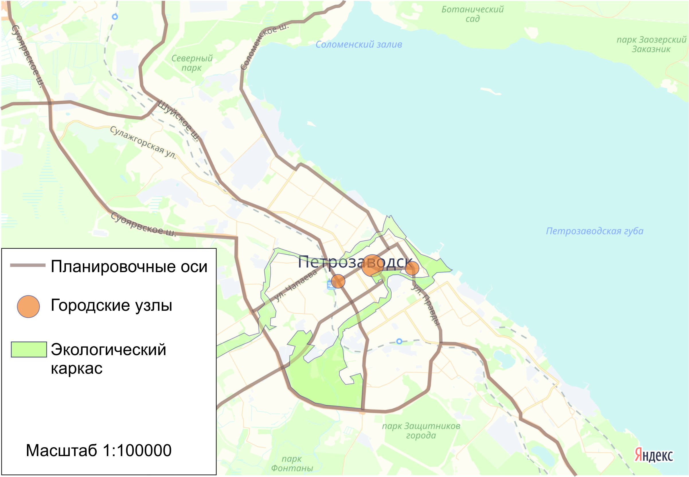

Таблица 4.4. Пример таблицы «Факторы планировочной структуры города»

+------+--------------------------------+-------------------------------------------+
| №    | Особенность                    | Фактор                                    |
|      | планировки                     |                                           |
+:====:+:==============================:+:=========================================:+
| 1    | Радиально-кольцевая            | Рельеф                                    |
|      | застройка Красного Города-Сада | (расположение на возвышенности)           |
|      |                                |                                           |
|      |                                | Институты                                 |
|      |                                | (социальный эксперимент советской власти) |
+------+--------------------------------+-------------------------------------------+
| 2    | ...                            | ...                                       |
+------+--------------------------------+-------------------------------------------+


Таблица 4.5. Пример таблицы Анализ планировочной структуры

+-----------------+-----------------+----------------+-----------------+
| №               | Название        | Азимут 1       | Азимут 2        |
|                 | улицы           |                |                 |
+:===============:+:===============:+:==============:+:===============:+
| 1               | Гоголевская     | 15-45          | 195-225         |
+-----------------+-----------------+----------------+-----------------+

Пример гистограммы пространственной ориентации улиц (выбор шкалы зависит от общего количества улиц полигона, также возможно использование долей).
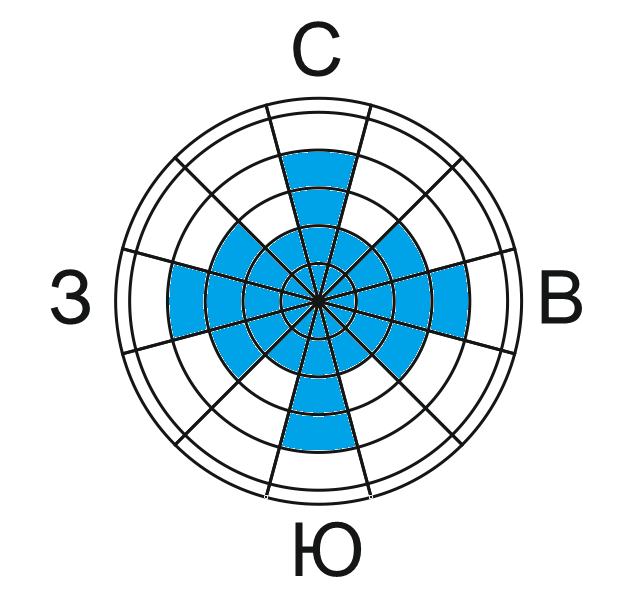

<!--chapter:end:04-geometry.Rmd-->

# Транспорт в городе {#transport}

## Теоретическая часть

Развитая транспортная инфраструктура является одним из ключевых условий жизнеобеспечения городов. В
условиях высокой плотности застройки и, как правило, низкой плотности дорожной сети (отношение протяжённости дорог к площади), обеспечение качественного общественного транспорта является важнейшей задачей городского транспортного комплекса.

Во многих российских городах общественный транспорт стремительно теряет свою популярность по ряду причин: износ автопарка, низкий уровень комфортности для пассажиров в транспорте и на остановках, неудобная организация маршрутной сети и расписания, наличие нелегальных перевозчиков, несоблюдение требований безопасности и комфорта пассажиров.

Эту тенденцию подтверждает официальная статистика: по мере роста автомобилизации население городов «пересаживалось» с общественного транспорта на личные автомобили. С 2008 по 2018 гг. доля автобусных перевозок сохранилась, однако произошло замещение электрического общественного транспорта (с 29,7% до
17,9%) личными автомобилями (с 30,1% до 41,9%). Наиболее сильно сократился пассажиропоток на трамваях и троллейбусах, которые в силу своей экологичности ближе всего стоят к целевой функции городского общественного транспорта - сокращению расходов ресурсов при перевозках. Однако уже сегодня в России есть проекты «экологизации» общественного транспорта, которые пока, правда, носят единичный характер -- с 2018 года в Москве запущено движение электробусов - автобусов, полностью работающих на электрической тяге.

В российских городах очень разный уровень автомобилизации.[^transport-1] Так, во Владивостоке этот показатель в 3 раза больше, чем в Махачкале. Средняя автомобилизация по стране составляет 297 автомобилей на 1000 человек. Уровень автомобилизации в Москве находится чуть выше среднероссийского и составляет 298 автомобилей. Московская область имеет более высокий показатель - 355 автомобилей. Уровень автомобилизации в столице сдерживается транспортными проблемами и транспортной политикой. Это связано с высокой плотностью населения, структурой улично-дорожной сети и большим количеством автомобилей, которые в течение будних дней въезжают в город из Московской области. Все это приводит к тому, что уровень автомобилизации непосредственно населения Москвы отстает от многих российских городов. Например, автомобилизация в Самаре составляет 334 автомобилей на 1000 жителей, а Санкт-Петербурге -- 321. 

[^transport-1]: Показатель количества автомобилей на 1000 жителей города рассчитан на
основе данных аналитического агентства «Автостат» по данным на 2018 год.

Крупнейшие города уступают более мелким по уровню автомобилизации не только в России. Город Нью-Йорк обладает одним из самых низких показателей количества автомобилей на 1000 жителей среди всех городов США (без учета метрополитенского ареала). 

Таблица 5.1. Автомобилизация городов мира, 2017 г.

|                    |     Автомобилизация (кол-во личных   автомобилей на 1000 жителей)    |
|--------------------|:--------------------------------------------------------------------:|
| Сиэтл              |                                  743                                 |
| Денвер             |                                  717                                 |
| Лос-Анжелес        |                                  595                                 |
| Нью-Йорк           |                                  305                                 |
| Лондон             |                                  302                                 |

Лондон имеет еще более низкий уровень автомобилизации - ниже среднего по Великобритании (469 автомобилей). Личный автомобиль становится наименее удобным видом транспорта в пространствах с высокой плотностью населения и проигрывает конкуренцию общественному транспорту.

Низкая транспортная связность удаленных городских районов, стремительно выросшая автомобилизация и
неподготовленность систем организации дорожного движения (режим работы светофоров, малое количество односторонних улиц, низкая эффективность управления парковочным пространством) -- все эти факторы создают предпосылки к возникновению транспортных заторов. Эффективно организованная работа системы общественного транспорта может в значительно мере решить транспортные проблемы крупных городов, однако для того, чтобы она полностью соответствовала их потребностям требуется детальная проработка всех ее элементов.

Согласно нормативным документам, регламентирующим деятельность транспорта в городе, из любой его
точки должна обеспечиваться 15-минутная доступность до остановок общественного транспорта. Однако этот норматив выполняется не везде -- где-то в силу быстрорастущего населения и активного жилищного строительства, не подкрепленного развитием городской инфраструктуры, где-то в результате реорганизации городской транспортной системы, отмены маршрутов, ликвидации отдельных видов транспорта.

## Практическая часть

**Методические рекомендации для формулировки и выполнения задания:**


Объектом исследования
может быть выбран один или несколько видов общественного транспорта. В качестве
территории для исследования может выступать:

- весь город (рекомендовано, если численность населения в вашем городе не превышает 100-150 тыс. чел.)

- отдельный микрорайон/район/часть города (рекомендовано, если численность населения в вашем городе превышает 100-150 тыс. чел.). В данном варианте предпочтение отдается удаленным от центра частям города, наиболее вероятно испытывающим проблемы с транспортным сообщением.

Задание может выполняться участниками индивидуально или в группах.

Учащимся предлагается построить карты внутригородской/внутрирайонной пешей доступности остановок общественного транспорта, выявить «лакуны» доступности общественного транспорта (территории, не имеющие транспортного сообщения с остальным городом/районом) путем построения изохрон пешей доступности от остановок
(линий равного временного расстояния), с учетом выявленных «лакун», по возможности, предложить оптимальную схему организации движения общественного транспорта в городе/районе.

**Оборудование и материалы:**

Бумага А4 или А3 (1 лист для карты, 1 лист для схемы), линейка, простой карандаш, цветные карандаши. 

**Этапы выполнения задания**

**1. Составление карты остановок общественного транспорта**

На листах размера А4 учащимся необходимо в масштабе нанести основные элементы планировочного каркаса
- все улицы, по которым осуществляется движение общественного транспорта. Остальные улицы могут быть отражены схематично, высокая детализация не требуется. В качестве источника информации рекомендуется использовать печатные карты города или картографические онлайн-сервисы (Google Maps, OpenStreetMap, Яндекс). Создание карты должно происходить с обязательным учетом правил оформления карт.

На полученной карте ученики отмечают остановки общественного транспорта. Рекомендации к выполнению:

- Если рассматривается несколько видов транспорта необходимо отразить их разными условными знаками в легенде.

- При мелком масштабе густое скопление остановок может быть картировано одним условным знаком.

- В случае, когда исследуется отдельный район города, необходимо учитывать доступность его периферийных территорий до остановок городского транспорта соседних районов (см. пример оформления готового задания:
северная часть Пашковского района тяготеет к системе городского транспорта соседних районов).

Источники информации о расположении остановок:

- Картографические онлайн-сервисы (Google Maps, OpenStreetMap, Яндекс, 2ГИС)

- Данные сайтов администраций муниципальных образований и городов, служб управления и обслуживания городского транспорта вашего города, данные компаний-перевозчиков (например, [www.m.gortransperm.ru](http://www.m.gortransperm.ru), [www.udmavtotrans.ru/raspisanie](http://www.udmavtotrans.ru/raspisanie))

- Данные сайтов-интеграторов информации об общественном транспорте ([www.marsruty.ru](http://www.marsruty.ru), [www.wikiroutes.info](http://www.wikiroutes.info) и др.)

- Полевые наблюдения учащихся (преимущественно для малых городов и сельских населенных пунктов).


**2. Зонирование территории по доступности общественного транспорта**

На полученных картах учащимся необходимо провести изохроны пешей доступности общественного
транспорта -- линии равного временного расстояния от каждой остановки, равной 5, 10, 15 минутам (сечение изохрон составляет 5 мин). Изолинии изображаются
пунктирной линией одним цветом, каждая изолиния подписывается.

В рамках выполнения задания принимается, что средняя скорость пешехода составляет 4,2 км/ч,
следовательно, за 5 минут он проходит 350 м, за 10 минут - 700 м, а за 15 минут - около 1 км. При расчетах расстояний в масштабе стоит учесть, что в условиях квартальной застройки оно преодолевается за большее время, чем по прямой улице. Поэтому, когда измерение расстояния проходит не вдоль транспортной магистрали, а через застроенные кварталы, необходимо применить понижающие коэффициенты, нивелирующие погрешности измерений.

Таблица 5.2. Понижающие коэффициенты для построения изохрон

| Тип населённого пункта         | Коэффициент |
|:-------------------------------|:-----------:|
| Городской населенный пункт     | 0,7         |
| Пгт, сельский населенный пункт | 0,8         |

Изохроны учащимся необходимо отразить от каждой остановки общественного транспорта в масштабе
карты. Перекрывающиеся изохроны одной величины объединяются в общий контур.


Рисунок 5.1. Принципы выделения изохрон

После нанесения на карту линий равного расстояния для большей наглядности учащиеся могут присвоить
цветовые значения каждой зоне удаленности, используя простую четырехцветную шкалу. Территории, удаленные от остановок более чем на 15 минут, не закрашиваются.


Рисунок 5.2. Пример шкалы пешей доступности


**3. Составление схем движения общественного транспорта**

На основании выявленных городских территорий, имеющих низкую доступность услуг общественного
транспорта, учащиеся предлагают варианты оптимизации сети маршрутов с учетом:

а) функционального использования этих территорий, прямо
влияющего на величину спроса на услуги общественного транспорта (селитебная с
выделением подтипов, промышленная, неиспользуемые территории и т.д.);

б) технических свойств общественного транспорта - пассажировместимости.

в) Приветствуется личный опыт участников, полученный в рамках добровольных полевых наблюдений на исследуемой территории.

Предлагаемые учащимися остановки должны быть расположены таким образом, чтобы полностью ликвидировать
участки с текущей доступностью более 15 минут. В случае, если по результатам выполнения предыдущих этапов они были выявлены не у всех участников практикума, они могут перегруппироваться для выполнения этого задания.

Составленная новая схема движения общественного транспорта должна быть максимально информативна и понятна, содержать элементы инфографики. К схемам не предъявляются жесткие требования по наличию обязательных элементов, как при составлении карт, однако такие элементы как название и легенда должны присутствовать во всех работах участников практикума.

**Пример оформления выполненного задания**

Карта города/района с обязательным соблюдением масштаба, на которой:

а) Присутствуют обязательные элементы оформления карты: рамка, название, год создания, масштаб, легенда, направление на север и пр.;

б) Приведено схематичное изображение основных улиц города, по которым осуществляется движение общественного транспорта;

в) Нанесены все остановки общественного транспорта;

г) Нанесены изохроны транспортной доступности от остановок общественного транспорта 5, 10 и 15-минутной доступности.

Схема маршрутов общественного транспорта города/района, составленная с учетом оптимизации маршрутной сети по результатам анализа транспортной доступности.

Рисунок 5.3 Пример оформления итогового задания по составлению карт доступности общественного транспорта

На основании проведенного зонирования учащиеся делают выводы:

- О плотности сети общественного транспорта в городе/районе.
- О доминировании одного или нескольких видов транспорта.
- О наличии или отсутствии территорий, имеющих плохую доступность общественного транспорта.
- О наличии транспортных осей в городе / районе, на которых наблюдаются дублирующиеся маршруты одного или нескольких видов
транспорта.

Выводы по проделанной работе могут быть представлены учащимися в разных форматах (на усмотрение учителя): защита проектов, устное или письменное сообщение, дискуссии с учителем и другими учениками.


Рисунок 5.4 Примеры оформления итогового задания по составлению схем
общественного транспорта

<!--chapter:end:05-transport.Rmd-->

# Функциональное зонирование{#func}

## Теоретическая часть

Современным городам свойственна крайне быстрая трансформация функций. Изменение их специализации, административных
функций, миграционной привлекательности и целый ряд других физико-географических и социально-экономических факторов воздействуют на городское пространство посредством изменения его использования. Все это создает фрагментацию городов на функциональные зоны -- территории с доминированием того или иного вида использования и застройки.

При изучении пространственного распределения любых величин в географии принято использовать так называемый
полимасштабный подход, т.е. различать область воздействия того или иного фактора в зависимости от масштаба территории. При изучении внутренней функциональной структуры городов, как объекта изучения на микромасштабном уровне, требуется отличать общие условия развития городов (которые были рассмотрены в главе о природно-исторической среде), от индивидуальных
характеристик функциональных зон (таблица 6.1).

Таблица 6.1. Факторы дифференциации землепользования в городах

| Группа факторов          | Примеры                                          |
|--------------------------|--------------------------------------------------|
| Природно-географические  | Инженерные ограничения строительства, наличие естественных барьеров |
| Экономико-географические | Расположение зон по отношению друг к другу, а также объектам и явлениям вне города (микро-ЭГП) |
| Исторические             | Этапы пространственного развития города          |
| Социальные               | Наличие локальных сообществ, степень геттоизации[^func-1] |
| Экономические            | Уровень цен на недвижимость, транспортная  доступность |
| Проектировочные          | Планировочная структура города, особенности  законодательства |

[^func-1]: Процесс сегрегации (отделения) мест проживания определённых групп населения (по этническому признаку, уровню доходов).

Степень пространственной дифференциации землепользования в городах в первую очередь связана с возможностью мобильности
населения. В средневековых городах место проживания было практически неотделимо от места приложения труда, так ремесленники и торговцы зачастую жили на верхних этажах дома, где была расположена лавка или мануфактура. Появление
общественного и развитие личного транспорта, интенсивная индустриализация, расцвет торговли и финансового сектора привели к формированию зон городов с достаточно чёткой специализацией.

Первые попытки выделения городских функциональных зон и их систематизации были предприняты в начале XX в. Закономерности взаиморасположения функциональных зон были генерализованы в виде моделей землепользования городов:

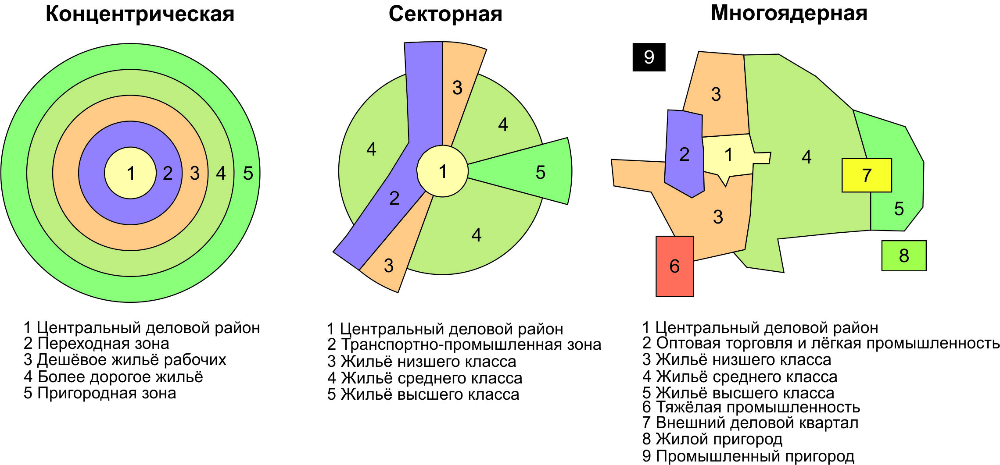

Рисунок 6.1. Модели территориальной организации города

Источник: составлено авторами на основе материалов Pearson Prentice Hall[^func-2]

[^func-2]: URL: http://www.geo41.com/intra-urban-spatial-patterns/ (дата обращения 10.11.2018 г.)

Российские города значительным образом отличаются от описанных моделей в силу множества исторических факторов, тем не
менее, на их примерах может быть проиллюстрировано влияние различных детерминантов функциональных зон города.

Концентрическая модель Бёрджесса[^func-3]
хорошо отражает специфику американского города второй четверти XX в. Наиболее прибыльным в центре города
является размещение офисов и объектов торговли, которые формируют центральный деловой район (ЦДР). Высокая концентрация рабочей силы и покупателей позволяет максимизировать прибыль несмотря на значительную земельную ренту. Производство
тяготеет к расположению на окраине центральной части города -- концентрация рабочей силы всё ещё велика, однако арендные ставки уже не столь высоки, как в ЦДР. Дифференциация жилья по ценовым категориям связана с экологическими причинами (состоятельные люди не хотят селиться поблизости от опасных производств) и возможностями мобильности населения (среди богатых гораздо
больше число людей, имеющих автомобиль).

[^func-3]: Эрнст Уотсон Бёрджесс (1886-1966) - американский социолог, представитель Чикагской школы социологии, один из
основоположников городских исследований, как научного направления.

Секторная модель Хойта[^func-4]
делает акцент на развитии функций вдоль транспортных коридоров (железных и автомобильных дорог). Общественно-деловые и производственные зоны будут размещаться так, чтобы иметь наилучшую транспортную доступность. Размещение жилья высокого класса также связано с природными факторами (преобладающее направление ветра: в американских городах восточное; в европейских, напротив,
западное).

[^func-4]: Хомер Хойт (1895-1984) - американский экономист, специалист по оценке недвижимости

Многоядерная модель Харриса-Ульмана[^func-5] является более реалистичной, допуская возможность появления новых деловых
районов, расположенных на «богатых» окраинах. Возникновение узлов экономической активности вне традиционного центра авторы связывают с тенденцией к минимизации транспортных издержек.

[^func-5]: Чонси Деннисон Харрис (1914-2003) и Эдвард Льюис Ульман (1912-1976) -- американские географы, занимавшиеся
исследованиями городов и транспортных систем

Первичной единицей функционального зонирования города обычно является квартал. Для каждого из этих участков
городской территории, ограниченных улично-дорожной сетью, определяется доминирующий вид использования. При этом маркируется современный тип использования территории, что становится особенно важным в условиях быстрой трансформации
функций в современных городах. Все чаще в российских городах можно встретить процесс ***джентрификации***,
который в развитых странах протекает уже на протяжении нескольких десятилетий.
Под этим понятием понимают реконструкцию или качественное обновление территорий в непрестижных городских кварталах, происходящее как благодаря централизованному планированию, так и вследствие притока более состоятельных жителей. Результатом джентрификации становятся изменение социального состава, привлечение инвестиций и изменение функционального использования территории.
Отдельным видом джентрификации может считаться реновация промышленных зон -подобные примеры сейчас можно встретить в большом числе российских городов, например реконструкция заводов ЗиЛ и «Красный Октябрь» в Москве, промзон Петроградской стороны в Санкт-Петербурге, завода «Уралпластик» в Екатеринбурге.

Наиболее общей типологией функциональных зон, используемой в том числе при разработке правил землепользования и
застройки (ПЗЗ)[^func-6] является список, представленный в таблице XXX.

[^func-6]: Правила землепользования и застройки -- официальный документ, прилагающийся к генеральному плану
населённого пункта, где обозначены разрешённые виды использования территории.

Таблица 6.2. Функциональные зоны города
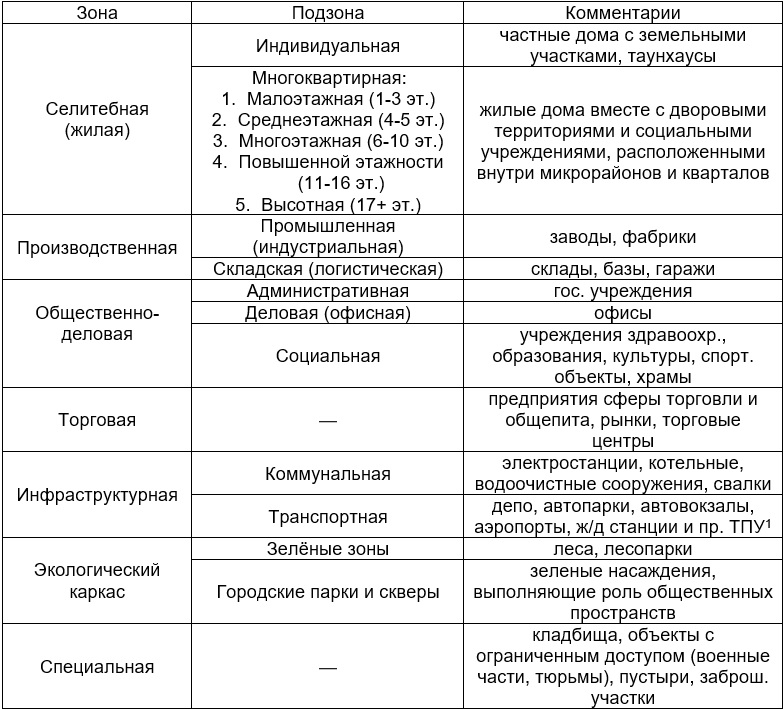
[^func-7]: Транспортно-пересадочные узлы

Отдельно на картосхеме функционального
зонирования отображаются линейные объекты транспортной инфраструктуры (железные
и автомобильные дороги), административные границы и водоёмы (реки, пруды,
озёра).

Функциональное зонирование обязательно
предполагает некоторую степень пространственной генерализации (обобщения
географической информации). Отнесение квартала к определенному функциональному
типу осуществляется на основе преимущественного использования. Так, если в
центре жилого квартала расположен социальный объект (например, школа), весь
квартал будет отнесён к селитебной функциональной зоне. Аналогичным образом тип
застройки по этажности определяется по преобладающей высоте.

Функциональное зонирование в полевых условиях
базируется на непосредственном визуальном обследовании территории. Признаками видов
использования могут являться вывески у входов в дома, интенсивность людских и
транспортных потоков, характер застройки. В камеральных условиях основой для
выделения функциональных зон становятся планировочные дешифровочные признаки
картографических материалов (см. приложение XXX).

Селитебные, производственные и торговые зоны
обычно выделяются достаточно легко по характерному рисунку жилых кварталов,
производственных цехов и торговых павильонов. Основные трудности возникают с
общественно-деловой зоной, которая может выглядеть на снимках по-разному. В
данном случае индикаторами могут служить высотные офисные здания в крупных
городах, паркинги, или собственно центральное расположение для малых городов.

Коммунальные и транспортные зоны могут быть
определены по характерным признакам объектов (например, для водоочистных
сооружений это отстойники круглой формы, площадки для стоянки автобусов в
депо). Для специальных зон может потребоваться консультация с альтернативными
картографическими источниками (например, Wikimapia, 2ГИС).


## Практическая часть

**Методические рекомендации для формулировки и выполнения задания:**

Функциональное зонирование городских территорий
в первую очередь требует навыков анализа картографических источников. Для более тщательного анализа исследуемого полигона по желанию также могут быть проведены полевые обследования. Наблюдение на местности помогает более точно отобразить последние изменения в использовании городских территорий: подобный способ поможет школьникам развить пространственное мышление. Также в выполнении задания очень важна правильная генерализация, которая зависит от масштаба исследуемой территории и значимости тех или иных объектов в её пределах.

Объектом функционального зонирования каждой группы школьников станет участок территории поселения. С учётом различного масштаба городов учителю предлагаются на выбор следующие варианты:

1. территория всего города (для малых городов и сельских поселений)

2. часть территории города (для средних и крупных городов) -- полигон размеров приблизительно 2\*2 км, на котором
представлено большинство типов использования территории.

При условии участия в занятии более 6 человек исследование может проводиться в малых группах (3-4 человека). Каждая группа
получает один из участков городской территории таким образом, что затем полученные данные могут быть сопоставлены для получения комплексной картины функционального использования городского пространства. Для малых городов в случае участия в занятии нескольких групп могут быть подобраны поселения-аналоги, расположенные в том же субъекте РФ или соседних регионах. 
Время, отведённое на данное занятие, составляет 5 академических часов, включая 3 часа на составление карты функционального
зонирования в камеральных условиях, а также 1 час на выступления школьников. При проведении дополнительных полевых наблюдений время занятия увеличивается на 1 час. При работе над заданиями школьники могут использовать материалы предыдущих занятий (плотность населения, историческая среда, геометрия города).

**Этапы выполнения задания:**

1. Подготовительный

Для выполнения задания требуется картографическая основа исследуемого участка. В целях экономии времени учителю
предлагается подготовить распечатанные черновые картосхемы исследуемых полигонов в формате A3. Наиболее подходящими являются электронные картографические источники (Яндекс.Карты, OpenStreetMap, GoogleMaps). Приветствуется использование школьниками для создания карты специализированных программных пакетов ArcGIS или QGIS, а также усовершенствованных графических редакторов (например, CorelDraw).

Если задание выполняется полностью в камеральных условиях, учителю рекомендуется также ознакомить учащихся со схемами
генерального плана и правил застройки и землепользования поселения, которые обычно находятся в открытом доступе на сайтах муниципальных образований.

В случае возможности проведения полевого занятия школьники приступают к непосредственному картированию городского пространства и
должны быть проинструктированы учителем. Функциональное зонирование проводится по основным визуальным и планировочным признакам (характер застройки, вывески организаций), группы не посещают территории с ограниченным доступом.


2. Функциональное зонирование

Каждая группа школьников первоначально изучает спутниковые снимки своего участка и предварительно определяет набор
функциональных зон, встречающихся в пределах полигона. На данном этапе необходимо составить легенду карты на основе предлагаемого перечня
функциональных зон (таблица 6.2). В качестве дешифровочных признаков может быть использован характер планировки,
застройки. Определённую сложность в идентификации набора функций представляют территории, испытывающие трансформацию (например, «переквалификацию» из промышленных в торговые или деловые). Необходимо помнить, что на картосхеме должно быть указано именно современное использование территории, что особенно важно для старопромышленных городов.

При возникновении затруднений в определении зон по снимкам, учащимся следует использовать картографические справочники
организаций (например, 2ГИС для крупных и некоторых средних городов) или Интернет-карты (Яндекс.Карты, Google Maps). Рекомендуется использовать карты в формате спутникового снимка либо гибридной схемы.


На чистовой бланк (лист формата A3) наносится планировочный каркас исследуемой территории, выдержанный в масштабе. Далее
полученная из спутниковых снимков и картографических справочников информация, обобщается. В случае, если возможно проведение полевого занятия, к данным материалам добавляются и данные, полученные в ходе наблюдений в городе.

Следует помнить, что основной единицей городского планирования является квартал и разбиение его территории на
несколько зон оправдано лишь в случаях исключительной общегородской значимости тех или иных объектов. Выбор функциональной зоны осуществляется по численному преобладанию площади, занятой определённым видом деятельности.

При составлении легенды стоит обратить внимание на её стилистическое оформление, которое позволит облегчить восприятие итоговой
карты (см. пример оформления готового задания). Картосхемы функционального зонирования территории являются классическим примером применения качественного фона (одинаковая заливка для однородных участков).

Традиционно для обозначения селитебной зоны используются оттенки оранжевого и красного цветов, причём чем выше этажность
застройки, тем цвет более насыщен. Производственная зона обозначается оттенками серого цвета (подобную практику можно наблюдать, например, на картосхемах Яндекса), рекреационная зона обозначается оттенками зелёного. Другие зоны не имеют строго закреплённого цветового кода. Однако чаще всего общественно-деловые и торговые зоны обозначаются такими цветами, как 
фиолетовый, синий, розовый, бежевый. Инфраструктурные и специальные зоны отображаются оттенками жёлтого и коричневого.

Функциональные зоны наносятся на итоговую карту участка вместе с условными обозначениями в соответствии с правилами оформления
карт (см. Занятие №1[#intro]).

3. Выступление

Итогом работы каждой группы школьников кроме карты функционального зонирования участка должно стать краткое выступление,
характеризующее функциональные типы на исследуемом участке. Учащиеся опираются на факторы дифференциации территорий по видам землепользования, указанные в таблице XXX, приводя примеры подобных связей в рамках своего участка. Опираясь на собственные знания о городе и проведённые наблюдения, школьники также могут попытаться сделать выводы о возможной динамике функционального использования территории (трансформация промышленных зон в офисные и жилые, открытие новых промышленных и инфраструктурных объектов и т. д.)

**Необходимые материалы:** простой карандаш, цветные карандаши (лучше -- акварельные 24 цвета, линейка

**Пример оформления задания**:


Пример условных обозначений для карты функциональных зон:
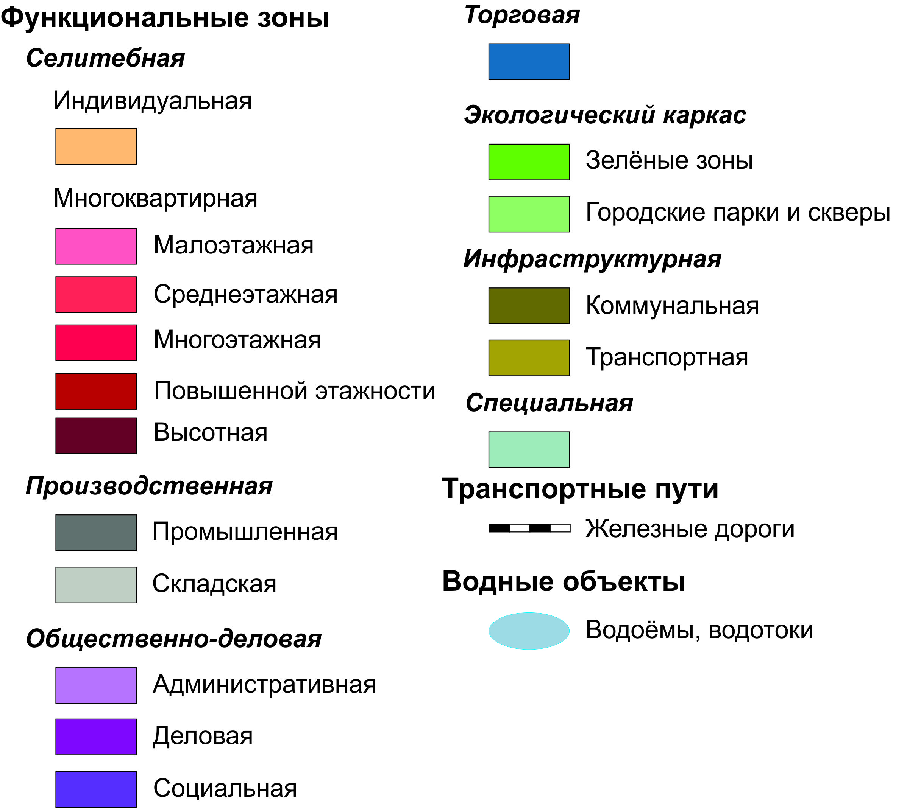


<!--chapter:end:06-functions.Rmd-->

# Внутригородские миграции{#migration}

## Теоретическая часть

Современные города сложно представить без ежедневной необходимости совершать поездки из одних районов в другие. Увеличение скорости транспортных средств и сокращение удельных издержек перевозок стали основными факторами сдвига в территориальной мобильности. Изменился облик городов: компактные средневековые поселения с преобладанием пешеходных связей уступили место разросшимся вдоль транспортных путей урбанизированным ареалам.

Миграция при рассмотрении на уровне города подразумевается в широком смысле -- в качестве передвижения населения между территориями, которое характеризуется определённой интенсивностью и направленностью. По частотности подобные перемещения внутри города обычно подразделяются на 2 основных типа: *эпизодические* (не носят систематического характера, т.е. не исполняются периодически в строго определенное время; обычно к такому типу относятся поездки в магазины, больницы, к друзьям) и *маятниковые* (ежедневные регулярные маршруты, соединяющие место жительства с местом приложения труда).

Аналогичные типы миграций преобладают и в пределах городских агломераций. Их основными отличиями от внутригородских миграций являются более высокая длительность подобных перемещений (по времени и расстоянию), обусловленная отсутствием единой транспортной системы, и как следствие более высокая стоимость таких поездок. Высокая плотность населения на окраинах с одной стороны, и сверхконцентрация центральных функций в ядрах агломераций с другой становятся причинами высокой нагрузки на инфраструктуру таких городов (примерами могут служить пробки «из области в Москву» в утренние часы-пик и заполненный до предела пассажирами общественный транспорт).

Ежедневно городские жители совершают перемещения с различными целями, которые не всегда могут быть причислены к одному из типов. Подобные поездки могут совершаться как эпизодически, так и регулярно. Наиболее общепринятой является следующая классификация видов миграции:

*Трудовая* (экономическая, деловая) -- поездки на рабочее место и по рабочим делам в течение дня;

*Учебная* (образовательная) -- поездки на место учёбы (в школу, университет, к репетитору);

*Рекреационная* -- поездки с целью отдыха, развлечений или культурно-познавательные (походы в музеи, театры);

*Бытовая* -- посещение родственников и друзей, прочие личные дела;

*Потребительская* -- покупка товаров и услуг (в том числе в области здравоохранения, посещение государственных учреждений).

Среди вышеуказанных видов миграции преобладает трудовая. Несоответствие места жительства и приложения труда является основной причиной ежедневных маятниковых миграций внутри города.

Таким образом, структура внутригородских миграций с одной стороны определяет транспортный каркас, а с другой стороны, уже сложившаяся транспортная система влияет на структуру миграций внутри города. Другими факторами, определяющими характер и направленность миграций, могут являться, плотность населения, взаимное расположение основных функциональных зон и планировка города.

Выявление структуры внутригородских миграций требует анализа загруженности транспортной системы города в течение дня. Для этого необходим подсчёт пассажиропотока (количества пассажиров за определённый промежуток времени, обычно за час) для конкретного пункта или направления.

Рисунок 7.1 Суточная динамика пассажиропотока с выраженными часами-пик Источник: ЗАО «Коммет». Статистика Петербургского метрополитена[^migr-1]

[^migr-1]: URL: <http://kommet.ru/stats> (дата обращения 03.11.2018 г.)

Суточный ход пассажиропотока обычно характеризуется двумя выраженными максимумами в утреннее и вечернее время (*часы-пик*). Именно в эти промежутки времени горожане массово совершают трудовые и учебные миграции. Утром они направлены от жилых районов к основным местам концентрации рабочих мест, а вечером наоборот[^migr-2]. Кроме пассажиропотока общественного транспорта индикатором часов-пик является загруженность автомобильных дорог (например, оценка сервисов Яндекс.Пробки и Google Maps).

[^migr-2]: Важно отметить, что обычно вечерний час-пик в большинстве современных городов является более продолжительным, чем
утренний: время окончания рабочего дня заметно различается в зависимости от вида деятельности; кроме того, многие предпочитают заниматься личными делами после работы.

Отдельной динамикой пассажиропотока и загруженности городских магистралей обладают выходные дни. Часы-пик в таком случае обычно не выражены, максимальный объем миграций приходится на дневное и вечернее время (с 13 по 18 часов), когда горожане занимаются личными делами.
Тем не менее, в крупнейших агломерациях в последние годы заметна тенденция
роста утреннего пассажиропотока в условиях «плавающего» или ненормированного рабочего графика.

Помимо этого, существует и годовая динамика пассажиропотоков -- максимальная нагрузка на транспортную сеть приходится на зимнее время, когда интенсивность миграций осложняется неблагоприятными погодными условиями, в результате чего увеличивается аварийность на дорогах, снижается скорость перевозок, а многие пассажиры предпочитают в связи с этим пользоваться общественным транспортом[^migr-3]. В летнее время, напротив, интенсивность внутригородских перевозок обычно снижается -- в сезон отпусков численность постоянного населения городов сокращается. Однако объем пригородных перевозок увеличивается, в особенности в пятницу и выходные дни, за счет дачных миграций.

[^migr-3]: Абсолютный годовой максимум загруженности дорог в большинстве российских городов приходится на рабочие дни
последних недель перед Новым годом. Увеличение мобильности населения, стремящегося приобрести подарки родным и близким, зачастую сопровождается «коллапсом» на дорогах после сильных снегопадов и метелей.

Определение направленности внутригородских миграций происходит в зависимости от разницы пассажиропотока остановочного пункта «на вход» и «на выход». Если в утреннее время гораздо больше число тех пассажиров, которые приезжают на остановку или станцию (пассажиропоток «на выход»), то территория вокруг транспортного узла скорее всего носит административно-деловые функции. Для вечерних часов-пик в подобных зонах наблюдается обратная картина. В селитебных зонах аналогичным образом с утра основная часть потока приходится «на вход», а вечером -- «на выход».

Несмотря на значительный рост уровня автомобилизации населения в последние 20 лет, доля россиян, ежедневно использующих общественный транспорт для поездок по городу, остаётся высокой (около 50-60%)[^migr-4].
Примерно 30% населения использует личный автотранспорт, ещё около 10% передвигается пешком.

[^migr-4]: По данным Левада-Центра. URL: <https://www.levada.ru/2017/09/27/transport-i-transportnye-problemy/> (дата обращения 03.11.2018 г.)

Подсчёты пассажиропотока общественного транспорта ведутся исходя из его примерной загруженности (% от максимальной вместимости; см. таблицу 7.1).


Таблица 7.1. Классификация общественного транспорта по пассажировместимости

| Класс по пассажиро-вместимости | Виды общественного транспорта               | Примерная пассажиро-вместимость 1 ед., чел. | Внешний вид (рисунок 7.2) |
|--------------------------------|---------------------------------------------|---------------------------------------------|---------------------------|
| Малый                          | Микроавтобусы («маршрутки»)                 | 20-30                                       | А                         |
| Средний                        | Небольшие автобусы                          | 30-60                                       | Б                         |
| Большой                        | Автобусы, троллейбусы, одиночные трамваи    | 60-90                                       | В                         |
| Особо большой                  | Сочленённые автобусы, троллейбусы, трамваи,  вагон метрополитена | 90-180                 | Г                         |


Рисунок 7.2. Классы вместимости автобусного транспорта


Другой важной характеристикой внутригородских миграций является количество транспортных средств на маршруте (величина, обратная показателю интервала движения -- времени между отправлением рейсов одного маршрута). В сочетании с вместимостью транспортных средств, эти две характеристики демонстрируют интенсивность миграции по выбранному направлению: чем выше произведение двух показателей, тем больше величина миграций из одного района в другой.

## Практическая часть

**Методические
рекомендации для формулировки выполнения задания:**

Анализ внутригородских миграций требует работы с большими объёмами данных, включающих сведения сервисов
геопозиционирования о движении личного и общественного транспорта. Для отслеживания ежедневных миграций в пределах города и агломерации также могут использоваться данные сотовых операторов.

Целью занятия является знакомство в первую очередь с полевыми методами оценки интенсивности и направленности
внутригородских миграций. Это позволит сформировать целостную картину о мобильности населения внутри города, основываясь на непосредственных наблюдениях школьников.

Объектом изучения каждой группы школьников станет одно из направлений внутригородских миграций в поселении. С
учётом различного масштаба городов учителю предлагаются на выбор следующие категории населения, как объекты исследования:

1. пешеходы (для сельских поселений и малых городов)

2. пользователи общественного транспорта (для средних и крупных городов)

При условии участия в занятии более 10 человек исследование может проводиться в малых группах (5-6 человек). Каждая
группа выбирает одно из основных направлений внутригородской миграции для последующего анализа. Затем полученные данные могут быть сопоставлены для получения комплексной картины внутригородской мобильности горожан.

Время, отведённое на данное занятие, составляет 6 академических часов, включая 2 часа на выступления школьников и 2 часа на проведение замеров в полевых условиях. При работе над заданиями школьники могут использовать материалы предыдущих занятий
(плотность населения, изучения городского транспорта, функциональное зонирование).

**Этапы выполнения задания:**

1. Подготовительный

*А) Выбор направления*

Для корректного выбора направления миграций учитель подготавливает для школьников схему общественного транспорта
поселения. В случае малых городов и сельских поселений используются планировочные схемы населённых пунктов.

Далее учащиеся выбирают одно из направлений типа «центр города -- отдалённый микрорайон». Оно определяется по
конечным остановкам магистральных маршрутов, отражённых на схемах и числу маршрутов в каждом направлении. Стоит отметить, что подобные схемы не всегда включают все маршруты общественного транспорта (могут отсутствовать данные по коммерческим перевозчикам). В этом случае рекомендуется использовать данные картографических сервисов (Яндекс.Карты, 2ГИС и другие).

Задача учащихся каждой группы на данном этапе состоит в выделении направления для последующего анализа (прохождение
всех маршрутов, соединяющих конечные пункты по одной траектории необязательно (см. рисунок 7.3).


Рисунок 7.3. Пример схемы общественного
транспорта города с выделенными направлениями. Источник: Общественный транспорт
Адыгеи и Кубани[^migr-5]

[^migr-5]: <http://www.kubtransport.info/schemes/krasnodar2014_center.gif> (дата обращения 03.11.2018 г.)

*Б) Определение объема потенциального пассажиропотока выбранного направления*

Для дальнейшего анализа необходимо собрать данные о потенциальном пассажиропотоке общественного транспорта с
помощью анализа существующих маршрутов, связывающих выбранные конечные пункты. В таком случае мы предполагаем, что в соответствии с правилами формирования рыночного спроса, величина потенциального пассажиропотока будет максимально приближена к реальной величине миграций между районами (т. е. даже субсидируемые из бюджета муниципальные маршруты так же отражают реальные
пассажиропотоки между районами города).

В целях экономии времени для расчёта потенциального пассажиропотока направления предлагается заполнение таблицы XXX,
в которой для каждого маршрута по направлению указывается класс
пассажировместимости (используется среднее значение вместимости для класса) и
количество рейсов в час в течение утреннего (с 7 до 10 часов) или вечернего (с
17 до 20 часов) часов-пик. Итоговая ёмкость направления представляет сумму
значений, указанных в столбце «пассажиропоток, чел./час».

Источником данных является информация о маршрутах общественного транспорта, которая обычно находится на сайтах
администраций муниципальных образований. В случае ее отсутствия таблица 7.2 заполняется «экспертным путём» на основе знаний школьников и учителей о транспорте в их
городе.

Таблица 7.2

| № маршрута | Класс пассажиро-вместимости (таблица XXX) | Интервал, мин | Количество рейсов в час (60/интервал), шт. |  Пассажиропоток, чел./час (класс пассажиро-вместимости\*количество рейсов)  |
|------------|-------------------------------------------|---------------|--------------------------------------------|-------------------------------------------------------|
| ...        | ...                                       | ...           | ...                                        | ...                                                   |

Для оптимизации расчетов предлагается ограничить число выделенных направлений тремя на группу. В таком случае, если
занятие проходит с небольшим число участников, учитель помогает школьникам определить основные направления внутригородских миграций (обычно, крупнейшие микрорайоны).

Для занятий в сельской местности и малых городах данный пункт практикума не выполняется. Определение потенциала
направления производится на основе замеров потока пешеходов при полевых наблюдениях.

2. Полевые измерения

Следующим этапом является проведение измерений на местности для подтверждения гипотез о характере и направленности
выбранного направления внутригородских миграций.

Участникам предлагается при помощи учителя выбрать до 3 остановочных пунктов на одном из выделенных направлений миграций. Условием отбора является их взаимное расположение -- одна их точек должна располагаться в «центральной зоне», где выражены деловые функции, вторая в нейтральной зоне «расширенного центра», третья в районе с выраженными селитебными функциями.

Для каждого из остановочных пунктов в течение 20 минут предлагается вести замеры пассажиропотока общественного
транспорта. Измерения должны быть синхронизированы и проводиться в вечерние часы-пик (наиболее удобное с учётом расписания учебных занятий время между 17 и 19 ч). Учитывая время суток, необходимо вести измерения на остановочных пунктах в направлении «из центра на окраину».

Таблица 7.3

| № Маршрута | Число вошедших | Число выходящих | Общий пассажиропоток | Разница |
|------------|----------------|-----------------|----------------------|---------|
| ...        | ...            | ...             | ...                  | ...     |

Учащимся предлагается заполнить таблицу Y, куда вносится число вошедших и
вышедших пассажиров из каждого транспортного средства в течение периода
измерений. По итогам измерений вычисляются суммы по каждому столбцу, которые
затем приводятся к значению пассажиропотока в час (умножаются на 3). Далее
полученные показатели сопоставляются для 3 остановочных пунктов изучаемого
направления. Особое внимание школьников должно быть обращено на разницу
входящих и выходящих пассажиров на остановочном пункте.

В случае малых городов и сельских
поселений в ходе полевых наблюдений производятся замеры числа пешеходов,
двигающихся по направлениям «центр-окраина» и «окраина-центр». Для этого, с
помощью учителя выбираются три аналогичные точки на одном из направлений,
определенных в п.1.

Таблица 7.4

| Число пешеходов в направлении центр-окраина | Число пешеходов в направлении окраина-центр | Общий пассажиропоток | Разница |
|---------------------------------------------|---------------------------------------------|----------------------|---------|
| ...                                         | ...                                         | ...                  | ...     |


3. Камеральная обработка

Итогом работы всех участников должна стать общая карта ёмкости основных направлений внутригородской миграции. Каждая
группа должна подготовить выступление, в котором будет отражено место конкретного направления во внутригородских миграциях, охарактеризованы основные источники пассажиропотока на исследованных остановочных пунктах. Школьники описывают различия входящего и выходящего потока на каждой остановке в виде диаграмм, а также делают выводы о функциональном назначении территорий вокруг
исследуемых пунктов.

По желанию, участники практикума могут также выполнить творческое аналитическое задание. На основе данных наблюдений,
умений и навыков, полученных в ходе практикума, а также знаний о родном городе школьникам предлагается составить диаграмму, отражающую суточный ход пассажиропотока для одного (по выбору) остановочного пункта в рамках исследуемого
направления. По оси абсцисс откладывается время с шагом в 1 ч, а по оси ординат пассажиропоток, чел./час. Предполагается, что в ходе подведения результатов практикума, школьники могут выступить перед группой с диаграммой, пояснив причины подобного
хода пассажиропотока в течение дня.

**Необходимые материалы:** простой карандаш, цветные карандаши, бумага, планшеты, часы (таймер для проведения замеров)

**Пример оформления выполненного задания**:

Пример заполненной таблицы 7.2

| № маршрута | Класс пассажировместимости (таблица XXX) | Интервал, мин | Количество рейсов в час (60/интервал), шт. | Пассажиропоток, чел./час (класс пассажировместимости \* количество рейсов)  |
|:----------:|:----------------------------------------:|:-------------:|:------------------------------------------:|:------------------------------------------:|
| 30         | Особо большая (135)                      | 5             | 12                                         | 1620                                       |
| 47         | Малая (25)                               | 20            | 3                                          | 75                                         |

Сумма = 1695 чел./час


Пример заполненной таблицы 7.3

| № Маршрута | Число вошедших | Число выходящих | Общий пассажиропоток | Разница |
|:----------:|:--------------:|:---------------:|:--------------------:|:-------:|
| 30         | 14             | 4               | 18                   | 10      |
| 47         | 5              | 1               | 6                    | 4       |

Сумма пассажиропотока = 72 чел./час

Пример заполненной таблицы 7.4

| Число пешеходов в направлении центр-окраина | Число пешеходов в направлении окраина-центр | Общий пассажиропоток | Разница |
|:-------------------------------------------:|:-------------------------------------------:|:--------------------:|:-------:|
| 54                                          | 14                                          | 68                   | 40      |

Сумма пассажиропотока = 204 чел./час

Пример диаграммы пассажиропотоков в вечерний час-пик


<!--chapter:end:07-migration.Rmd-->

# Сфера обслуживания {#service}


## Теоретическая часть

Города являются основными центрами экономической активности. Высокая плотность населения делает их подходящими
рынками для реализации различных видов товаров и услуг.

В современном мире сектор услуг доминирует в структуре экономик развитых и большинства развивающихся стран, как
по числу занятых, так и по вкладу в ВВП[^service-1].
Услуга -- это вид деятельности, в процессе которой не создаётся нового материального продукта, но изменяется качество уже имеющегося. Другими словами, услуги -- это блага не в форме вещей, а в форме работы, не предполагающей создания новых вещественных продуктов.

Услуги делятся на 2 крупные категории - рыночные и нерыночные. Первая категория наиболее обширна, в неё входят все виды
деятельности, которые являются платными для потребителей (например, услуги парикмахера, нотариуса или тренера по фитнесу). Нерыночные услуги оказываются бесплатно, имеют высокое социальное значение и часто финансируются из бюджета (например, образовательные услуги в школах, медицинские в поликлиниках).

Существует множество других подходов к классификации услуг, однако наиболее распространённым является их разделение на материальные и нематериальные, а также их типология по отраслям. Материальные услуги связаны с непосредственной работой с имуществом клиента (примером, может служить упаковка подарков, изготовление ключей и т. д.). Нематериальные осуществляются
напрямую с клиентом (например, образовательные, консультационные, банковские услуги).

По отраслям можно выделить следующие виды услуг[^service-2]:

- Торговля, гостиницы и общественное питание (магазины[^service-3], рынки, отели, рестораны и кафе)
- Транспорт, хранение и связь (такси, службы доставки, складские хозяйства, интернет-провайдеры)
- Финансы, юридические услуги и страхование (банки, нотариальные конторы)
- Образование и наука, культура и искусство (школы, музеи, театры)
- Здравоохранение, физическая культура и спорт (больницы, лаборатории, фитнес-клубы)
- Жилищно-коммунальные услуги (теплоснабжение, текущий ремонт)
- Бытовые услуги (салоны красоты, фотоателье, прачечные)
- Государственное управление (административные учреждения -- в т.ч. полиция, МЧС, суды)

Вместе с эволюцией мировой экономики сфера услуг становилась всё более развитой. В Древности и Средние века
преобладал обмен товарами -- готовыми результатами аграрного или ремесленного труда. Интенсивная урбанизация в последние два столетия привела к развитию специализации работников -- появлению узконаправленных видов услуг. В современном мире экономика наиболее развитых стран характеризуется широким набором высокоприбыльных видов услуг, связанных с IT-сферой[^service-4] и
финансами.

Предприятия сферы услуг являются важным элементом городского пространства. В рамках функционального зонирования отдельные кварталы могут иметь выраженную специализацию на том или ином виде услуг (административные, социальные, торговые). Однако подобные предприятия размещаются и внутри других зон (жилых, деловых, промышленных).

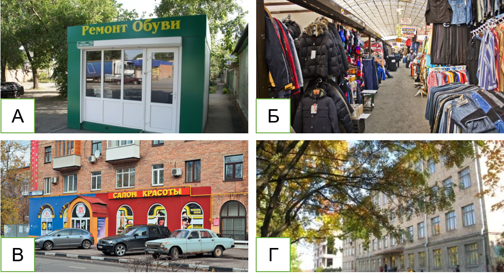

Рисунок 8.1. Типы объектов сферы услуг. А - некапитальные строения (ларьки), Б - рынки, В - 
первые этажи жилых домов, Г - отдельно стоящие строения
Источник: Информационный портал Юга.ру, Справочник Адреса.Телефоны

Объекты сферы услуг могут быть размещены в различных условиях. Виды услуг, не требующие большой площади помещения,
обычно располагаются в ларьках (А), которые можно перемещать на новое место без значительных затрат, и чья установка обычно имеет упрощенные требования законодательства. Зачастую подобные торговые точки оказывается удобнее размещать на одном специально выделенном участке -- рынке (Б). Исторически именно этот вид размещения предприятий сферы услуг (в первую очередь, торговых)
сложился самым первым. Продавцам было выгодно находиться в одном месте, т.к. таким образом клиент, приходящий за одним товаром (например, хлебом), покупал бы также и другие (овощи).

В современных городах рынки часто заменяются торговыми центрами или объектами сферы услуг на первых этажах зданий
(В). В виде отдельно стоящих строений (Г) обычно размещаются школы, детские сады, больницы, бизнес-центры, однако и они могут быть локализованы на первых этажах жилых домов.

Картографирование сектора услуг может носить совершенно разный характер. Существует два основных принципа отображения
таких объектов:
- Площадной (типы Б и Г) - выделяются непрерывные территории с доминированием тех или иных отраслей услуг. Если
площадные объекты занимают бо́льшую часть квартала городской застройки, характер использования объектов определяет функциональный тип использования территории (обычно, общественно-деловая зона);

- Точечный (типы А и В) - отдельно обозначается каждый объект вместе с его характеристиками (например, размером
значка может быть охарактеризована площадь помещения, формой -- тип объекта, а цветом -- отрасль). В этом случае объекты сферы услуг размещаются в пределах территории, которая имеет в качестве основной иную функцию помимо оказания услуг, чаще всего селитебную.

При маркировке предприятий сектора услуг необходимо обращать внимание на вывески, которые могут содержать информацию о
видах деятельности, стоимости услуг, владельцах объекта и режиме работы.

Для оптимального размещения предприятий сектора необходимо учитывать совокупность целого ряда характеристик территорий
(физико-географических, экономико-географических, социально-экономических). Их анализом занимается специальная дисциплина, находящаяся на стыке географии, экономики и социологии - географический маркетинг (геомаркетинг). Главным принципом при выборе места является извлечение максимальной прибыли от сочетания факторов размещения в конкретном месте.

Основные задачи геомаркетинга можно сформулировать следующим образом:

- Выбор оптимального размещения объекта и его площади (Где продавать?)
- Планирование деятельности в соответствии с учётом размещения клиентов (Что продавать и в каких объемах?)
- Оценка и прогнозирование объёмов реализации товаров и услуг (Что и в каких объемах я буду продавать через несколько лет?)

В последнее время все более широким становится использование геоинформационных технологий для решения подобных
задач. Однако в условиях растущего спроса на геомаркетинговые услуги со стороны бизнеса традиционные методы полевых исследований остаются востребованными, а зачастую -- единственными возможными для выбора места размещения предприятий.

Основными факторами размещения предприятий являются различные характеристики возможного местоположения объекта и потенциальных потребителей.


Таблица 8.1. Факторы размещения объектов сферы услуг согласно концепции геомаркетинга[^service-5]

+-------------------------------------------+-------------------------------------------------------------------------------+
| Факторы размещения                        | Анализируемые показатели                                                      |
+===========================================+===============================================================================+
| Есть ли здесь покупатели и легко ли сюда  | Плотность населения                                                           |
| добраться?                                |                                                                               |
|                                           | Транспортная доступность (количество                                          |
|                                           | пешеходов, автомобилей и маршрутов общественного транспорта; время в пути)    |
+-------------------------------------------+-------------------------------------------------------------------------------+
| Кто эти покупатели?                       | Структура населения по доходам, возрасту,                                     |
|                                           | образованию                                                                   |
+-------------------------------------------+-------------------------------------------------------------------------------+
| Где локализованы покупатели?              | Зоны рыночного охвата -- территория, которую                                  |
|                                           | обслуживает данное предприятие в отличие от конкурентов                       |
+-------------------------------------------+-------------------------------------------------------------------------------+
| Есть ли здесь другие объекты сферы услуг? | Взаиморасположение с другими предприятиями                                    |
| Какие?                                    | (конкуренция или кооперация и кластеризация с объектами других отраслей сферы |
|                                           | услуг)                                                                        |
+-------------------------------------------+-------------------------------------------------------------------------------+
| Как часто клиенту будут нужны услуги?     | Характер потребительского спроса                                              |
|                                           | (повседневный, периодический, эпизодический)                                  |
+-------------------------------------------+-------------------------------------------------------------------------------+
| Насколько высокими будут издержки?        | Стоимость земли, аренды помещений, средняя                                    |
|                                           | заработная плата работников                                                   |
+-------------------------------------------+-------------------------------------------------------------------------------+

Отдельно рассмотрим те из факторов,
которые являются наиболее важными с точки зрения географии, а их влияние
оценивается с помощью полевых методов исследований:

1. **Наличие покупателей и доступность территории** являются основными требованиями при размещении предприятий. Они определяют потенциальный объем спроса на предприятие со стороны клиентов. В зависимости от того, что является первоочередным -- наличие потребителя в районе предполагаемого размещения объекта или его возможность добраться до него, все виды услуг можно условно
разделить на две группы: 

А. Услуги, приуроченные к местам с высокой плотностью населения, обычно связаны с удовлетворением повседневного
спроса (магазины продуктов, бытовые услуги). Местами локализации могут быть точки как постоянного (жилые районы), так и временного нахождения людей (например, на период рабочего дня -- бизнес-центры, университеты)[^service-6]. В таком случае основным признаком, позволяющим идентифицировать спрос, является плотность населения.

Доступность для потребителей может считаться вторичным фактором, который определяет конкретное место размещения в
пределах выделенных районов максимальной концентрации населения. Обычно такими локациями оказываются центры кварталов (например, для школ и детских садов[^service-7], участковых отделений полиции) или места с наибольшим потоком людей в течение
дня (станции метро, остановки).

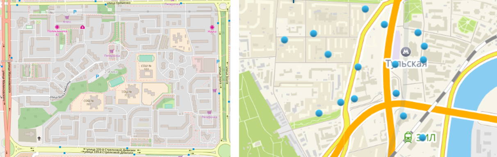
Рисунок 8.2. Локализация услуг повседневного спроса: школы в центре кварталов (слева),
магазины, приуроченные к потокам людей от станции метро (справа). Источник:
картографические материалы OpenStreetMap и 2GIS

Б. «Экстерриториальные»[^service-8] услуги ориентированы на периодический или эпизодический спрос, который
формируется на территории большего масштаба. В таком случае первичным становится транспортная доступность -- клиентам должно быть удобно быстро добраться до локации. Классическими примерами такого расположения являются крупные торговые центры или магазины одежды на главной торговой улице города (Тверская в Москве, Невский проспект в Санкт-Петербурге, Большая Садовая в
Ростове-на-Дону). В основном они приурочены к крупным транспортным магистралям с удобными развязками, станциям метро или центральным остановкам общественного транспорта.

2. Современные города, вне зависимости от их размера и функций, отличаются все большей социальной неоднородностью.
Данная особенность требует при размещении предприятий сферы услуг **сопоставления социального портрета их среднего пользователя с социальным портретом района**.

В данное понятие входит целая совокупность социальных характеристик жителей района, которые влияют на
поведение покупателей и тем самым формируют величину и структуру потребительского спроса. Наибольшее влияние на них оказывают:

- уровень доходов населения - базовая величина, определяющая уровень покупательной способности населения, т.е. количество
товаров и услуг, которые они могут приобрести при располагаемом доходе.
Согласно основам экономической теории, потребности людей заметно отличаются в зависимости от их уровня доходов. Так, еще в XIX в.
немецкий ученый Э. Энгель установил[^service-9], что по мере роста доходов, расходы на питание возрастают в меньшей степени, чем на предметы длительного пользования и персональные услуги. Большинство предприятий сферы услуг ориентированы на определенную категорию потребителей по уровню доходов.

- возрастно-половая структура населения является важным фактором при размещении специализированных услуг для таких
широких когорт населения как молодёжь или люди преклонного возраста. Так, в районе, где преобладают молодые, потенциально выше спрос на услуги, относящиеся к категории досуг и развлечения (клубы, бары, кафе, столовые). Примером услуг,
сегментированных по полу, могут быть салоны мужских стрижек (барбершопы) или услуги косметолога (макияж).

- уровень образования (без образования, среднее, высшее) часто не является жёстким основанием для сегментирования
потребителей, однако он может служить косвенным индикатором «новаторства» потребителя. Лица с высшим образованием более вероятно будут пользоваться «сложными» услугами, связанными с IT-сферой, дизайном, финансами и т. д.

Определение социального портрета района -- достаточно сложная задача, которая требует больших по объёму работ (социологические опросы, маркетинговые исследования). Из-за высокой стоимости и затрат времени, зачастую они невозможны даже при решении реальных задач размещения предприятий. В этой связи географы используют целый ряд косвенных признаков, которые можно диагностировать в полевых условиях. На их основе можно определить базовые характеристики потенциальных потребителей:

  - Уровень благоустройства района -- качество асфальтового покрытия, регулярность уборки улиц и дворовых территорий, наличие охраны или консьержа, ограничений на вход (въезд) на территорию;
  - Состояние жилого фонда: год постройки зданий, регулярность наружного и квартирного ремонта (состояние крыш, наличие теплоизоляции зданий, пластиковых окон); для частного сектора и сельской местности -- состояние заборов;
  - Состояние автомобильного парка: ценовой сегмент, возраст (новые, б/у), страна-производитель (отечественные, иномарки российской сборки, иномарки);
  - Ценовая категория существующих предприятий сферы услуг: наличие объектов бюджетного,
среднего, премиального класса;
  - Характер рекламных объявлений: тематика, целевая аудитория.

Данный список далеко не исчерпывающий.
Приветствуется проявление креативности участниками практикума и предложение
собственных маркирующих признаков в соответствии со спецификой отдельных
городов.

3. Важнейшей географической задачей геомаркетинга является необходимость определить **формы пространственного взаиморасположения предприятий** изучаемой отрасли. Принципиальным образом отличаются два типа взаимодействия:

Конкурирующие между собой предприятия обычно имеют конкретную территорию, для которой они специализируются в
предоставлении услуг -- зону обслуживания. Обычно её границы определяются временем, за которое клиент сможет дойти или доехать до объекта. Для этого строятся изохроны[^service-10] - линии равного времени доступности от определенной точки. Определение зон
обслуживания производится путем сопоставления изохрон для существующих объектов отрасли. Если вся территория оказывается «распределена» между действующими предприятиями (как на рисунке ХXX), размещение нового объекта в ее
пределах связано с определенным предпринимательским риском и может быть
невыгодно, т.к. величина спроса для данного магазина будет незначительной.

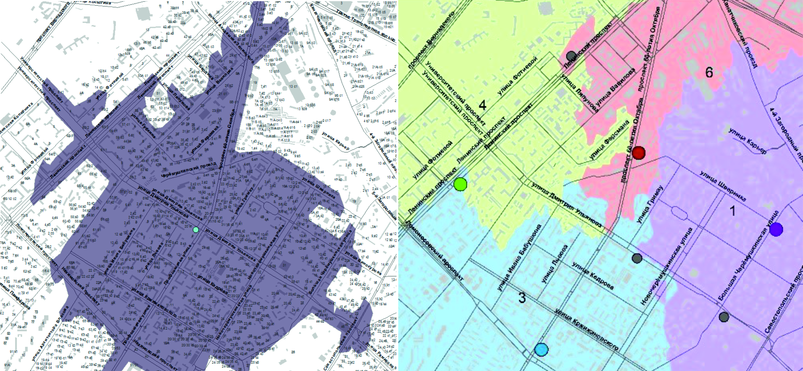
Рисунок 8.3. Определение изохрон (слева) и зон обслуживания торговых предприятий (справа) по
сети улиц в программном продукте ArcGIS. Выполнено авторами.

В то же время предприятия одной или разных отраслей сферы услуг могут испытывать выгоду от близости положения.
Обычно она связана с сокращением издержек от совместного использования инфраструктуры (например, офисы различных отделов государственных учреждений или точки общепита в ресторанных двориках), увеличения прибыли от притягивания клиентов
смежных отраслей (продовольственные супермаркеты, магазины одежды и аптеки в торговых центрах) или предоставления большего разнообразия предлагаемых товаров одной отрасли (специализированные рынки, например, вещевые, автомобильные или
так называемые «радиорынки»). В таких случаях формируются кластеры предприятий -- сконцентрированные на некоторой территории группы взаимосвязанных компаний.

Кластеризация измеряется с помощью специальных соотношений, которые отражают долю объектов сферы услуг, расположенных поблизости от аналогичных предприятий. Входящими в кластер можно считать объекты, расположенные «через стену» либо друг напротив друга. В наиболее общем виде степень кластеризации можно выразить следующей формулой:

Где N -- это общее количество предприятий, a - количество предприятий, расположенных в кластерах из 2 объектов, b - из 3-4 объектов, c - из 5-7 объектов, d - из более чем 8 объектов.

Коэффициент кластеризации безразмерен и может принимать значения от 0 до 1. Чем выше данный коэффициент, тем более
кластеризованы предприятия сферы услуг. Расчёт может проводиться как для отдельных отраслей, так и для объектов сферы услуг в целом.

Таблица 8.2. Шкала оценки степени
кластеризации объектов сферы услуг

| Значения коэффициента | 0...0,2      | 0,2...0,4 | 0,4...0,6 | 0,6...0,8 | 0,8...1       |
|-----------------------|--------------|-----------|-----------|-----------|---------------|
| Степень кластеризации | очень низкая | низкая    | средняя   | высокая   | очень высокая |

## Практическая часть

**Методические рекомендации для формулировки и выполнения задания:**

Анализ размещения объектов сферы услуг в городах -- трудоёмкая задача, требующая особого подхода к выбору исследуемой территории. Функциональные зоны города отличаются различной плотностью предприятий сферы услуг. Для центров городов, где выражены деловые и торговые функции, а также максимальны транспортные потоки, она высока. В то же время в жилых районах распределение объектов сферы
услуг гораздо менее равномерно и не характеризуется высокой плотностью.

Центры городов могут характеризоваться наличием экстерриториального спроса (клиентами организаций являются жители всего города) в отличие от кварталов жилой застройки, где основными потребителями являются местные жители.

Учителю предлагается выбрать один из следующих типов полигонов для исследования:

1) Участок в центре города, характеризующийся высокой плотностью и разнообразием объектов сферы услуг;
2) Участок в пределах кварталов жилой застройки (например, спального микрорайона).

При условиях участия в занятии более 6 человек работа может проводиться в рамках небольших групп (3-4 человека). Каждой из групп предлагается выбрать одну из отраслей сектора услуг (см. список ниже). Подобное разделение обязанностей необходимо для формирования целостной картины факторов размещения в рамках каждого типа объектов. Затем полученные каждой группой школьников данные сопоставляются.

Время выполнения задания -- 5 академических часов, включая 2 академических часа полевых работ и 1 час на выступления школьников с результатами творческих проектов. При камеральной обработке результатов полевого выхода школьники должны использовать данные, полученные в ходе прошлых занятий (карты плотности населения, функционального зонирования).

**Этапы выполнения задания:**

1. Подготовка к полевому выходу

Перед полевым этапом работ необходима подготовка черновой картографической основы
исследуемого полигона. На схеме участка должны быть отображены основные
планировочные структуры -- улично-дорожная сеть, отдельные здания и строения,
остановки общественного транспорта, что необходимо для точной географической
привязки исследуемых объектов.

Рекомендуемый размер картографической основы -- лист А4, схема должна быть выполнена в
масштабе с его обязательным указанием. Для экономии времени возможна распечатка
фрагментов карт из открытых картографических источников (OpenStreetMap,
Яндекс.Карты, 2ГИС и Google Maps).

Использование готовых карт в качестве шаблонов, а также непосредственно во время выполнения
задания в качестве источника данных не запрещается, однако и не приветствуется.
В данном случае у школьников могут не сформироваться навыки пространственного
восприятия городской среды, что на взгляд авторов практикума является его
основной задачей.


2. Полевой этап

Каждая группа школьников выбирает для анализа один из следующих типов платных услуг:

- Торговля,
гостиницы и общественное питание (магазины, рынки, отели, рестораны и кафе);

- Транспортировка, хранение и связь
(почтовые отделения, службы доставки (в т.ч. почтоматы, места выдачи заказов),
складские хозяйства, интернет-провайдеры);

- Финансы, недвижимость, юридические услуги и страхование (банки, страховые организации,
нотариальные конторы, агентства недвижимости);

- Здравоохранение, физическая культура (частные больницы и клиники, лаборатории);

- Бытовые услуги (салоны красоты, фитнес-клубы, прачечные, ремонтные мастерские)

Также для последующего этапа задания необходимо выбрать подтип услуг более узкой специализации внутри выбранной
отрасли (например, фитнес-клубы среди бытовых услуг или хостелы среди торговли, гостиниц и общественного питания).

Все предприятия выбранной отрасли маркируются школьниками на подготовленной схеме (геометрическими значками в той части строения, где находится основной вход в предприятие). Отдельными значками отмечаются объекты выбранного подтипа.

Маршрут обхода участка выбирается в зависимости от возможности непосредственного обследования предприятий сектора услуг (сами объекты могут располагаться в офисе с закрытым доступом, однако рекламные баннеры и вывески обычно находятся
снаружи).

3. Камеральная обработка

По итогам полевого обследования участниками составляется чистовой вариант карты, содержащий все объекты выбранной отрасли услуг, а также организации, включённые в подотрасль для последующего анализа.

Для последующей работы участникам необходимо отобразить на карте зоны обслуживания предприятий узкой отрасли. Проведение границ должно происходить по принципу изохрон -- по линиям примерно равного по времени пути до двух соседних организаций. Делимитация зон должна учитывать планировочную структуру исследуемого полигона (улично-дорожная сеть), а также возможные преграды
(крутые уступы рельефа, водоёмы и водотоки, заборы). Итогом работы для каждой группы должна стать карта, отражающая расположение объектов сферы услуг (отрасли и подотрасли с возможными зонами обслуживания отдельных объектов).

Участники заполняют таблицу 8.3 для расчёта коэффициента кластеризации. С его помощью школьники определят принцип размещения
предприятий разных отраслей (чем больше коэффициент, тем выше степень кластеризации).

Таблица 8.3
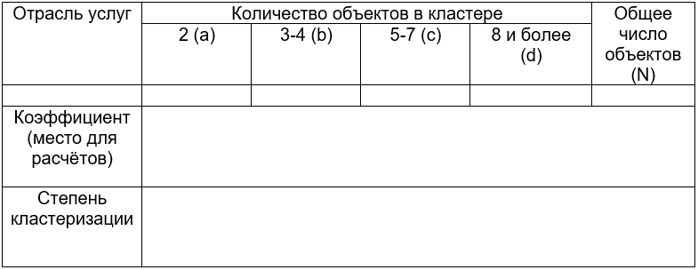

После заполнения таблицы производится расчёт коэффициента согласно формуле и производится его словесная оценка согласно приведённой шкале.

Следующим
этапом задания является определение оптимального места (мест) размещения для нового объекта выбранной подотрасли (например, фитнес-клуба). Решение о размещении предприятия в том или ином месте принимается школьниками на основе полученных данных о возможных факторах размещения (в том числе социального облика района, который оценивается экспертным путем по маркирующим признакам, перечисленным выше) и оценки примерного размера зон обслуживания.

Необходимо отдельно обратить внимание участников практикума, что на предложенном участке может не быть оптимального места размещения предприятия выбранного вида услуг - например, из-за существующей высокой конкуренции и отсутствия территорий,
находящихся вне зон обслуживания действующих предприятий. В этом случае группы должны быть готовы аргументировать свою позицию с учетом материала теоретической части практикума.

Участники групп готовят выступление, в котором им необходимо назвать основные факторы, влияющие на размещение предприятий в рамках исследуемой отрасли. Также в рамках доклада рассматриваются варианты размещения нового предприятия подотрасли и их
подробное обоснование.

**Необходимые материалы:** планшеты для всех участников с предварительно составленной схемой исследуемого участка, простые и
цветные карандаши, калькулятор.

**Пример оформления выполненного задания**:
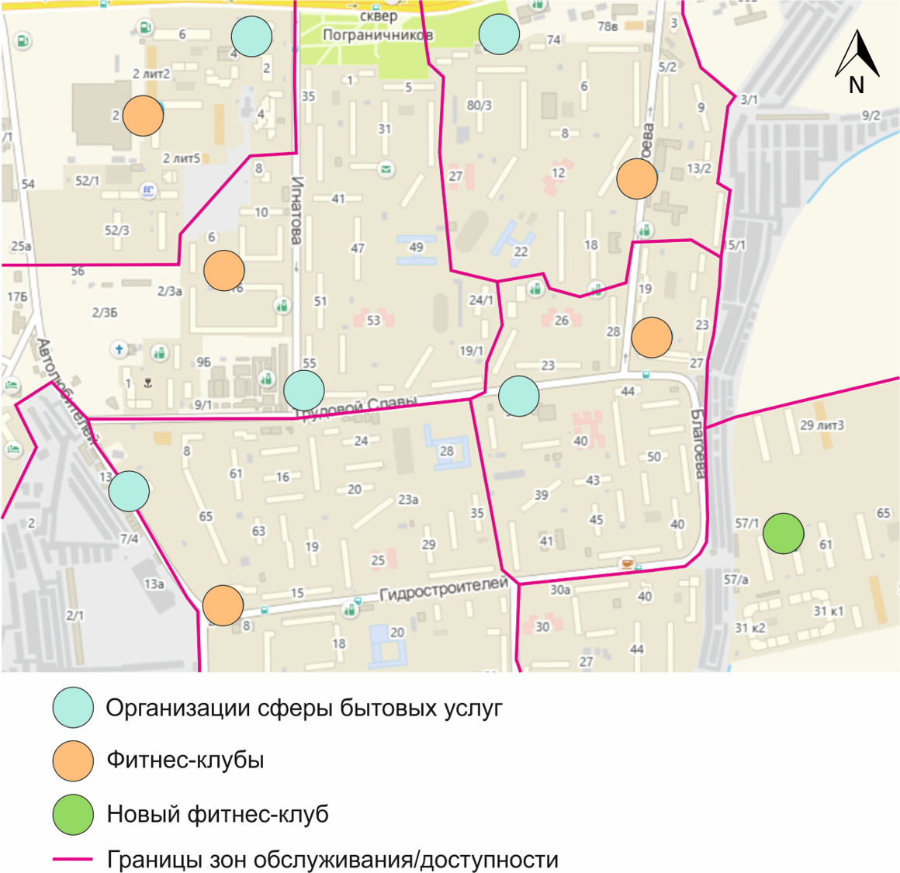
Пример оформленной карты полигона


Пример заполненной таблицы 8.3
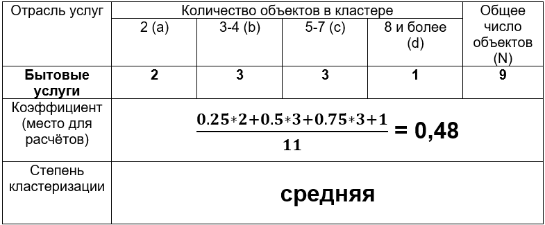


[^service-1]: Валовый внутренний продукт - показатель, отражающий совокупную стоимость всех конечных товаров и услуг,
произведённых за год на территории страны.

[^service-2]: Подобные типы выделяются и в официальной классификации отраслей экономики -- Общероссийском классификаторе
видов экономической деятельности (ОКВЭД), который используется в официальной статистике.

[^service-3]:
В последние годы часто используется термин *ритейл* (от англ. retail «торговля в розницу»), который понимает под собой розничные (поштучные, небольшими количествами) продажи конечному покупателю.

[^service-4]: Информационные технологии (создание, передача, хранение и восприятие информации). В данную сферу входят все
компьютеризированные отрасли с активным использованием различных видов данных (в том числе СМИ, научные исследования и т. д.)

[^service-5]: Составлено авторами на основе работы: Цветков В. Я. Геомаркетинг: прикладные задачи и методы. -- 2002.

[^service-6]: В современной геоурбанистике принято отличать не только постоянную плотность населения (которую вы определяли в занятии №Х), но и дневную -- т.е. во время рабочего дня по будням.

[^service-7]: Локализация объектов социальной сферы объясняется принятыми при плановой экономике градостроительными нормативами
(СНиП), согласно которым на район с населением 3-5 тыс. чел. должна приходиться одна школа, при этом расстояние от жилых домов до образовательного учреждения по нормам не должно превышать 500 м. В современной России данные нормы являются рекомендуемыми, но не обязательными к исполнению.

[^service-8]: То есть не привязанные к постоянному спросу только на определённой небольшой территории (например, в
жилом квартале)

[^service-9]: Кураков Л. П., Кураков В. Л. Словарь-справочник по экономике. - 1999.

[^service-10]: Вид изолиний. От греческого isos «равный» + chronos «время».

<!--chapter:end:08-service.Rmd-->

# Подготовка итогового проекта {#summary}


## Практическая часть

**Методические рекомендации для формулировки и выполнения задания:**

По итогам проведённых в течение учебного года исследований ученики под
руководством учителя готовят сводный отчёт о проведённых исследованиях.

В зависимости состава группы и от полученных в ходе курса результатов, итоговое
задание может быть реализовано в различных форматах:

- Индивидуальных исследовательских эссе по заданным темам;

- Серии индивидуальных или общего совместного доклада с электронной презентацией;

- Постера, отражающего суть проведённых исследований или посвящённого одной или нескольким ключевым
проблемам развития города и района.

Главная задача итогового проекта -- дать возможность участникам практикума вспомнить всё виды
исследований, выявить наиболее важные с их точки зрения.

**Исследовательское эссе** -- особый, творческий вид заданий. Школьникам необходимо напомнить о его структуре, форме написания и
при этом не ограничивать его стилистически. При подготовке тем эссе, которые предоставляются школьникам «на выбор» необходимо сформулировать их максимально привлекательно и «широко», оставаясь при этом в рамках геоурбанистики.
Примерами таких тем могут стать «Моё географическое открытие», «Неизвестное рядом...», «Если я был бы мэром...», «География моего района»...

При подготовке **доклада (докладов**) важно вместе с учениками найти общие, наиболее интересные и понравившиеся школьникам
сюжеты проведённых исследований, общую тему доклада важно также определить вместе. Задача учителя -- грамотно выстроить структур доклада, распределить роли учеников в его подготовке. В докладе должны присутствовать вводная часть, в которой формулируются главные задачи исследования, примеры из лекций, демонстрирующие теоретическую основу исследования, важно отразить наиболее
яркие моменты исследований. Самым главным в исследовательском докладе являются выводы. Их желательно формулировать сообща всем участникам проекта. Учителю в данном случае отводится роль редактора и модератора.

**Итоговый постер** -- одна из самых ярких и привлекательных форм завершающего вида деятельности. Она позволяет школьникам
систематизировать приобретённые навыки и полученные выводы. Рекомендуется подготовить итоговый постер под общим названием «Как мы исследуем родной город (наш район) и т.п.». При подготовке постера рекомендуется чётко выдерживать структуру представляемой информации. Как правило, постер содержит четыре раздела:

- Объект исследования (Характеристика город, района исследований)

- Методика исследований («Что мы делали?» и полученные отчётные и черновые материалы, в т.ч. карты)

- Ход исследований (фотографии выполняемых видов работ и исследуемой территории, отдельных объектов исследования)

- Основные результаты исследований (Полученные результаты и выводы)

При подготовке итоговых проектов важно ориентироваться на итоговую целевую направленность проекта. Как показывает опыт подобных исследований, они могут быть представлены на муниципальных, региональных конкурсах научного творчества,
в настенном оформлении кабинетов школ, кабинетов географии.


Приложение XXX.
Примеры функциональных зон городов на спутниковых снимках

Рисунок XXX. Селитебная зона. А --
индивидуальная; многоквартирная: Б -- малоэтажная, В -- среднеэтажная, Г --
многоэтажная, Д -- повышенной этажности, Е -- высотная

Источник: Google
Earth

Рисунок XXX.
Общественно-деловая зона: А -- административная и деловая, Б -- социальная (на
примере больниц); торговая зона: В -- рынки, Г -- торгово-развлекательные центры

Источник: Google
Earth

Рисунок XXX.
Производственная зона: А -- промышленная, Б -- складская; инфраструктурная зона:
В -- коммунальная (на примере водоочистных сооружений), Г -- транспортная (на
примере аэропорта)

Источник: Google Earth


Рисунок XXX.
Специальная зона: А -- на примере кладбищ, Б -- на примере воинских частей; рекреационная
зона: В -- зелёные зоны (на примере лесопарка), Г -- городские парки

Источник: Google Earth

<!--chapter:end:09-service.Rmd-->

# Заключение {#conclusion}

НАПИСАТЬ

<!--chapter:end:10-conclusion.Rmd-->

# **Рекомендуемая дополнительная литература**{#biblio}

1. Города России. Энциклопедия. Под ред. Лаппо Г.М. ---М.: Большая
Российская энциклопедия, 2008. урбанистика
2. Колбовский Е.Ю. Изучаем природу в городе. ---М.: Академия Развития, 2006.
3. Кучер Т. В. География для любознательных: 6---10 кл. -- М.: Дрофа, 1996.
4. Лаппо Г. М. Города России: Взгляд географа. ---М.: Новый хронограф, 2012.
5. юбушкина С.Г., Пашканг К.В. Естествознание: Землеведение и краеведение. Владос,
2002.
6. Перцик Е.Н. Города мира: география мировой урбанизации. ---М.: Междунар. отношения, 1999.
7. Социально-экономическая география: понятия и термины: Словарь-справочник. ---Смоленск: Ойкумена, 2013.
8. Махрова А. Г. География городов, геоурбанистика // Социально-экономическая география: понятия и термины. Словарь-справочник.
Отв. ред. А.П. Горкин / Под ред. А. П. Горкин, Е. Е. Демидова (Чиркова). ---Ойкумена Смоленск, 2013.

<!--chapter:end:11-bibliography.Rmd-->

