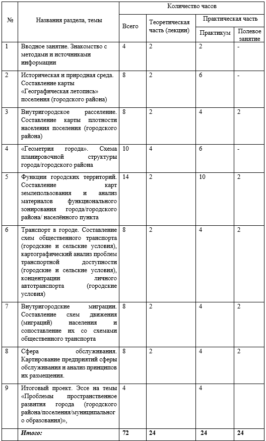

# О пособии {.unnumbered}

Руководство по проведению практикума по геоурбанистике для учителей географии, педагогов дополнительного образования.

[*НАДО дать регалии авторов (степени, знания, должности и места работы)*]{.ul}

[*В апробации пособия принимали участие: 1. Тищенко Надежда Ивановна, учитель географии ГБОУ «Школа №.....», 2. Григорьева Анастасия Владимировна, учитель географии ГБОУ «Школа №.....», 3. Шуванова Ольга Владимировна, учитель географии ГБОУ «Школа №.....», 4. Тимошенко Ирина Васильевна, учитель географии ГБОУ «Школа №.....»*]{.ul}

**Ссылка на грант**

**МОЖНО ПОМЕНЯТЬ НАЗВАНИЕ ПРАКТИКУМА**

```{r include=FALSE}
# automatically create a bib database for R packages
knitr::write_bib(c(
  .packages(), 'bookdown', 'knitr', 'rmarkdown'
), 'packages.bib')
```

# Введение {.unnumbered}

География городов (геоурбанистика) является комплексным научным направлением, объединяющим исследовательский аппарат географии, истории, экономики, обществознания. В России, где ¾ населения -- горожане, проблемы городов особенно актуальны, неслучайно они всё чаще привлекают внимание молодого поколения. С многими насущными проблемами городов школьники сталкиваются почти ежедневно, поэтому реализация содержания практикума позволит, под руководством учителя, проводить обучающимся учебные исследования на регулярной основе.

Настоящее учебное пособие разработано для учителей географии образовательных организаций, расположенных в городской местности, для проведения факультативных занятий по географии городов (геоурбанистике) с группами школьников, проявляющих повышенный интерес к изучению географии, выбравших географию как элемент будущей профессиональной подготовки.

Особое внимание при реализации программы практикума следует уделять организации учебных экскурсий и практических исследований, особенно полевых наблюдений, в рамках которых требуется не только продуманная организация работ, но и соблюдение требований техники безопасности. Специальные инструкции по выполнению полевых работ приведены в соответствующих тематических разделах пособия.

Практикум адаптирован для школьников и с учётом междисциплинарных связей географии с другими учебными предметами. Для учителей и учеников обеспечивается вариативность содержания индивидуальных задач и чёткое распределение ролей исполнителей в коллективных исследованиях.

Пособие построено по принципу «конструктора»: учитель может изменять содержание занятий в зависимости от возрастного состава и уровня теоретической подготовки групп школьников, доступного графика проведения занятий, внешних условий для полевых исследований, особенностей исследуемой местности, специфики проблем территории дислокации школы, материально-технической обеспеченности исследований и т.д. В зависимости от размера и состава групп также можно существенно варьировать объёмы и виды детальности исследований, комбинировать индивидуальную и коллективную работу, организовывать разделение видов деятельности, совместную работу школьников разного возраста.

## Методические рекомендации {.unnumbered}

Появление в школьной практике элементов проектного обучения, специальных профильных образовательных программ, введение в программы курсов таких понятий как устойчивое развитие, цели и вызовы мирового устойчивого развития, актуализируют необходимость практической ориентированности учебного процесса. Однако, в настоящий момент нет чёткого понимания специфики организации профильного географического образования в основной и средней школе, а также в системе повышения квалификации и переподготовки педагогических кадров.

Определённо, профильное географическое образование носит междисциплинарный характер и находит отражение в содержании многих школьных предметов: истории, обществознании, экологии, биологии, химии, физики, экономики, информатики. География как школьный предмет имеет серьёзные возможности стать системообразующего в формировании верного и истинного представления о современном мире, а также комплексного и системного понимания всех природных и социально-экономических процессов, что формирует правильную картину мира.

В виду значимости и актуальности проблем урбанизации географическое образование должно строиться на принципах системности, непрерывности и целенаправленности процесса, цель которого -- сформировать у обучающихся географическую и экологическую грамотность, развить социальные компетенции через ответственное отношение к окружающей среде.

Основными направлениями реализации занятий практикума «МОЙ ГОРОД -- ГЕОГРАФИЧЕСКАЯ ЛАБОРАТОРИЯ» являются:

-   развитие познавательного интереса к обучению в целом, формирование функциональной грамотности;

-   подготовка к решению разного уровня контрольно-измерительных материалов, олимпиадных заданий по географии;

-   приобретение знаний и навыков, освоение способов деятельности для решения практических, жизненных задач, уход от традиционного школьного «академизма»;

-   возможности успешной карьеры выпускника и учителя, продвижения на рынке труда;

-   интеграция основного и дополнительного географического образования;

-   профессиональная ориентация обучающихся;

-   формирование целостной научной картины мира.

## Цели и задачи {.unnumbered}

Цель практикума «МОЙ ГОРОД -- ГЕОГРАФИЧЕСКАЯ ЛАБОРАТОРИЯ» --- сформировать комплексное мышление, географическую культуру личности обучающегося на материалах о городской среде и ее трансформации. Выполнение заданий практикума позволяет решить задачи профильной и профессиональной ориентации, стимулирует приобретение навыков будущей профессиональной и научно-исследовательской деятельности, даёт возможность понять механизмы процессов, происходящих в городской среде.

Содержание практикума можно рассматривать как элемент непрерывного географического образования в условиях интеграции основного и дополнительного образования. Выполнение заданий практикума стимулируют учебно-исследовательскую деятельность обучающихся, позволяет достичь качественных образовательных результатов по географии, истории, экологии, обществознанию, краеведению, а также формирует опыт социального взаимодействия у старшеклассников.

Задачи практикума:

-   создать условия для повышения качества географического образования через развитие географической культуры личности школьника, удовлетворения его образовательных потребностей и формирование индивидуальной образовательной траектории развития;

-   сформировать мотивацию учащегося на непрерывность образования и развитие профессиональных компетенций для выполнения будущей профессиональной научно-исследовательской и научно-практической деятельности через раскрытие важности овладения географическими знаниями и методами географического анализа для принятия решений в междисциплинарном проблемном поле и в повседневной жизни;

-   дополнить знания обучающихся о природных, социальных и экономических факторах, влияющих на пространственную организацию хозяйства современного города;

-   показать современные тенденции процесса мировой урбанизации и место Российской Федерации в этом процессе;

-   увеличить количество обучающихся, вовлеченных в предпрофильную, профильную и профориентационную работу по приоритетным научным направлениям через практическую деятельность.

В ходе освоения содержания и выполнения заданий практикума «МОЙ ГОРОД -- ГЕОГРАФИЧЕСКАЯ ЛАБОРАТОРИЯ» согласно требованиям Федерального государственного образовательного стандарта основного общего образования (ФГОС ООО) обучающиеся должны достичь личностных, метапредметных и предметных результатов.

1.  Личностные результаты освоения содержания практикума отражают осознание российской гражданской идентичности; готовность обучающихся к саморазвитию, самостоятельности и личностному самоопределению; ценность самостоятельности и инициативы; наличие мотивации к целенаправленной социально-значимой деятельности; сформированность внутренней позиции личности как особого ценностного отношения к себе, к окружающим людям и к жизни в целом, и формируются по нескольким направлениям:

-   патриотическое воспитание: осознание российской гражданской идентичности в поликультурном и многоконфессиональном обществе, проявление интереса к познанию родного языка, истории, культуры Российской Федерации, своего края, народов России; ценностное отношение к достижениям своей Родины -- России, к науке, искусству, боевым подвигам и трудовым достижениям народа; уважение к символам России, государственным праздникам, историческому и природному наследию и памятникам, традициям разных народов, проживающих в родной стране;

-   гражданское воспитание: готовность к выполнению обязанностей гражданина и реализации его прав, уважение прав, свобод и законных интересов других людей; активное участие в жизни семьи, образовательной организации, местного сообщества, родного края, страны; неприятие любых форм экстремизма, дискриминации; понимание роли различных социальных институтов в жизни человека; представление об основных правах, свободах и обязанностях гражданина, социальных нормах и правилах межличностных отношений в поликультурном и многоконфессиональном обществе; готовность к разнообразной совместной деятельности, стремление к взаимопониманию и взаимопомощи, активное участие в школьном самоуправлении; готовность к участию в гуманитарной деятельности (волонтерство; помощь людям, нуждающимся в ней);

-   духовно-нравственное воспитание: ориентация на моральные ценности и нормы в ситуациях нравственного выбора; готовность оценивать свое поведение и поступки, а также поведение и поступки других людей с позиции нравственных и правовых норм, с учетом осознания последствий поступков; активное неприятие асоциальных поступков, свобода и ответственность личности в условиях индивидуального и общественного пространства;

-   эстетическое воспитание: восприимчивость к разным видам искусства, традициям и творчеству своего и других народов, понимание эмоционального воздействия искусства; осознание важности художественной культуры как средства коммуникации и самовыражения; понимание ценности отечественного и мирового искусства, роли этнических культурных традиций и народного творчества; стремление к самовыражению в разных видах искусства;

-   ценности научного познания: ориентация в деятельности на современную систему научных представлений об основных закономерностях развития человека, природы и общества, взаимосвязях человека с природной и социальной средой; овладение языковой и читательской культурой как средством познания мира; овладение основными навыками исследовательской деятельности, установка на осмысление опыта, наблюдений, поступков и стремление совершенствовать пути достижения индивидуального и коллективного благополучия;

-   физическое воспитание, формирование культуры здоровья и эмоционального благополучия: осознание ценности жизни; ответственное отношение к своему здоровью и установка на здоровый образ жизни (здоровое питание, соблюдение гигиенических правил, сбалансированный режим занятий и отдыха, регулярная физическая активность); осознание последствий и неприятие вредных привычек (употребление алкоголя, наркотиков, курение) и иных форм вреда для физического и психического здоровья; соблюдение правил безопасности, в том числе навыки безопасного поведения в интернет-среде; способность адаптироваться к стрессовым ситуациям и к меняющимся социальным, информационным и природным условиям, в том числе осмысляя собственный опыт и выстраивая дальнейшие цели;

-   трудовое воспитание: установка на активное участие в решении практических задач (в рамках семьи, школы, города, края) технологической и социальной направленности, способность инициировать, планировать и самостоятельно выполнять такого рода деятельность; интерес к практическому изучению профессий и труда различного рода, в том числе на основе применения изучаемого предметного знания; осознание важности обучения на протяжении всей жизни для успешной профессиональной деятельности и развитие необходимых умений для этого; готовность адаптироваться в профессиональной среде; уважение к труду и результатам трудовой деятельности; осознанный выбор и построение индивидуальной траектории образования и жизненных планов с учетом личных и общественных интересов и потребностей;

-   экологическое воспитание: ориентация на применение знаний из социальных и естественных наук для решения задач в области окружающей среды, планирования поступков и оценки их возможных последствий для окружающей среды; повышение уровня экологической культуры, осознание глобального характера экологических проблем и путей их решения; активное неприятие действий, приносящих вред окружающей среде; осознание своей роли как гражданина и потребителя в условиях взаимосвязи природной, технологической и  социальной сред; готовность к участию в практической деятельности экологической направленности.

2.  Метапредметные результаты освоения содержания практикума отражают освоенные обучающимися межпредметные понятия (используются в нескольких предметных областях и позволяют связывать знания из различных дисциплин в целостную научную картину мира) и универсальные учебные действия (познавательные, коммуникативные, регулятивные); способность их использовать в учебной, познавательной и социальной̆ практике; готовность к самостоятельному планированию и осуществлению учебной деятельности и организации учебного сотрудничества с педагогами и сверстниками, к участию в построении индивидуальной образовательной траектории; овладение навыками работы с информацией: восприятие и создание информационных текстов в различных форматах, в том числе в цифровой среде, с учетом назначения информации и ее целевой аудитории, и формируются по нескольким направлениям:

-   овладение познавательными универсальными учебными действиями: переводить практическую ситуацию в учебную задачу; формулировать вопросы, фиксирующие разрыв между имеющимися необходимыми условиями решения учебной задачи, выявлять дефициты информации; соотносить учебную задачу с мотивами, выдвинутыми проблемами и предположениями, выдвигать предположения о причинах несоответствия желаемым и текущим состоянием объекта, процесса; выявлять элементы / переменные для решения учебной задачи и формулировать вопросы об их значимых признаках; устанавливать связи между элементами, выявлять закономерности и противоречия в наборе фактов, данных, наблюдениях, аргументации; переносить усвоенные алгоритмы, способы действий, формы контроля в новые контексты; самостоятельно конструировать способ решения учебной задачи, (сравнивать несколько вариантов решения, выбирать наиболее целесообразный и эффективный); планировать и учитывать время, последовательность действий необходимых для решения учебной задачи; узнавать учебные задачи, имеющие более одного способа решения, и обосновывать допустимость нескольких вариантов решений; рассматривать несколько вариантов решения учебной задачи; определять их сильные и слабые стороны с целью выбора оптимального решения; находить сходные аргументы, проверять наличие альтернативных аргументов в разных источниках и их обосновывать; проводить по самостоятельно составленному плану опыт, эксперимент, небольшое исследование по установлению особенностей̆ объекта изучения, причинно-следственных связей и зависимостей объектов между собой; формулировать обобщения и выводы по результатам проведенного наблюдения, опыта, исследования; осуществлять логические операции по установлению родовидовых отношений, обобщению и ограничению понятия, группировке понятий по объему и содержанию; выделять признаки предметов (явлений) по заданным существенным основаниям; устанавливать существенный признак классификации, основания для сравнения, критерии проводимого анализа; осуществлять дедуктивные и индуктивные умозаключения в том числе умозаключения по аналогии, приводить аргументы, подтверждающие собственную позицию с учетом существующих точек зрения;

-   овладение регулятивными универсальными учебными действиями: самостоятельно планировать деятельность (намечать цель, создавать алгоритм, отбирая целесообразные способы решения учебной̆ задачи); оценивать средства (ресурсы), необходимые для решения учебной задачи; осуществлять контроль результата (продукта) и процесса деятельности (степень освоения способа действия) по заданным и (или) самостоятельно определенным критериям; устанавливать приоритеты в деятельности, вносить коррективы в деятельность на основе новых обстоятельств, измененных ситуаций, установленных ошибок, возникших трудностей; прогнозировать последствия своих решений и действий; прогнозировать трудности, которые могут возникнуть при решении учебной задачи; объяснять причины успеха (неудач) в деятельности; сравнивать полученные результаты с исходной учебной задачей (достигнуто ли решение, каковы его сильные и слабые стороны);

-   овладение коммуникативными универсальными учебными действиями: владеть смысловым чтением текстов разного вида, жанра, стиля с целью решения различных учебных задач, для удовлетворения познавательных запросов и интересов -- определять тему, главную идею текста, цель его создания; устранять в рамках общения разрывы в коммуникации, обусловленные непониманием / неприятием со стороны собеседника учебной задачи, формы или содержания диалога; выявлять детали, важные для раскрытия основной темы, содержания текста, выступления, диалога; определять жанр выступления и в соответствии с ним отбирать содержание коммуникации, учитывать особенности аудитории; определять содержание выступления в соответствии с его жанром и особенностями аудитории; соблюдать нормы публичной речи и регламент; адекватно теме и ситуации общения использовать средства речевой выразительности для выделения смысловых и эмоциональных характеристик своего выступления; публично представлять полученные результаты практической экспериментальной или теоретической исследовательской деятельности;

-   овладение навыками участия в совместной деятельности: принимать цель совместной деятельности; участвовать в учебном диалоге -- следить за соблюдением процедуры обсуждения, задавать вопросы на уточнение и понимание идей друг друга; сопоставлять свои суждения с суждениями других участников диалога; оценивать полученный совместный результат, свой вклад в общее дело, проявлять уважение к партнерам по совместной̆ работе, самостоятельно разрешать конфликты; владеть умениями осуществлять совместную деятельность (договариваться, распределять обязанности, подчиняться, лидировать, контролировать свою работу); проявлять готовность конструктивно разрешать конфликты;

-   овладение навыками работы с информацией: самостоятельно формулировать основания для извлечения информации из источников, учитывая характер учебной задачи; различать основную и дополнительную информацию, устанавливать логические связи и отношения, представленные в тексте; распознавать истинные и ложные суждения по заданным критериям; использовать знаково-символические средства для представления информации и создания моделей изучаемых объектов, с выделением значимых компонентов и связей между ними; преобразовывать предложенные схематичные модели в текстовый вариант представления информации, а также предложенную текстовую информацию в схематичные модели (таблица, диаграмма, схема); соблюдать правила информационной безопасности.

3.  Предметные результаты освоения содержания практикума отражают освоенные обучающимися в ходе изучения учебного предмета научные знания, умения и способы действий, специфические для данной предметной области; предпосылки научного типа мышления; виды деятельности по получению нового знания, его интерпретации, преобразованию и применению в различных учебных ситуациях, а также при создании учебных и социальных проектов, и формируются по нескольким направлениям:

-   приводить примеры географических объектов, процессов и явлений, изучаемых различными ветвями географической науки;

-   приводить элементарные примеры использования геоинформационных систем (ГИС) в повседневной жизни;

-   использовать планы, топографические и географические карты для получения информации, необходимой для решения учебных и (или) практико-ориентированных задач;

-   находить, извлекать и использовать информацию из различных источников (картографические, текстовые, видео- и фотоизображения, Интернет-ресурсы) необходимую для решения учебных и (или) практико-ориентированных задач;

-   различать изученные географические объекты, процессы и явления;

-   распознавать проявления глобальных проблем человечества на локальном и региональном уровнях и приводить примеры международного сотрудничества по их преодолению;

-   приводить примеры взаимодействия природы и общества в пределах отдельных территорий и давать им объективную оценку в т. ч. влияния природных условий на хозяйственную деятельность населения и экономику семьи;

-   формулировать оценочные суждения о воздействии человеческой деятельности на окружающую среду;

-   выбирать источники географической информации (картографические, статистические, текстовые, видео- и фотоизображения, компьютерные базы данных), необходимые для изучения особенностей природы и (или) населения России;

-   представлять в различных формах (таблицы, графики, географическое описание) географическую информацию, необходимую для решения учебных и (или) практико-ориентированных задач;

-   использовать знания о естественном и механическом движении населения, половозрастной структуре и размещении населения, городском и сельском населении, этническом и религиозном составе населения для решения практико-ориентированных задач в контексте реальной жизни;

-   сравнивать города России по численности населения, отдельные территории страны по плотности населения;

-   использовать знания об особенностях компонентов природы России и ее отдельных территорий, об особенностях взаимодействия природы и общества в пределах отдельных территорий для решения практико-ориентированных задач в контексте реальной жизни;

-   проводить классификацию населенных пунктов и регионов России по заданным основаниям;

-   распознавать показатели, характеризующие состояние окружающей среды, демографические процессы и явления, характеризующие динамику численности населения России и отдельных регионов страны (естественное движение населения, рождаемость, смертность, внутренние и внешние миграции, миграционный прирост);

-   находить, извлекать и использовать информацию, характеризующую отраслевую, функциональную и территориальную структуру хозяйства России для решения практико-ориентированных задач;

-   использовать знания о факторах и условиях размещения хозяйства для решения различных учебных и практико-ориентированных задач;

-   критически оценивать финансовые условия жизнедеятельности человека и их природные, социальные, политические, технологические, экологические аспекты, необходимые для принятия собственных решений, с точки зрения домохозяйства, предприятия и национальной экономики;

-   оценивать влияние географического положения отдельных регионов России на особенности природы, жизнь и хозяйственную деятельность населения;

-   объяснять географические различия населения и хозяйства территорий крупных регионов страны.

## Содержательно-теоретическое ядро {.unnumbered}

***Содержательно-теоретическое ядро*** практикума «МОЙ ГОРОД -- ГЕОГРАФИЧЕСКАЯ ЛАБОРАТОРИЯ» как модели интеграции основного и дополнительного географического образования --- это организующая роль практических полевых занятий и учебных экскурсий.  Фундаментальность и интегративность содержания задают направление отбора учебного материала, проектирования учебных ситуаций и конструирования учебного содержания, ориентированного на формирование предметных компетенций и способностей по географии. Далее потенциальные способности обучающегося ориентируются относительно ступеней географического образования. Такова логика реализации образовательных программ по географии в условиях профильного обучения.

Методы и формы обучения определяются требованиями профилизации обучения, учетом индивидуальных способностей, развитием и саморазвитием личности школьника. В связи с этим можно выделить основные приоритеты методики преподавания в условиях внедрения развивающих образовательных программ, интеграции основного и дополнительного образования:

-   междисциплинарная интеграция, ориентированная на формирование целостной научной картины мира;

-   обучение через опыт и сотрудничество;

-   интерактивность (работа в малых группах, метод проектов, имитационное моделирование);

-   личностно-деятельностный подход в обучении;

-   краеведческий подход при отборе материала;

-   лидерство, основанное на совместной деятельности, направленное на достижение общей образовательной цели.

## Методические рекомендации по проведению лекционных занятий {.unnumbered}

*Лекции* по актуальным темам географической науки требуют от учителя дополнительной подготовки, связанной с поиском, обобщением и систематизацией материала, продумыванием логики изложения, выбором наиболее актуальных и существенных вопросов изучаемой темы, формулированием основных выводов в заключении. В лекцию следует включить более широкий обзорный материал, для чего необходимо привлечь информацию, опубликованную в научных и справочных изданиях, учебниках, специализированных журналах.

Время лекции не более 35 минут, после чего следует спланировать время (до 10 минут) для ответов на вопросы обучающихся, возникшие в ходе лекции. Затем можно провести беседу по обсуждаемой теме занятия с использованием материалов пособия и дополнительной литературы

Представленные в программе практикума «проблемные и актуальные» темы, позволяют развить познавательный интерес обучающихся к процессу развития урбанизации, особенностям взаимодействия общества и природы, созданию городского ландшафта как специфической системы. Организация дискуссий и диалога позволяет участникам проекта высказывать своё мнение и обосновать свою точку зрения по неоднозначным вопросам, существующим в рамках устойчивого развития общества, например «Урбанизация и устойчивые поселения», «Перспективы человечества, оптимистический и пессимистический прогноз» и так далее.

Целесообразно в процессе обучения по программе практикума, обращать внимание обучающихся на изучении особенностей устойчивого развития человечества, демонстрировать современные материалы о глобальных геоэкологических проблемах, проектах социально-экономического развития общества, истории развития человеческой циви­лизации и перспективах её развития.

**Методические рекомендации по проведению практических занятий и учебных экскурсий**

*Практические занятия и учебные экскурсии* активизируют географическое мышление обучающихся, позволяют организовать обучение на основе системно-деятельностного подхода. Использование методов и приемов частично-поискового и творческого характера побуждают обучающихся к познавательной деятельности (организация практик, маршрутных съемок, наблюдений, работа в учебном проекте).

Решение сложной методической задачи --- реализовать на практике компетентностный подход (т.е. сформировать у обучающихся готовность использовать усвоенные знания, умения и способы деятельности в жизни для решения практических задач и жизненно значимых ситуаций) - возможно при использовании следующих видов работ:

-   работа с источниками геоэкологической информации и научно-популярной литературой;

-   работа с картами и картосхемами;

-   работа со статистическим материалом;

-   работа на местности, на географической площадке;

-   маршрутные съемки;

-   наблюдения за окружающей средой;

-   практикумы;

-   работа с ресурсами ГИС и Интернета;

-   учебные (практико-ориентированные) проекты.

Данные виды работ направлены на усиление практической составляющей программ дополнительного образования по географии как дидактического принципа подготовки обучающихся к успешному выбору будущей профессии.

В основе отбора содержания экскурсионного материала и практических занятий лежат основные дидактические и методические принципы: научность, системность, индивидуализация и социализация.

## Типология уроков/учебных занятий {.unnumbered}

Современный урок/учебное занятие (далее урок) должен строиться на основе требований ФГОС, но при этом опираться на традиции российской педагогической школы. Исходя из данных постулатов, можно выделить следующие типы уроков:

-   урок освоения новых знаний и видов учебной деятельности;

-   урок применения знаний и умений учебной деятельностиурок обобщения и систематизации знаний и умений учебной деятельности;

-   урок развивающего контроля;

-   комбинированный урок.

-   Необходимость изменения структуры уроков объясняется следующими причинами:

-   изменением целеполагания деятельности учителя и обучающегося в процессе урочной и внеурочной деятельности на основе результатов освоения основной образовательной программы;

-   изменением структуры учебника и УМК;

-   необходимостью формирования устойчивой мотивации к обучению у школьников;

-   изменением роли и функции учителя на уроке: переход от транслятора знаний и способов учебной деятельности к организатору и координатору деятельности, направленной на освоение новых знаний и учебных действий;

-   изменением логики построения процесса обучения: переход от усвоения набора знаний к способности добывать их самостоятельно и применять в учебных и жизненных ситуациях.

Система разных типов уроков, используемых учителем в повседневной практике, должна обеспечивать восприятие, осмысление, закрепление, применение знаний и учебных действий на практике.

К современному уроку предъявляются группы требований:

1)  общепедагогические: учёт возрастных и личностных особенностей обучающегося, приоритет развития личности школьника, ориентация на педагогическое взаимодействие, доминирование деятельностного подхода в организации обучения, становление и поддержание устойчивой мотивации к учению, ориентация процесса обучения на достижение результатов освоения основной образовательной программы и результатов изучения курса, чередование видов и форм работы при их соответствии поставленным целям деятельности;

2)  дидактические: рациональное использование времени, интегрированное применение вариативных методов обучения, ориентация на активные методы освоения новых знаний и учебных действий, опора на субъектный опыт обучающегося, дифференцированный и личностно ориентированный подход к обучению, стимулирование учебной деятельности школьников;

3)  психологические: учёт психологических особенностей обучающихся и их состояния в данный момент обучения, создание благоприятной психологической среды общения на уроке за счёт сочетания доброжелательности и требовательности в отношениях с обучающимися.

Развёрнутая структура типовых уроков

1\. Урок освоения новых знаний и видов учебной деятельности

Данный тип урока используется:

-   при освоении новых знаний на основе применения сформированных видов учебной деятельности;

-   при формировании новых видов учебной деятельности на основе освоенных знаний;

-   при освоении новых знаний на основе формирования новых видов учебной деятельности.

Целью использования данного типа урока является формирование у обучающихся новых научных знаний и (или) учебных действий в рамках учебной ситуации выбора. В каждой из трёх ситуаций структура урока имеет вид:

1¬й этап --- мотивация учебной деятельности, то есть создание внутреннего позыва у обучающихся к освоению новых знаний и (или) учебных действий;

2¬й этап --- актуализация знаний и (или) учебных действий;

3¬й этап --- формирование индивидуального алгоритма освоения новых знаний и (или) учебных действий;

4¬й этап --- освоение новых знаний и (или) учебных действий;

5¬й этап --- самопроверка уровня усвоения новых знаний и (или) сформированности умений проведения учебных действий на основе сопоставления их с эталоном;

6¬й этап --- рефлексия учебной деятельности по освоению новых знаний и (или) формированию учебных действий.

Деятельность:

-   учителя: создание педагогических условий для деятельностного и предметного освоения новых знаний и (или) учебных действий обучающимися;

-   обучающегося: восприятие, осмысление, запоминание новых знаний и (или) учебных действий.

2.  Урок применения знаний и умений учебной деятельности

Целью использования данного типа урока является формирование у обучающихся способностей использования новых научных знаний и (или) учебных действий в рамках учебной и жизненной ситуации выбора, то есть соответствие новых знаний и (или) учебных действий учебным и жизненным задачам. Структура урока имеет вид:

1¬й этап --- мотивация учебной деятельности, то есть создание внутреннего позыва у обучающихся к применению новых знаний и (или) учебных действий;

2¬й этап --- актуализация освоенных знаний и (или) учебных действий;

3¬й этап --- формирование индивидуального алгоритма применения новых знаний и (или) учебных действий в рамках стандартной учебной ситуации;

4¬й этап --- сопоставление результата деятельности с эталоном;

5¬й этап --- применение новых знаний и (или) учебных действий в рамках нестандартной учебной и (или) жизненной ситуации;

6¬й этап --- самопроверка и взаимопроверка способности применения новых знаний и (или) умений использования учебных действий в рамках нестандартной ситуации выбора;

7¬й этап --- рефлексия учебной деятельности по использованию новых знаний и (или) учебных действий в рамках нестандартной ситуации выбора.

Деятельность:

-   учителя: создание педагогических ситуаций, направленных на практическое применение новых знаний и (или) учебных действий обучающимися;

-   обучающегося: практическое применение новых знаний и (или) учебных действий обучающимися.

3.  Урок обобщения и систематизации знаний и умений учебной деятельности

Целью использования данного типа урока является обобщение и систематизация у обучающихся способностей использования новых научных знаний и (или) учебных действий в рамках учебной и жизненной ситуации выбора. Структура урока имеет вид:

1¬й этап --- мотивация учебной деятельности, то есть создание внутреннего позыва у обучающихся к демонстрации новых знаний и (или) учебных действий;

2¬й этап --- актуализация освоенных знаний и (или) учебных действий;

3¬й этап --- формирование индивидуального алгоритма обобщения новых знаний и (или) учебных действий в рамках стандартной учебной ситуации;

4¬й этап --- сопоставление результата деятельности с эталоном;

5¬й этап --- коррекция знаний и (или) учебных действий в рамках нестандартной учебной и (или) жизненной ситуации;

6¬й этап --- самопроверка и взаимопроверка способности применения новых знаний и (или) умений использования учебных действий в рамках нестандартной ситуации выбора;

7¬й этап --- рефлексия учебной деятельности по использованию новых знаний и (или) учебных действий в рамках нестандартной ситуации выбора.

Деятельность:

-   учителя: организация обобщения и систематизации знаний и (или) умений учебной деятельности обучающихся;

-   обучающегося: обобщение и систематизация знаний и (или) умений учебной деятельности обучающимися на основе выявления затруднений.

4\. Урок развивающего контроля

Целью использования данного типа урока является контроль у обучающихся способностей использования новых научных знаний и (или) учебных действий в рамках учебной и жизненной ситуации выбора в рамках использования диагностического материала разного вида. Структура урока имеет вид:

1¬й этап --- мотивация учебной деятельности, то есть создание внутреннего позыва у обучающихся к применению новых знаний и (или) учебных действий при использовании диагностического материала;

2¬й этап --- использование освоенных знаний и (или) учебных действий при выполнении диагностических заданий;

3¬й этап --- самоконтроль и самоанализ деятельности по результатам выполнения диагностических заданий;

4¬й этап --- взаимоконтроль и взаимоанализ деятельности по результатам выполнения диагностических заданий;

5¬й этап --- коррекция результатов деятельности по итогам выполнения диагностических заданий;

6¬й этап --- контроль учителем итогов выполнения диагностических заданий;

Деятельность:

-   учителя: организация контроля уровня усвоения знаний и (или) сформированности умений учебной деятельности обучающихся;

-   обучающегося: выполнение дидактических заданий, само¬ и взаимоконтроль, само¬ и взаимопроверка результатов выполнения диагностических заданий контроля уровня усвоения знаний и (или) сформированности умений учебной деятельности обучающихся.

5\. Комбинированный урок

Целью использования данного типа урока является создание ситуации, при которой учитель имеет возможность наряду с освоением новых знаний и (или) учебных действий обучающимися провести закрепление уровня их усвоения и сформированности. Структура урока формируется на основе целеполагания деятельности учителя из разных иных типов уроков.

Деятельность:

-   учителя: организация освоения знаний и (или) умений учебной деятельности, их практическое применение обучающимися;

-   обучающегося: освоение знаний и (или) умений учебной деятельности, их практическое применение.

ффективность использования типа урока зависит от способности учителя:

-   организовать интенсивное мышление и деятельность обучающихся, основанные на планировании учебной деятельности, определении содержания, методов и средств достижения цели;

-   проанализировать учебные ситуации;

-   определить цель обучения и сделать её личностно значимой для каждого обучающегося;

-   предъявить учебный материал обучающимся с учётом особенностей их личностей, уровня предметной и деятельностной подготовки;

-   организовать освоение обучающимися знаний, предметных и метапредметных учебных действий;

-   организовать обобщение, систематизацию, контроль, корректировку знаний и деятельности обучающихся на основе анализа результатов обучения.

## Контроль знаний и сформированности универсальных учебных действий (УУД) {.unnumbered}

-   Правильно организованная *работа на этапе отработки и закрепления знаний* формирует глубину, осознанность и прочность знаний.

-   Контрольные мероприятия могут иметь различную форму:

-   опрос обучающихся по пройденному материалу на занятиях;

-   проверка выполненных заданий;

-   тестирование/ письменная контрольная работа/ выполнение заданий в КИМах и заданий интеллектуальных соревнований разного уровня;

-   подготовка эссе и устных сообщений.

Одной из форм проверки усвоения обучающимися знаний и УУД является подготовка и написание эссе по теме «Проблемы пространственного развития города (городского района/округа/поселения/муниципального образования). Сравнение с территориями-аналогами». Эта творческая работа позволяет выявить способности обучающегося самостоятельно собирать и анализировать географическую информацию, работать с литературными первоисточниками и статистической информацией, делать обобщающие выводы.

Системное использование представленных заданий практикума «МОЙ ГОРОД -- ГЕОГРАФИЧЕСКАЯ ЛАБОРАТОРИЯ» позволит достичь высоких образовательных результатов. Разработанные материалы ориентированы на выделение значимого в представленной информации, а также на самостоятельность в нахождении способов и средств выполнения.

Овладение общими учебными умениями, навыками и способами деятельности как существенными элементами культуры являются условиями, необходимыми для развития и социализации школьников. Целостность информационно-образовательной среды, интеграция основного и дополнительного образования по географии позволяют обучающемся активно и сознательно организовывать свою учебную деятельность.

Курс практических занятий рассчитан на 72 часа, в т.ч. 24 камеральных (аудиторных), 48 полевых (в т.ч. самостоятельных) работ.

## Примерное почасовое планирование {.unnumbered}

Примерное почасовое планирование приведено в ниже.

+-------+----------------------------------------------------------------------------------------------------------------------------------------------------------------------------------------------------------------------------+----------------------+
|       | **Тематика**                                                                                                                                                                                                               | **Объём занятий, ч** |
+=======+============================================================================================================================================================================================================================+======================+
| 1     | **Вводное занятие*.***                                                                                                                                                                                                     | 4                    |
|       |                                                                                                                                                                                                                            |                      |
|       | Знакомство с методами и источниками информации                                                                                                                                                                             |                      |
+-------+----------------------------------------------------------------------------------------------------------------------------------------------------------------------------------------------------------------------------+----------------------+
| 2     | **Историческая и природная среда**.                                                                                                                                                                                        | 8                    |
|       |                                                                                                                                                                                                                            |                      |
|       | Составление карты «Географическая летопись» поселения (городского района)                                                                                                                                                  |                      |
+-------+----------------------------------------------------------------------------------------------------------------------------------------------------------------------------------------------------------------------------+----------------------+
| 3     | **Внутригородское расселение.**                                                                                                                                                                                            | 8                    |
|       |                                                                                                                                                                                                                            |                      |
|       | Составление карты плотности населения поселения (городского района)                                                                                                                                                        |                      |
+-------+----------------------------------------------------------------------------------------------------------------------------------------------------------------------------------------------------------------------------+----------------------+
| 4     | **«Геометрия города».**                                                                                                                                                                                                    | 10                   |
|       |                                                                                                                                                                                                                            |                      |
|       | Схема планировочной структуры города/городского района/ населённого пункта                                                                                                                                                 |                      |
+-------+----------------------------------------------------------------------------------------------------------------------------------------------------------------------------------------------------------------------------+----------------------+
| 5     | **Функции городских территорий.** Составление карт землепользования и анализ материалов функционального зонирования города/городского района/                                                                              | 14                   |
|       |                                                                                                                                                                                                                            |                      |
|       | населённого пункта                                                                                                                                                                                                         |                      |
+-------+----------------------------------------------------------------------------------------------------------------------------------------------------------------------------------------------------------------------------+----------------------+
| 6     | **Транспорт в городе.**                                                                                                                                                                                                    | 8                    |
|       |                                                                                                                                                                                                                            |                      |
|       | Составление схем общественного транспорта (городские и сельские условия), картографический анализ проблем транспортной доступности (городские и сельские условия), концентрации личного автотранспорта (городские условия) |                      |
+-------+----------------------------------------------------------------------------------------------------------------------------------------------------------------------------------------------------------------------------+----------------------+
| 7     | **Внутригородские миграции.**                                                                                                                                                                                              | 8                    |
|       |                                                                                                                                                                                                                            |                      |
|       | Составление схем движения (миграций) населения и сопоставление их со схемами общественного транспорта                                                                                                                      |                      |
+-------+----------------------------------------------------------------------------------------------------------------------------------------------------------------------------------------------------------------------------+----------------------+
| 8     | **Сфера обслуживания.**                                                                                                                                                                                                    | 6                    |
|       |                                                                                                                                                                                                                            |                      |
|       | Картирование предприятий сферы обслуживания и анализ принципов их размещения.                                                                                                                                              |                      |
+-------+----------------------------------------------------------------------------------------------------------------------------------------------------------------------------------------------------------------------------+----------------------+
| 9     | **Итоговый проект.**                                                                                                                                                                                                       | 6                    |
|       |                                                                                                                                                                                                                            |                      |
|       | *Эссе на темы «Проблемы пространственного развития города (городского района/ поселения». Сравнение с территориями-аналогами*                                                                                              |                      |
+-------+----------------------------------------------------------------------------------------------------------------------------------------------------------------------------------------------------------------------------+----------------------+

**Учебно-тематический план**


